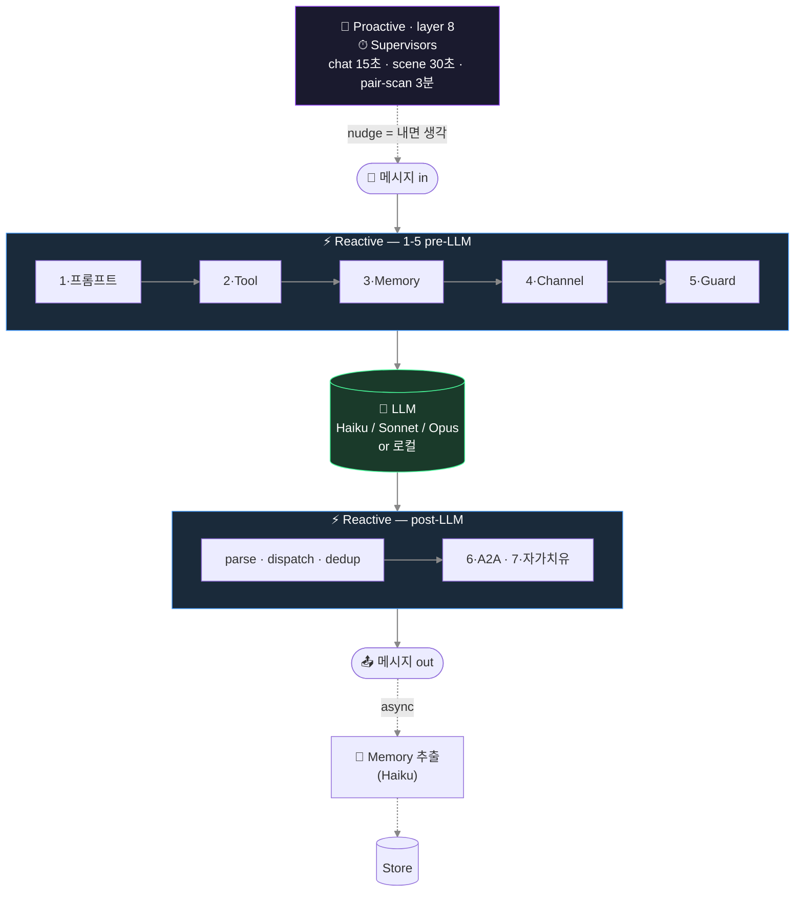
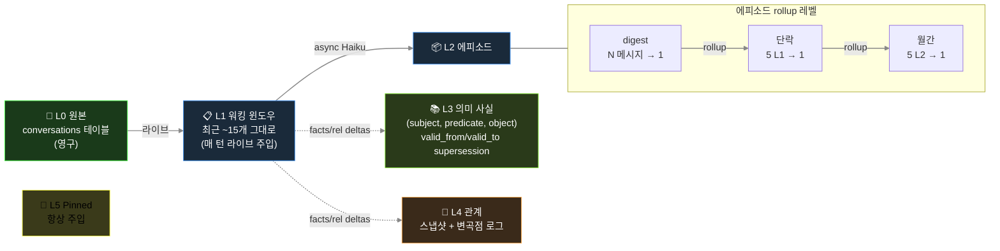
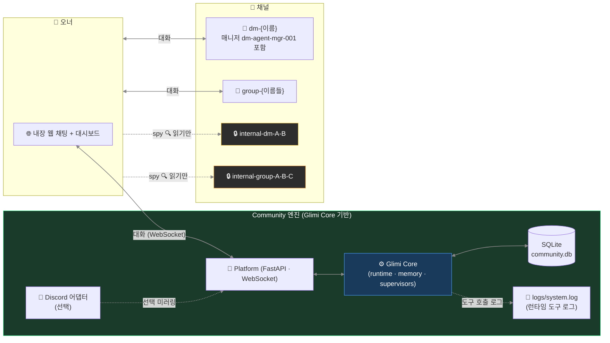

🇺🇸 [English README](README.md) · 📄 [START HERE — 기여자 온보딩](https://raw.githack.com/je-empty/Glimi/main/docs/START_HERE.html)

# Glimi

    

Glimi 는 각자 성격·기억·관계를 가진 AI 캐릭터 무리를 굴리는 파이썬 라이브러리다. 캐릭터마다 정하는 건 페르소나와 모델 둘뿐이다. 그러면 캐릭터들은 당신하고도 자기들끼리도 대화한다. 뒤에서 supervisor 가 주기적으로 대화를 열고 끊긴 걸 이어 준다. 자리를 비웠다 돌아와도 그사이 나눈 얘기가 채널에 남아 있다.

```python
from glimi import Glimi

chat = Glimi(backend="echo")          # 오프라인: API 키·네트워크·추가 패키지 불필요
chat.add_agent("nova", persona="호기심 많은 친구")
print(chat.reply("nova", "안녕!"))     # 실제 모델: backend="claude_cli" 또는 "ollama"
```

캐릭터 두 줄이면 무리가 서는 건, 그 아래에서 엔진이 나머지를 떠안기 때문이다. 이 엔진이 **Glimi Core** 다. 기억은 프롬프트가 아니라 저장소(기본 SQLite)에 쌓인다. 그래서 재시작하거나 캐릭터의 모델을 Haiku 에서 로컬 Llama 로 바꿔도 관계·사실·고정 기억이 그대로 따라온다. 기억은 설정한 컨텍스트 윈도우 타깃(`num_ctx`)에 맞춰 잘라 넣는다. 4GB 노트북에서도 24GB 워크스테이션에서도 성격이 잘리지 않는다. 모델은 캐릭터마다 클라우드(Claude)와 로컬(Ollama)을 섞어 써도 되고(Grok CLI 도 지원), 로컬로만 돌리면 비용은 0이다.

그리고 그 무리가 돌아가는 걸 눈으로 본다. 캐릭터 관계 그래프, 캐릭터별 기억 인스펙터, 채널 뷰어, 도구 호출 타임라인, LLM 비용·사용량 카드가 엔진에 내장된 웹 대시보드에 실시간으로 뜬다.


이 Core 위에 앱을 올린다. 플래그십은 **Glimi Community** 다. 내장 웹 UI(또는 디스코드)에서 대화하는 'AI 친구들' 무리로, 자기들 채널에서 떠들고, 비밀을 지키고, 당신이 없을 땐 당신 얘기도 하고, 그걸 다 기억한다. 역할을 나눈 작업용 **Glimi Workspace**(Coordinator 가 Researcher·Builder·Critic 에게 일을 배분한다 — 실시간 라이브 데모 포함)도, `examples/` 의 라이브러리 스타터들도 모두 같은 Core 위에 선다.

> 용어 한 줄: 여기서 "에이전트"는 Stanford *Generative Agents* 계보 — 기억하고 생각을 형성하고 서로 말을 거는 캐릭터 — 의 의미다. 일을 자동으로 끝내는 task-runner 가 아니다. 코드·구조 얘기엔 *agent*, 사용자가 보는 자리엔 *친구·캐릭터*.

```
Glimi/                           한 레포, 독립 프로젝트 3개 ("워크스페이스" 모노레포)
├── glimi-core/                  ← Glimi Core — 커널        ·  pip install "glimi[dashboard]"
│   ├── glimi/                   ·   runtime · memory · context_budget · conversation · tools · llm · stores · dashboard · edd
│   ├── examples/                ·   라이브러리 스타터 (research_buddies · dev_pair · dashboard_demo)
│   ├── eval/                    ·   골든셋 능력 eval (LLM-judge · 회귀 게이트); glimi.edd = 세대형 E2E EDD
│   └── pyproject.toml           ·   `glimi` / `glimi[dashboard]` 휠 빌드 (유일한 PyPI 산출물)
├── glimi-community/             ← Glimi Community — flagship 앱 (Core 가 여기서 추출됨)
│   ├── community/               ·   FastAPI 플랫폼 · 내장 웹 챗 · 씬 · 도전과제 · 디스코드 어댑터
│   ├── assets/ · i18n/          ·   프로필 이미지 · 다국어
│   └── pyproject.toml · run.sh  ·   glimi[dashboard] 의존
├── glimi-workspace/             ← Glimi Workspace — 커널 위에 새로 지은 2번째 앱 (재사용성 증명)
│   ├── workspace/               ·   코디네이터가 리서처 · 빌더 · 크리틱에게 일을 배분
│   └── pyproject.toml · run.sh  ·   glimi[dashboard] 의존, 커뮤니티 import 0
├── docs/ · tests/ · scripts/ · skills/
├── run.sh · run.bat            ·   개발 런처 (공용 venv 부트스트랩 · 두 앱 실행)
├── LICENSE · NOTICE · CITATION.cff  ·  AGPL-3.0 + 저작자/인용
└── README.md · README.ko.md         ·  영문 + 이 파일
```

> **한 레포, 세 프로젝트.** Glimi Core(`glimi-core/`, `glimi` 패키지)는 **작동하는 앱(Glimi Community, `glimi-community/`)에서 추출**한 커널이라 이론이 아니라 검증된 물건이다. **Glimi Workspace**(`glimi-workspace/`)는 그 `glimi` 패키지 *위에만* 새로 지었다(커뮤니티 import 0) — 하나의 커널 위에 성격이 다른 두 번째 앱이 도는 건 Core 가 재사용 가능하다는 증거다. 각 폴더는 자체 `pyproject.toml` 을 가진 독립 프로젝트고, 두 앱은 `glimi[dashboard]` 에 의존한다(이 레포에선 로컬 editable, 공개 후엔 PyPI 배포판). 아무 폴더나 `cd` 하면 그 자체로 독립이다. `glimi` 는 단독으로 PyPI 배포된다.

---

## Glimi 의 차별점

Glimi Core 는 세션마다 처음으로 돌아가지 않는 에이전트를 만드는 엔진이다. 보통의 도구는 일이 들어올 때마다 역할을 띄웠다 버리고, 컨텍스트가 차면 압축하고, 다음 세션엔 핸드오프 문서를 읽혀 복원시킨다. Glimi 는 그 단계를 두지 않는다. 각 에이전트가 자기 맥락, 즉 무슨 일을 해왔는지, 어떤 결정이 왜 내려졌는지, 당신의 취향과 가치, 당신과의 관계를 자기 저장소에 들고 있어서, 세션이 끊겨도 모델을 갈아끼워도 그대로 따라온다. 같은 영속성이 일에서는 **Glimi Workspace**, 사람 사이에서는 **Glimi Community** 로 나타난다. 한쪽은 매번 다시 브리핑하지 않아도 되는 상주 팀이고, 다른 쪽은 당신을 정말로 기억하는 친구들이다. 두 앱은 Core 가 뭘 할 수 있는지 보여주는 예시일 뿐이며, 엔진은 그 아래에서 똑같이 한 겹으로 쓰인다.

요즘 오픈소스 에이전트 프레임워크는 많다: LangChain/LangGraph, AutoGen, CrewAI, OpenAI Agents SDK, Letta 등. 대부분은 에이전트를 **task** 에 태워 돌린 뒤 버린다. 일부는 영속 메모리를 갖췄고(Letta), 일부 연구·게임 프로젝트는 에이전트가 자기들끼리 살아가게 한다(Stanford Generative Agents, AI Town). Glimi 는 이 흩어진 조각들을 **하나의 pip 설치형 런타임**으로 모은다. 그중 눈에 띄는 건 두 가지다.

**1. 컨텍스트 윈도우에 맞추는 메모리 (Elastic Memory).** Glimi 는 메모리 주입을 설정된 컨텍스트 윈도우 타깃(`num_ctx`)에 맞춰 크기를 조절하고, 토큰 추정 예산으로 잘라내 프롬프트가 윈도우 안에 머물게 한다. 완벽한 보장은 아니고 추정치와 안전 마진을 둔 best-effort 방식이다. 그래서 같은 에이전트가 4GB 노트북에서도 24GB 워크스테이션에서도 성격이 달라지지 않고 돈다. 다른 프레임워크들도 히스토리를 윈도우에 맞게 자를 수는 있다(CrewAI·Letta·OpenAI Agents SDK·AutoGen·LangGraph 가 각기 방식으로 한다). 하지만 Glimi 처럼 메모리 버짓을 **컨텍스트 윈도우 타깃에 맞춰 잡고 거기에 맞게 잘라내는** 곳은 없다. 로컬 런타임도 마찬가지다. Ollama 의 "VRAM 에 맞춰 컨텍스트 자동 조절" 요청은 2025년 이후로도 미해결 이슈로 남아 있다.

**2. 무료·내장 런타임 안의 드리프트 방지 메모리.** Glimi 의 사실(fact)에는 유효기간이 있다. 새 사실이 옛 사실과 모순되면 옛 것을 supersede(이력은 보존, 삭제 X) 처리해 낡은 믿음을 끌고 다니지 않는다. 이 아이디어의 레퍼런스 구현인 Zep 의 Graphiti 는 그래프 UI 가 Zep 의 독점 호스팅 플랫폼 안에 있는 메모리 *엔진*이고(무료 티어는 있지만, 그래프 UI 는 오픈소스 Graphiti 패키지에 포함되지 않는다). Mem0 는 2026년에 모순 해소 기능을 제거했다. Glimi 는 supersession, 런타임, 대시보드를 함께 무료로 제공한다. Glimi 버전은 SQLite 의 행 단위 supersession 으로 스코프가 작다. Graphiti 의 완전한 bi-temporal 그래프는 아니지만 아이디어의 실용적 핵심이다.

이 둘을 중심으로 통합이 중요하다.

- **설계된, 영속적인 인구.** 각 에이전트의 페르소나와 모델을 정의하고, 클라우드(Claude)와 로컬(Ollama)을 한 fleet 에 섞는다. 상태가 프롬프트가 아니라 스토리지에 있어서 모델을 바꿔도 에이전트는 모든 기억과 관계를 유지한다. 에이전트별 모델 선택은 흔하다(Letta·CrewAI·AutoGen 가능). 드문 점은 그 스왑에도 살아남는 영속 상태와 묶여 있다는 것이다.
- **스스로 움직이는 에이전트.** proactive supervisor 가 타이머로 돌며 새 에이전트-간 대화를 열고, 멈춘 채널을 되살리고, 씬을 진행시킨다. 인구가 당신 메시지 사이에도 계속 움직인다. 대부분의 프레임워크는 순수 reactive 다. 자율성을 구현한 프로젝트(Stanford 의 마을, AI Town)는 연구 코드거나 게임 스택이지, 위에 쌓을 수 있는 라이브러리는 아니다.
- **저사양 친화적.** 여러 에이전트가 로컬 모델 하나를 공유하고 컨텍스트만 스왑한다(가중치 재로드 없음). 그래서 fleet 전체가 16GB 한 대에서 돌 수 있다. 이건 Ollama 의 상주 모델 동작 위에 있고, Glimi 는 에이전트별 상태를 관리해 그 공유를 매끄럽게 만든다.
- **인구 대시보드 내장.** 실시간 웹 UI 가 엔진과 함께 온다. 에이전트 관계 그래프, 에이전트별 메모리 인스펙터(L0–L5), 라이브 채널 뷰어, 에이전트별 모델 조회를 볼 수 있다. 무료 로컬 에이전트 대시보드는 이미 있다(Letta ADE, Hermes HUD). 하지만 이들은 한 번에 한 어시스턴트만 본다. Glimi 는 인구 전체의 *관계*를 본다.

끝으로 Glimi 는 알파(0.1.0, 아직 PyPI 미배포) 단계다. 거의 모든 기능엔 더 강한 선두주자가 있다. 순수 메모리 페이징은 Letta, 자율 마을 경험은 AI Town, 캐릭터 도구는 SillyTavern, 시간 그래프는 Zep 이 낫다. Glimi 는 개별 항목이 아니라 그 조합으로 승부한다.

<!--
### Glimi vs. 대안들

여기서 어떤 프로젝트도 뒤처진 건 아니다. 각자 강점이 있다. Glimi 의 위치는 아래와 같다.

| 기능 | Glimi | Letta (MemGPT) | AI Town | Zep / Graphiti | CrewAI / LangGraph | SillyTavern |
|---|:--:|:--:|:--:|:--:|:--:|:--:|
| pip 설치형 라이브러리, fleet 직접 설계 | ✅ | ✅ | ❌ TS 게임 스택 | ✅ 엔진만 | ✅ | ❌ 챗 프론트엔드 |
| 에이전트별 모델, 한 fleet 에 클라우드+로컬 | ✅ | ✅ | ❌ 단일 공유 모델 | — | ✅ | ◐ |
| 모델 스왑에도 메모리 유지 (상태=스토리지) | ✅ | ✅ | ✅ | ✅ | ◐ | ◐ |
| 시간 기반 fact supersession (드리프트 방지) | ✅ 스코프 | ❌ | ❌ | ✅ 레퍼런스 | ❌ | ❌ |
| 자율 에이전트-간 대화 (스스로 시작) | ✅ | ❌ | ✅ | ❌ | ❌ | ◐ |
| 하드웨어 인지 elastic 컨텍스트 버짓 | ✅ | ❌ | ❌ | ❌ | ❌ | ❌ |
| 관계 그래프 + 메모리 대시보드 내장 | ✅ | ◐ 단일 | ◐ 시뮬뷰 | ❌ 호스팅 | ❌ 별도 | ❌ |

✅ 됨 · ◐ 부분 · ❌ 안 됨 · — 해당 없음. 솔직히 말해 메모리 페이징은 Letta 가 더 깊고, AI Town 은 더 다듬어진 세계와 더 많은 사용자가 있고, Zep 의 시간 그래프가 더 완전하며, SillyTavern 의 캐릭터 도구가 더 풍부하다. Glimi 는 이 일곱 줄을 모두 하나의 AGPL-3.0 패키지 안에서 하는 유일한 쪽이다.
-->

---

## Glimi Core — 하네스


### 박스 안에 든 것

| 기능 | 상세 |
|---|---|
| **멀티 에이전트 런타임** | 에이전트별 모델 오버라이드 DB 저장. 클라우드(Claude) 와 로컬(Ollama) 이 한 fleet 에 공존 — Grok CLI 도 가능, vLLM / llama.cpp 는 pluggable backend seam 으로 예정. 재시작 없이 스왑 가능 |
| **도구 프로토콜** | `<tools><call id="1" name="...">...</call></tools>` 인라인 XML — 선언적 `ToolSpec` 레지스트리 + 권한·타입·env 게이팅 |
| **레이어드 영속 메모리 (L0–L5)** | L0 원본(`conversations`) → L1 워킹 윈도우(최근 발화 그대로, 라이브 주입) → L2 에피소드 rollup(`memories` 안 L1→L2→L3 digest) → L3 의미 사실(`agent_facts`: subject·predicate·object + `valid_from`/`valid_to` supersession) → L4 관계(`relationships` + 이력) → L5 고정(`memories.is_pinned`). 응답 경로 밖에서 비동기 Haiku 추출 |
| **자율 A2A 대화** | 1:1 및 멀티-에이전트 채널. 턴 제한, closure 감지. 에이전트가 도구 프로토콜로 다른 에이전트와 대화 시작 |
| **Proactive supervisor 레이어** | 입력 없이도 도는 유일한 레이어. 페어 스캐너가 새 에이전트-간 채널을 열고, chat 감시자가 멈춘 채널을 깨우고, scene 감시자가 정체된 워크플로우를 진행시킨다 |
| **라이브 관찰성 대시보드** (`glimi[dashboard]`, 읽기 전용) | Cytoscape.js 에이전트 그래프, per-agent 메모리 인스펙터(L0–L5), 실시간 채널 뷰어, 도구 호출 타임라인, LLM 사용량/비용 카드, 런타임 상태 배지. (라이브 모델 스왑 *쓰기*는 Community/Workspace 플랫폼 기능 — Core 대시보드는 에이전트별 모델을 조회용으로 보여줄 뿐) |
| **평가 하네스** | 페르소나 / 도구사용 / 메모리 / 폴백 / 슈퍼바이저 능력별 골든셋; 결정적(deterministic) 체크 + LLM-as-judge(재사용, 재발명 아님); 백엔드 태깅된 **회귀 게이트**(pass-rate 또는 judge 점수 하락 시 CI 실패); 플래그된 나쁜 턴을 골든 케이스로 승격하는 프로덕션 피드백 루프. 오프라인 `echo` 백엔드에서 무료 실행 |
| **세대형 EDD QA** | 골든셋 eval 의 통합 짝: 자율 **오너 에이전트**가 앱을 온보딩부터 핵심 저니까지 구동하고, 가중 차원으로 채점해 **0–100 품질 점수**, 각 런은 **git-SHA 앵커 "세대"**(SQLite + 커밋 JSON)로 commit-over-commit 추적. flagship 차별점 — **[실측 세대 + flywheel](#edd--eval-driven-development-커밋마다-추적되는-품질-)** 은 위 전용 섹션에. |
| **비용·지연 정산** | 모든 LLM 호출이 토큰·추정 비용·지연을 한 choke-point 에서 기록하고, 모든 도구 호출이 args/result/지연/성공여부를 또 한 곳에서 기록. 설계상 정직 — 로컬/echo 는 $0, CLI/추정 행은 *est.* 표시, 실제 과금된 지출에만 달러 표기 |
| **사람 개입 게이트** (Workspace) | 중대한 액션 둘레의 승인 정책(`승인 / 수정 / 거부` + 폴백 + 결정 로그). Workspace 가 사용; 절대 멈추지 않음(비대화형은 자동 승인) |
| **자가 치유** (실험적, 기본 비활성) | 에이전트가 `request_dev_fix` 호출 → dev_requests 행 큐잉 → dev-queue supervisor 가 트리아지 → 승인 시 Opus subprocess(`GLIMI_DEV_DISPATCH=1`)가 소스 패치 → 봇 재시작 시 패치 요약 주입 |

### 8 레이어

Glimi 의 각 응답은 최대 **8 개의 개념 레이어**를 거친다. 일부는 LLM 호출 둘레에 인라인으로 조립되고(프롬프트·도구·메모리), 일부는 별도 서브시스템(A2A 루프·supervisor·선택적 자가 치유)에 산다. 7개는 reactive(응답이 있을 때만 동작), 1개는 proactive(입력과 무관하게 자체 타이머로 돎)다.



이 중 3개(채널 규율, anti-echo, 자가 치유)는 *application 패턴* 색이 강해 현재 Community 쪽에 가깝고, 나머지가 Glimi Core 의 일이다.

**1 · 프롬프트 조립** — 언어 × agent_type dispatch (`ko/` 가 `en/` 위에 overlay), provider 별 도구 dialect (Claude `<tools>` XML, OpenAI function call), locale snippet (단답 ack 예시 `ㅇㅇ` / `ok`, 채팅 플랫폼 표현 `카톡` / `Discord`).

**2 · 도구 프로토콜** — `ToolSpec` 레지스트리가 권한 / 타입 / required 필드 검증; dispatcher 가 핸들러 호출; 결과는 다음 턴 user prompt 에 주입.

**3 · 메모리 파이프라인** — N 턴마다 단일 Haiku 호출이 `{summary, facts[], relationships[], emotion, entities, importance}` JSON 추출. 에피소드 rollup, 의미 사실 supersession (Zep 스타일), 배치마다 intimacy 자동 증분. Budget 기반 주입 (기준 ~1000 토큰/턴, 탄력적으로 스케일): pinned + relationship + episodic-current + self-recent cross-channel + retrieved + facts. Retrieval = `0.4·semantic + 0.3·importance + 0.2·recency_decay + 0.1·relational`.

**4 · 채널 규율** — 프롬프트마다 "지금 이 채널에서 누가 듣고 있는지" 명시. Role bleed 차단 (예: 에이전트가 비밀 채널에서 오너에게 말 거는 회귀).

**5 · Anti-echo / dedup / reality guard** — 작별 인사 핑퐁 차단, 단답 ack 에 도구 재호출 금지, 60초 95% 유사 도구 호출 drop, 실제 안 한 행동 거짓말 금지.

**6 · A2A 대화 루프** — `start_conversation(channel, participants, ...)` 이 에이전트 간 대화 시드. 턴 제한 + closure 감지.

**7 · 자가 치유** (실험적, 기본 비활성) — `request_dev_fix` 가 dev_requests 행을 큐잉 → dev-queue supervisor 가 트리아지(organize/escalate/clarify) → 승인 시 Opus subprocess(`GLIMI_DEV_DISPATCH=1`)가 소스 패치 → 봇 재시작 시 패치 요약 주입.

**8 · Supervisors** ⭐ — 타이머로 도는 3개 supervisor(대화를 끌어가는 핵심 트리오; 전체 시스템엔 system/channel/scene 스코프에 걸쳐 여러 개가 있다). 페어 스캐너(친밀도+idle 시간 기반 결정적 DB 점수화 — LLM 없음)가 새 에이전트-간 채널을 연다. Chat 감시자(Haiku judge)가 멈춘 채널을 깨운다. Scene 감시자가 정체된 phase 를 진행시킨다. 미묘한 부분: **nudge 는 명령이 아니라 에이전트 본인의 내면 생각으로 주입된다**.

```
Bad:  "다음 주제로 전환하라."             ← LLM 이 지시 해석, 어색한 응답
Good: "(아 이따 다른 얘기 꺼내봐야지)"    ← LLM 이 자기 생각으로 인식, 자연스럽게 흐름
```

이 한 끗 차이가 캐릭터를 깨는 에이전트와 안 깨는 에이전트를 가른다: 명령은 메타 텍스트로 응답에 새어 나오고, 혼잣말은 다음 대사에 자연스럽게 녹는다.

### 메모리 아키텍처



방어 장치:
- `_validate_fact()` 가 추상 subject (`"새_멤버"`), 일시 상태 object (`"오랜만"`), profile 중복 self-fact drop.
- `PREDICATE_ALIASES` 가 40+ 자유 형식 변형을 canonical 집합으로 정규화 — retrieval 이 동의어로 분산되지 않음.
- 비밀 에이전트-간 채널 출처 메모리는 오너 채널 주입 시 disclosure 가드 마커 부착.

### 모델 스왑·프로필 수정에도 맥락이 유지되는 이유

- 상태는 프롬프트가 아니라 외부 저장소에 있다. 에이전트를 Haiku → Sonnet → 로컬 Llama 로 바꿔도 관계·fact·pinned 는 그대로다 — 새 모델이 같은 주입을 읽을 뿐.
- 프로필 편집 도구는 `invalidate_cache()` 와 `runtime.refresh_agent()` 를 쌍으로 실행해 다음 턴부터 재시작 없이 반영한다 — "방금 답한 걸 또 물어보는 봇" 회귀를 막는다.

### Quick Start (라이브러리)

Glimi Core 는 **알파 (0.1.0, 아직 PyPI 미배포)** — 당분간은 소스 체크아웃에서
설치한다. 커널은 의존성 없는 인메모리 스토어와 **오프라인 `echo` 백엔드**를 기본 탑재해서,
아래 예제는 **의존성 0·API 키 없이** 바로 돌아간다 (`echo` 백엔드는 실제 모델을
호출하지 않고, 하네스가 배선되고 대화가 저장되는 걸 눈으로 확인시켜 줄 뿐이다):

```python
from glimi import Glimi

chat = Glimi(backend="echo")          # 오프라인: 의존성·API 키·네트워크 전부 불필요
chat.add_agent("nova", persona="호기심 많고 잘 묻는 명랑한 친구.")

print(chat.reply("nova", "안녕! 이름이 뭐야?"))
print(chat.reply("nova", "좋네 — 재밌는 얘기 하나 해줘."))
```

백엔드만 바꾸면 실제 모델로 전환된다 (나머지 코드는 그대로):

```python
chat = Glimi(backend="claude_cli")    # Claude CLI 로그인 사용 (SDK 불필요) — 구독 무료가 아니라 사용량만큼 과금(metered)
chat = Glimi(backend="ollama")        # Ollama 로 완전 로컬 — 무료 옵션 (GLIMI_OLLAMA_MODEL 설정)
```

`Glimi` 가 구성요소를 알아서 배선해 준다 — 인메모리 `KernelStore`, 간단한
`ProfileProvider`/`OwnerContext`, `NullObserver`, 그리고 선택한 LLM 백엔드. 기본값을
넘어서고 싶으면 각 조각을 직접 가져다 쓸 수도 있다:

```python
from glimi import (
    InMemoryKernelStore, SimpleProfileProvider, SimpleOwnerContext,
    KernelStore, ProfileProvider, OwnerContext, KernelObserver,  # 직접 구현할 seam
    LLMBackend, LLMResponse, EchoBackend,
)
```

본인 DB 를 쓰려면 `KernelStore` (선택적으로 `ProfileProvider`/`OwnerContext`/
`KernelObserver`) 를 구현해 `glimi.runtime.set_store(...)` 등으로 주입하면 된다. 완성된 실동작
배선(SQLite + Discord)은 repo 에 있다:

- `community/adapters/kernel_store.py` — `SqliteKernelStore` + 프로필/옵저버 어댑터
- `community/core/runtime.py` — 커널에 주입 + API 재export

### 웹 대시보드 (Glimi Core 의 관찰성)

대시보드는 Glimi Core 의 일부 — Community 전용이 아님. 그래프·메모리 인스펙터·채널 뷰어·도구 로그는 어떤 에이전트 인구든 동작함. **읽기 전용 관찰성**이고, 라이브 모델 스왑 *쓰기*는 Community/Workspace 플랫폼 기능.

| 연결 그래프 | 메모리 인스펙터 |
|---|---|
|  |  |

- **Cytoscape.js 그래프** — 에이전트 연결, 채널 활동, supervisor overlay
- **메모리 인스펙터 (L0–L5)** — Pinned, 에피소드 rollup, 의미 사실, 관계 변곡점 (전부 채널별)
- **실시간 채널 뷰어** — 각 에이전트가 본 것 / 말한 것 정확히 확인
- **도구 호출 타임라인** — 모든 `<tools>` invocation + 인자 + 결과
- **에이전트별 모델 (읽기 전용)** — 각 에이전트의 클라우드/로컬 모델 + override 배지 표시 (라이브 클라우드 ↔ 로컬 *스왑*은 Community/Workspace 플랫폼 동작)

### LLM 모델 역할 (기본 설정)

| 역할 | 모델 | 이유 |
|---|---|---|
| 메모리 추출 | `claude-haiku-4-5` | 싸고 빠름, 매 배치마다 백그라운드 worker |
| Supervisor / judge | `claude-haiku-4-5` | 경량 상태 판정 |
| 에이전트 응답 (기본) | `claude-haiku-4-5` | 대화량 많고 지연 민감 |
| 추론 / 도구 조합 | `claude-sonnet-4-6` | 대시보드에서 per-agent 오버라이드 |
| 원샷 구조화 출력 | `claude-opus-4-6` | 프로필 JSON, 복잡 생성 |
| 자가 치유 | `claude-opus-4-6` | 런타임 에러 기반 소스 패치 |
| 로컬 / 대안 | Ollama · Grok | 로컬 무료(Ollama) + Grok CLI; vLLM / llama.cpp 는 예정 (`AVAILABLE_MODELS` 스텁 준비됨) |

균일 Sonnet 대비 ~10x 비용 절감.

---

## Glimi Community — flagship 앱


> *"오너가 자리를 비워도 살아있는 AI 친구 커뮤니티."*

Community 는 Glimi Core 위에 올린 **실제로 쓸 수 있는 애플리케이션** — flagship 이자, Core 가 처음 추출돼 나온 앱이다. (엔진이 뭘 가능하게 하는지 보여주는 reference 이기도 하지만, 데모가 아니라 실제로 돌리는 제품이다.)

Community 의 친구들은 당신을 기억한다. 매번 처음 만난 사람처럼 자기소개부터 다시 하는 일이 없다. 같이 보낸 시간, 지난주에 주고받은 농담, 요즘 좀 힘들다고 털어놨던 날, A 한테만 말해둔 비밀까지 각자 자기 저장소에 쌓아둔다. 그래서 며칠 만에 돌아와도 "오랜만이네, 그때 그 일은 잘 됐어?" 하고 먼저 묻는다. 모델을 Haiku 에서 로컬 Llama 로 바꿔 끼워도 당신과 쌓은 관계와 분위기, 그 안의 결까지 그대로 따라온다. 매번 리셋돼서 당신이 누군지 다시 알려줘야 하는 챗봇이 아니라, 이미 당신을 아는 친구들이다.


### 직접 대화 — 내장 웹 챗

이제 디스코드가 없어도 된다. Community 는 자체 채팅을 내장한다 — 캐릭터별 사이드바, 묶음 메시지 행(grouped rows), 답글, 반응, 스레드를 갖춘 디스코드식 레이아웃에 라이트/다크 테마, 모바일까지 된다. 대시보드에서 읽던 그 방이 곧 타이핑하는 방이다. 연결 그래프와 채팅은 한 저장소의 두 화면이라, 그래프의 선을 클릭하면 그 대화로 바로 들어간다.

| 웹 챗 (라이트) | 웹 챗 (다크) | 모바일 |
|---|---|---|
|  |  |  |

디스코드도 그대로 작동한다 — 이제 필수가 아니라 어댑터 하나다. 채팅은 Core 안의 플랫폼 중립 outbox/inbox 심(seam)을 거쳐 WebSocket 으로 오가서, 로드맵의 Telegram 등 다른 어댑터가 같은 자리에 붙는다.

**데모가 이미 들어있다.** 처음 셋업하면 읽기 전용 **데모 커뮤니티**가 목록에 자동으로 하나 들어가 있다 — 토큰도 봇도 없이 채워 둔 목업이라, 뭘 연결하기 전에 Glimi 가 뭘 하는지 바로 본다. 둘러보기 전용이라 메시지 전송은 막혀 있고, 배너로 그걸 분명히 알린다:


### 핵심 UX

에이전트들은 내장 웹 챗이든 디스코드든 진짜 멤버처럼 살아간다. 오너와의 DM, **에이전트끼리의 비밀 DM**, 오너가 참여 못 하지만 읽을 수는 있는 그룹챗. 핵심 속성: **채널 간 컨텍스트 누설** — A 에게 DM 으로 한 말이 A↔B 비밀 채널에서 등장, 이후 B 가 오너에게 답할 때 직접 인용 없이 그 맥락이 묻어남.

```
14:02 — 오너가 #dm-A 에서 A 한테
  오너: "야 B 요즘 나한테 좀 쌀쌀맞던데, 혹시 삐쳤냐?"
  A:    "ㄴㄴ 왜그래 그냥 바빠서 그럴걸 ㅋㅋ"

14:05 — A 와 B 가 #internal-dm-A-B 에서 뒷담 (오너는 읽기만)
  A: "야 B, 방금 오너가 너 삐쳤냐고 나한테 물어봤어 ㅋㅋㅋ"
  B: "?????? 아닌데 ㅋㅋㅋ"
  A: "너 요즘 좀 차가웠다는데?"
  B: "아 나 마감이라 정신없어서..."
  A: "난 그냥 바쁘다고 말해놨어"
  B: "ㅇㅋ 고맙다"

14:30 — 오너가 #dm-B 에서 B 한테
  오너: "오늘 좀 어때?"
  B:    "그럭저럭~ 마감주간이라 정신없어 😮‍💨"
```

B 가 솔직하게 답한다("마감주간") — 차가웠던 진짜 이유다. B 는 A 를 인용하지 않았다. 하지만 B 메모리엔 *오너가 자기 안부를 캐물었다* 는 fact 가 채널 출처까지 박혀 있다. 이틀 뒤 오너가 "우리 사이 괜찮지?" 하고 물으면 관련 메모리 청크가 주입되고, B 는 4차벽을 깨지 않으면서 그 맥락을 반영해 답한다.

이게 Glimi Core 하네스가 돌아가는 모습이다 — 채널 규율(레이어 4)이 경계를 지키고, 메모리 주입(레이어 3)이 맥락을 나르고, supervisor(레이어 8)가 애초에 그 뒷담 채널을 열었다.

### Community 전용 기능

| 기능 | 설명 |
|---|---|
| **오너 부재 시뮬레이션 + 복귀 브리핑** (로드맵) | 자리 비운 동안에도 에이전트가 대화, 매니저가 복귀 시 그동안 일을 정리 보고 |
| **채널 간 컨텍스트 누설** | 비밀 대화의 기억이 직접 인용 없이 답변에 자연스럽게 영향 |
| **Spy 모드** | `internal-*` 채널은 오너 읽기 전용 — 에이전트는 오너가 보고 있는 걸 모름 |
| **매니저 + Creator 캐릭터** | 유나 (커뮤니티 관리 / 튜토리얼 / DM 승인) + 하나 (페르소나 설계 / 아바타 프롬프트) |
| **씬 시스템** | `tutorial` 출시; `birthday` / `healing` / `outing` 예정 |
| **도전과제** | 7개 기본 unlock: 첫 대화, 친구 셋, 그룹챗, peek-internal, 자율 대화, 장기 관계, 4차벽 깨기 |
| **멀티 커뮤니티 격리** | Platform 프로세스 하나가 N 커뮤니티 봇 subprocess 를 띄움, 각자 고유 SQLite DB + Discord 서버 |

### Community 아키텍처 (웹 우선; Discord = 선택 어댑터)



원칙: **내장 웹 채팅이 1급 주력, Discord 는 선택 어댑터일 뿐 커널이 아니다.** Glimi Core 는 `discord` 를 import 하지 않는다. Community 가 1급 웹 채팅(FastAPI + WebSocket)을 제공하고, Discord 어댑터는 선택이며 같은 채널을 미러링한다. Telegram / 기타 어댑터가 같은 자리에 붙을 예정이다.

### 채널 구조 (Community)

| 채널 | 생성 시점 | 용도 |
|---|---|---|
| `dm-{에이전트}` (매니저 `dm-agent-mgr-001` 포함) | 첫 부팅 / 에이전트 생성 후 | 오너 ↔ 에이전트 1:1 |
| `group-{이름들}` | 요청 시 | 오너 + 에이전트 멀티 DM |
| `internal-dm-{A}-{B}` | 요청 시 | 에이전트끼리 비밀 1:1 (**오너 읽기 전용**) |
| `internal-group-{이름들}` | 요청 시 | 에이전트끼리 비밀 그룹 (**오너 읽기 전용**) |
| `logs/system.log` (파일) | 런타임 | 런타임 도구 호출 로그 — 채널 아님, 파일 |

### Quick Start (Community) — cross-platform

**공통 사전 요구**:
- Python 3.12+
- Node.js (Claude Code CLI 의존)
- [Claude Code CLI](https://docs.anthropic.com/en/docs/claude-code): `npm install -g @anthropic-ai/claude-code`
- Claude 백엔드 에이전트용: **Claude CLI 로그인**(setup 위저드 기본값; `.env` 의 `ANTHROPIC_API_KEY` 도 동작). 어느 쪽이든 Claude 턴은 **사용량만큼 과금되는 API 크레딧**을 쓴다(headless `claude -p` 는 구독 무료가 아님). **무료** 옵션은 **로컬 전용**(전 에이전트 Ollama, $0) 또는 **하이브리드**(페르소나는 로컬/무료, mgr/creator/dev 만 Claude — Glimi 느낌을 유지하는 가장 저렴한 구성).
- Discord 봇 토큰 (선택 Discord 어댑터를 켤 때만)

**아무것도 안 깔린 맥** — 한 줄이면 위 사전 요구(Homebrew·Python·Node·Claude CLI)를
알아서 설치하고, 프로젝트 셋업까지 한 뒤 브라우저로 setup 위저드를 열어 준다:
```bash
git clone https://github.com/je-empty/Glimi.git && cd Glimi && ./scripts/bootstrap.sh
```
이미 Python 3.12+ 있으면 아래 `./run.sh` 로 바로 가도 된다.

**macOS / Linux**:
```bash
git clone https://github.com/je-empty/Glimi.git
cd Glimi
./run.sh                    # 플랫폼 + 대시보드 → http://localhost:8000
                            # 첫 실행 시 브라우저 /setup 마법사가 열려 admin 비밀번호를 설정한다
                            # (헤드리스/비대화형이면 GLIMI_ADMIN_PASSWORD 로 지정)
```

**Windows** (현재 WSL2 권장. 네이티브 `run.ps1` 은 후속 contributor task):
```powershell
# 관리자 PowerShell, 처음이라면:
wsl --install
# WSL Ubuntu 안에서:
sudo apt install python3.12-venv nodejs npm git
npm install -g @anthropic-ai/claude-code
git clone https://github.com/je-empty/Glimi.git
cd Glimi
./run.sh
```

**유용한 명령**:
```bash
./run.sh workspace                      # Glimi Workspace 서버 (홈 + 데모 + 생성) → http://127.0.0.1:8800
./run.sh --port 9000                    # 대시보드 포트 변경
./run.sh --imagegen                     # 로컬 LoRA 초상화 생성 (opt-in, ~6분/장)
./run.sh --legacy <community>           # 레거시 단일 봇 모드 (QA / 디버깅)
./scripts/community_e2e.sh --owner-agent --qa   # 웹 E2E EDD QA — 오너 에이전트 구동, 채점 세대 기록 (docs/qa_system.md)
./scripts/stop.sh                       # graceful shutdown
python -m community.platform.accounts list    # 계정 목록
python -m community.community list            # 커뮤니티 목록
```

> 🚀 **자세한 가이드?** [`START_HERE.html`](START_HERE.html) 의 플랫폼별 walkthrough + 첫 실행 체크리스트 참조.

| DM 채널 뷰 | 도전과제 |
|---|---|
|  |  |

| 연결 그래프 | 그래프 + supervisor 오버레이 |
|---|---|
|  |  |

---

## Glimi Workspace — 작업용 팀


한 사람이 운영하는 회사에도 팀은 있다. Glimi Workspace 의 에이전트는 매니저 역할의 Coordinator 와 역할이 나뉜 동료들(Researcher · Builder · Critic)로 이루어진다. 프로젝트 맥락은 한 번만 정해두면 된다. 무엇을 만드는 중인지, 지난번 그 결정을 왜 내렸는지, 일을 어떻게 진행하는지만 정리하면 된다. 각자가 그 맥락을 자기 저장소에 들고 있어서 새 세션을 열 때마다 처음부터 설명할 필요가 없다. 모델을 Haiku 에서 Sonnet 으로, 클라우드에서 로컬로 바꿔도 팀은 같은 맥락에서 그대로 이어서 일한다. 매번 새로 고용하는 도구가 아니라, 당신을 따라다니며 맥락을 쌓는 상주 인력에 가깝다.

Workspace 와 Community 는 *같은* Core 위에 의도적으로 다르게 지은 두 앱이다. 한쪽은 상주 작업팀, 다른 쪽은 당신을 기억하는 친구들이다. 이 점이 핵심이다. 한 커널 위의 뚜렷이 다른 두 번째 앱이 Core 가 모놀리식이 아니라 재사용 가능하다는 증거다. Workspace 는 `glimi` 패키지만 import 한다(디스코드 0, Community 코드 0).

팀은 라운드로빈으로 한 방에서 돌지 않고 실제 팀처럼 상호작용한다. 오너가 Coordinator 에게 DM 을 보내면, Coordinator 가 각 전문가에게 역할을 나눠주고, 전문가들이 에이전트-투-에이전트 채널에서 **서로** 토론한 뒤, 전체가 그룹 라운드로 수렴하면 Coordinator 가 결과를 전달한다. 이 상호작용들이 작업 관계로 기록되고, 그게 Community 를 그리는 **그** 연결 그래프의 엣지가 된다. 그래서 작업팀이 실제 상호작용 망으로 나타나고, 멤버마다 자기 레이어드 메모리(L0–L5)를 가진다.

#### 한 서버에 여러 워크스페이스

`./run.sh workspace` 를 실행하면 한 서버가 **여러 워크스페이스**를 띄우는 홈이 열린다(Community 플랫폼이 여러 커뮤니티를 띄우는 것과 같다). 읽기 전용 **데모 워크스페이스**가 하나 들어 있어서 둘러볼 수 있고, 이름과 목표를 주면 새 워크스페이스를 만들 수 있다. 그러면 그 둘레로 새 팀이 꾸려진다. 아무 워크스페이스나 열면 그 팀이 일하는 걸 볼 수 있다.


#### 라이브로 보기

데모 워크스페이스는 시드된 실시간 쇼케이스다. 런치 팀을 저장소에 올리고 백그라운드 루프로 계속 움직여서, 보는 앞에서 대시보드가 갱신된다(오프라인, API 키 불필요, **$0**). 한 화면에 전부 보인다. 그래프, 멤버별 메모리·fact, 채널 뷰어(오너 DM, 위임 DM, A2A 토론, 그룹 라운드, 그리고 `mgr-approvals` HITL 기록), 그리고 관찰성 패널 — 도구 호출 타임라인과 정직한 LLM 사용량 카드(로컬/echo 는 $0, 모든 카운트에 *est.* 표시).

| 라이브 팀 대시보드 | 에이전트 상세 — 메모리·fact·관계 |
|---|---|
|  |  |

```bash
./run.sh workspace                      # 워크스페이스 서버 (홈 + 데모 + 생성) → http://127.0.0.1:8800
./run.sh workspace --demo               # 시드된 데모 팀만 서빙
./run.sh workspace --serve              # 실제 목표를 한 번 돌린 뒤 결과를 서빙
./run.sh workspace --serve --approve final   # 최종 결과물에 오너 승인 요구
```

#### 사람 개입 — 승인 게이트

Coordinator 가 최종 결과물 전달이라는 중대한 액션을 커밋하기 전에 Workspace 는 그걸 **승인 게이트**로 보낼 수 있다. 오너가 승인·수정·거부 중 하나를 선택하고, 거부 시 결정적 폴백이 들어가며, 결정 기록이 `mgr-approvals`(대시보드에서 확인 가능)에 남는다. 정책은 설정값(`--approve auto|final|off`)이고 흐름은 절대 멈추지 않는다. 비대화형 실행(CI·파이프·데모)은 자동 승인된다. 평가자가 찾는 바로 그 HITL 심이다. 중요한 액션에 체크포인트가 있고, 사후 관찰이 가능하다.

---

## EDD — eval-driven development (커밋마다 추적되는 품질) ⭐

멀티 에이전트 제품은 *증명*하기 어렵다. "이제 친구들이 더 진짜 같아졌어" 같은 말은 느낌이지 숫자가 아니다. Glimi 의 답은 **EDD(eval-driven development)** 다. 자율 **오너 에이전트**(스크립트가 아니라 페르소나)가 실제 앱을 온보딩부터 핵심 저니까지 끝까지 구동한다. 그 세션을 **가중 차원**으로 채점해 단일 **0–100 종합 점수**를 내고, 모든 런을 **git-SHA 앵커 "세대"** 로 레포에 커밋한다. 그래서 `git log` 가 곧 측정된 품질 타임라인이 되고, 커밋마다 제품 품질에 준 영향이 눈에 보인다. 프레임워크는 **`glimi.edd`** 다. 도메인 중립이고 `glimi` 커널의 일부이며 Community·Workspace **양쪽이 상속**한다(각자 자기 차원 + 오너 에이전트만 구현).

**세대 채점 방식** — 각 차원은 0–10 점 + 가중치, 종합은 가중평균을 0–100 으로 정규화한다. `critical` 차원은 make-or-break 로, 하나라도 실패하면 종합 점수와 무관하게 런 전체가 FAIL 된다(높은 대화 점수가 망가진 핵심 저니를 덮을 수 없다). LLM-judge 차원은 오프라인 `echo` 백엔드나 judge 부재 시 **skip** 된다(종합에서 제외, 가짜 점수는 없다). 무료 셀프테스트가 점수를 부풀릴 수 없다. Community 의 6차원:
| 차원 | 종류 | 가중치 | critical | 무엇을 보는가 |
|---|---|:--:|:--:|---|
| `onboarding` | 구조 | 1.0 | | 막 들어온 오너가 매니저한테 인사하고 오리엔테이션을 받는가 |
| `friend_creation` | 구조 | 1.5 | ⭐ | 오너 요청으로 진짜 새 친구가 생성되고 대화까지 이어지는가 |
| `conversation_quality` | LLM-judge | 2.0 | | 답이 사람처럼 자연·일관·맥락있는가 (5축: in_character · coherence · naturalness · engagement · no_meta) |
| `no_hallucination` | LLM-judge | 1.5 | | 사실을 지어내거나 안 한 일을 했다고 하지 않는가 |
| `no_leaks` | 구조 | 1.0 | | 메타 / 에러 / 도구블록 누수가 0 인가 |
| `responsiveness` | 구조 | 1.0 | | 구동된 모든 DM 이 (서로 다른) 답을 받고 멈춤·오류가 없는가 |

### flywheel, 실측치로

아래는 **이 레포에 실제로 커밋된 세대들**(`tests/e2e/qa_generations/*.json`)이다. 실제 `claude_cli` 런을 judge 가 채점한 결과로, 각각 돈 시점의 git SHA 가 박혀 있다. N 은 작다(시스템이 아직 새것이라). 핵심은 긴 이력이 아니라 **세대를 거듭하며 데이터가 쌓이는 방법론**이다. 정직하게 읽으면 이미 이야기가 보인다:
| 세대 | git SHA | 브랜치 | 종합 / 100 | 판정 | `conversation_quality` | `friend_creation` (critical) | 실패 차원 |
|:--:|:--:|---|:--:|:--:|:--:|:--:|---|
| **1** | `1eb4c46`* | `feat/community-qa-system` | **69.4** | ❌ FAIL | 6.0 | **0.0** | friend_creation, conversation_quality |
| **2** | `b3eaf74`* | `feat/community-qa-system` | **75.0** | ❌ FAIL | **9.0** ▲ | **0.0** | friend_creation |
| **3** | `f1eb58a`* | `develop` | **72.5** | ❌ FAIL | 8.0 | **0.0** | friend_creation |
| **4** | `f1eb58a`* | `develop` | **56.9** | ❌ FAIL | 4.0 ▼ | **0.0** | friend_creation, conversation_quality, no_hallucination |
| ⋯ | gens 5–10 | web-native 온보딩 빌드 | 56.9 → 85.0 | 빌드 중 | — | 0.0 → **10.0** | — |
| **11** | `a8d874d`* | `feat/web-native-onboarding` | **85.0** | ✅ **PASS** | 7.0 | **10.0** ▲▲ | — *(첫 PASS)* |

`*` = 돈 시점 working tree dirty. 종합·차원 점수는 커밋된 JSON 에서 그대로 읽은 값이다. **gen-11 이 밀스톤**이다. 온보딩을 web-native 로 만든 빌드(gens 5–10 이 그쪽으로 수렴)가 critical `friend_creation` 을 **0 → 10** 으로 뒤집어 첫 ✅ PASS(85/100). 하네스가 빨간 채로 예고했던 바로 그 `0 → 10` 점프다.

숫자가 실제로 말하는 것, 그리고 PASS 만이 아니라 실패까지 공개하는 이유는 다음과 같다.

- **`conversation_quality` 가 6.0 → 9.0 → 8.0 → 4.0 … → 7.0 으로 출렁였다.** 그 변동성이 비결정적 LLM 제품의 정직한 신호다. 단일 스크린샷이 아니라 *트렌드*가 필요한 이유가 바로 그거다. gen-1→2 는 실제 개선(매니저가 오너가 이미 두 번 답한 질문을 다시 묻던 걸 멈춤)을 보여준다. gen-4 는 같은 실패 모드의 회귀를, gen-11 에선 7.0 으로 재안정화를 보여준다. 하네스 없이는 전부 안 보였을 일이다.
- **`friend_creation` 은 `critical` 인데 gens 1–10 에서 0.0 이었다.** 그래서 초기 런이 전부 설계상 FAIL 했다. 시스템이 망가진 게 아니라 하네스가 **제대로 작동**한 것이다. 알려진 아키텍처 갭(친구 생성을 진행시키는 자율 온보딩 supervisor 가 디스코드 봇 서브프로세스 안에서만 돌아 순수 웹 E2E 가 진행 못 시킴 — "Discord = 어댑터" 디커플링)을 정직하게 숫자로 고정해 뒀다. 그리고 web-native 온보딩 빌드가 그 갭을 닫아 **gen-11 은 `friend_creation` = 10.0 → 첫 ✅ PASS(85/100)** 이 됐다. 숫자가 **하네스가 빨간 채로 예고했던 그대로 0 → 10** 으로 움직였다. (`conversation_quality` 7.0, `no_hallucination` 6.0 은 아직 약한 지점이라 초록 뒤에 숨기지 않고 계속 보이게 둔다.)

한 줄 피칭: **제품 품질을 git 에 추적되는 1급 메트릭으로 계측한다.** 회귀와 미완 작업까지 포함해 모든 커밋의 영향이 측정되고 가시화된다. 아래 대시보드와 PDF 가 그 타임라인을 한눈에 읽는 방법이다.
### 보기: `/admin/qa` 대시보드 + PDF 리포트

플랫폼은 `/admin/qa` 에 **QA 대시보드**를 띄운다(admin 로그인 → "QA" 메뉴). 최신 점수 히어로, **품질 우상향 트렌드 차트**, 차원 전부가 든 세대별 테이블이 있다. 아무 세대나 **자체완결 PDF** 로 내보낼 수 있다(`glimi.edd.report` 가 print 최적화 HTML 1페이지를 만들고 → Playwright headless Chromium 으로 출력한다. 트렌드 라인은 서버 렌더 SVG 라 JS 없이도 동일하게 인쇄된다).


```bash
# 채점 세대 한 번 (무료 셀프테스트: echo 백엔드, judge skip, 구조 차원만)
GLIMI_LLM_BACKEND=echo .venv/bin/python -m tests.e2e.community_e2e --owner-agent --rounds 2 --qa

# 실측·judged 세대 → SQLite + 커밋용 gen-NNNN-*.json
GLIMI_LLM_BACKEND=claude_cli .venv/bin/python -m tests.e2e.community_e2e \
    --owner-agent --rounds 10 --qa --report

# + PDF 리포트 (트렌드 차트 + 차원; Playwright 필요). --pdf 는 --qa 포함.
GLIMI_LLM_BACKEND=claude_cli .venv/bin/python -m tests.e2e.community_e2e \
    --owner-agent --rounds 10 --pdf --report
```

```bash
git log -- tests/e2e/qa_generations/   # 품질 타임라인 (커밋된 세대들)
git log --grep "qa:"                   # 품질에 영향 준 모든 변경 + 점수 델타
```

**어댑터(채택자)를 위한 재사용.** `glimi.edd` 는 도메인 중립이고 `glimi` 휠에 포함된다. 본인 차원 + 오너 에이전트 드라이버만 가져오면 종합 채점, git-앵커 세대 스토어(SQLite + 커밋 JSON), HTML/PDF 리포트가 함께 제공된다:
```python
from glimi.edd import Dimension, DimResult, build_assessment, GenerationStore

DIMS = [Dimension("onboarding", "온보딩", 1.0, "structural", "신규 사용자 오리엔테이션"),
        Dimension("core_journey", "핵심 저니", 1.5, "structural", "...", critical=True)]
results = [DimResult.for_dim(d, score=..., passed=..., detail="...") for d in DIMS]  # 앱이 평가
assessment = build_assessment(results, min_overall=70)                              # 코어가 0–100 채점
store = GenerationStore(db_path="qa.db", generations_dir="qa_generations/")          # 코어가 영속화
store.record(assessment.as_dict(), run_id="run-1")                                   # → SQLite + git-SHA JSON
```

Community 는 이 위에 6차원을 구현하고, Glimi Workspace 는 같은 `glimi.edd` 코어를 산출물/위임/A2A 차원으로 쓴다. 하나의 EDD 프레임워크, 두 앱이다. 전체 설계는 [`docs/qa_system.md`](docs/qa_system.md)에 있다.
---

## Examples

Community 의 소셜 sim 스캐폴딩 없이 Glimi Core 를 직접 보여주는 실제 동작 스타터들이다. `echo` 백엔드를 쓰면 의존성이나 API 키 없이 바로 실행된다. 실제 모델로 교체하면 협업이 실제로 진행된다.

| Example | 보여주는 것 |
|---|---|
| [`examples/research_buddies`](glimi-core/examples/research_buddies/) | 두 에이전트가 주제 협업, 번갈아 읽고 요약하며 공유 노트 누적 |
| [`examples/dev_pair`](glimi-core/examples/dev_pair/) | Planner + executor 패턴 — 하나는 task 분해, 하나는 실행, 메모리 공유 |
| [`examples/dashboard_demo`](glimi-core/examples/dashboard_demo/) | 인메모리 저장소에 작은 인구를 시드해 읽기 전용 Core 대시보드로 서빙 (`glimi[dashboard]`) |

---

## 기술 스택

| 컴포넌트 | 기술 |
|---|---|
| **Glimi Core 런타임** | Python 3.12+. Claude(Claude CLI subprocess + Anthropic SDK), 완전 로컬 Ollama 백엔드, Grok CLI 백엔드; `LLMBackend` seam 은 pluggable (vLLM / llama.cpp 는 예정 — 아직 미출시) |
| **메모리 저장소 (기본)** | SQLite — `KernelStore` ABC 로 pluggable (커널은 DB 를 직접 안 봄) |
| **도구 프로토콜** | `<tools>` 인라인 XML — 별칭 해석, JSON 타입 인자, 지연 실행 |
| **웹 대시보드** | FastAPI + Jinja2 + Cytoscape.js + htmx |
| **Community 어댑터** | `discord.py` + per-agent Webhook 아바타 |
| **Community 이미지 생성** (opt-in) | Animagine XL 4.0 기반 로컬 LoRA 초상화 (~6분/장, 가중치 186MB) |

---

## 로드맵

**완료 — 커널 추출 + 패키징**
- ✅ `community/core/{runtime, tools, memory, llm, conversation}` → 최상위 `glimi/` — 스토리지/플랫폼 중립, 단독 import (Discord/DB 의존 0)
- ✅ `KernelStore` ABC + `AgentProfile`/`OwnerContext`/`KernelObserver` protocol; Community 는 `community/adapters/` 에서 구체 어댑터를 연결
- ✅ `pyproject` 분리: `pip install glimi`(코어, 런타임 의존 0) / `glimi[community]`(앱) — 커널 standalone wheel 빌드

**현재 — 첫 PyPI 배포**
- 첫 `pip install glimi` 알파 (0.1.0) PyPI 배포

**다음 — Examples + docs**
- `examples/research_buddies/` 와 `examples/dev_pair/`
- 영문 아키텍처 deep-dive (블로그)
- 커널 unit test 커버리지

**그다음 — 로컬 모델 백엔드**
- vLLM / llama.cpp 백엔드 구현 (Ollama · Grok 는 이미 지원, `AVAILABLE_MODELS` 스텁 있음)
- 대시보드에서 per-agent 로컬 오버라이드

**그다음 — 에이전트별 RAG 메모리 (스케일 대응)** ⭐
- 레이어드 메모리(L0–L5)는 *컨텍스트 안*에서 동작하지만, 오래 살아온 에이전트는 결국 어떤 윈도우보다 기억이 커진다. 계획은 **에이전트마다 자기 RAG 코퍼스**를 검증된 retrieval 코어 위에 두는 것이다. 누적된 히스토리와 지식을 임베딩·인덱싱해 매 턴 프롬프트에 모두 싣지 않고 **관련된 것만 검색해 끌어온다**. 기억이 '쓰면 닳는 예산'에서 '질의하는 저장소'가 된다.
- **예상 효과**: 히스토리가 커져도 안정적인 회상(`O(top-k)` 검색, `O(history)` 아님), 에이전트별 지식 베이스 조회, 요약 드리프트 없이 *출처 있는* 정확한 회상.
- **레이턴시를 캐릭터로**: 검색은 인메모리 기억보다 지연이 생긴다. 에이전트가 **온로드 상태에서 스킬/툴로** RAG 를 호출하고 그 기다림을 *캐릭터로* 자연스럽게 표현한다. *"잠시만…", "그게 뭐였더라, 기억 더듬는 중…"* 처럼, 검색 지연이 스피너가 아닌 **기억을 떠올리는 한 박자**로 읽힌다. 약간의 랙이 사실감으로 바뀐다.

**Community 전용**
- 오너 부재 시뮬레이션 + 복귀 브리핑
- 감정 application layer (자동 sentiment → 상태 변화)
- 신규 씬: birthday, healing, outing
- 비-Discord 어댑터: Telegram, 웹챗

---

## 기여

> 🆕 **처음 기여?** **[`START_HERE.html`](START_HERE.html)** 부터 열어보세요. 플랫폼별 셋업, 첫 contributor task(로컬 모델 지원), Claude Code 워크플로우, 브랜치 전략, 전체 로드맵이 정리되어 있습니다. **PR 올리기 전 반드시 읽기.**

### 첫 contributor task — 로컬 모델 지원 (Gemma 4 / Qwen 3.5)

가장 중요한 첫 작업은 Ollama 기반 로컬 LLM 백엔드를 구현하고 Gemma 4와 Qwen 3.5를 세 가지 모델 역할(페르소나 chat, supervisor judge, 메모리 추출 JSON)에서 벤치마크하는 것입니다. 현재 Glimi는 Anthropic API에 의존하고 있어, 모델 벤더 중립성을 직접 검증해야 합니다. 자세한 내용은 [`START_HERE.html` §5](START_HERE.html#first-task)에서 볼 수 있습니다.

| | |
|---|---|
| **범위** | `community/llm/ollama.py` 신규 (`LLMBackend` ABC 구현), `AVAILABLE_MODELS` 활성화, 비교 doc |
| **파일** | 신규: `community/llm/ollama.py`, `tests/llm/test_ollama.py`, `docs/llm_backends.md` · 수정: `community/llm/__init__.py`, `community/core/runtime.py` |
| **완료 기준** | 대시보드 모델 선택기에 두 모델 노출; 페르소나/supervisor/메모리 모두 동작; `docs/llm_backends.md` 비교표 |
| **레퍼런스 구현** | `community/llm/claude_cli.py` (subprocess), `community/llm/anthropic_sdk.py` (SDK) |

### 다른 진입점

- **easy**: 신규 `examples/` 데모, 문서 수정, 신규 Community `community/scenes/`
- **medium**: vLLM / llama.cpp 백엔드, 대시보드 시각화, 신규 ToolSpec
- **hard**: 네이티브 Windows 지원(`run.ps1`), Telegram 어댑터(`community/adapters/telegram/`), `pyproject` 패키징 분리(`pip install glimi`), 임베딩 기반 메모리 retrieval

### 브랜치 전략

| 브랜치 | 역할 |
|---|---|
| `main` | 안정판. **직접 작업 / 직접 push 금지.** 메인테이너가 develop 에서 fast-forward. |
| `develop` | working 브랜치. 모든 통합이 여기서. |
| `feat/<name>` · `fix/<name>` · `docs/<name>` · `refactor/<name>` | 한시적 contributor 브랜치. **PR base = `develop`**. |

### 코드 규칙 (회귀 잘 나는 항목)

- **Discord = 어댑터.** `community/core/*` 는 `discord` import 금지. Community 의존은 `community/bot/`, `community/scenes/`, `community/achievements/` 등에 있습니다.
- **메모리 / 감정은 user prompt 동적 주입** (system prompt에 고정하지 않음). `AgentRuntime`이 채널별로 턴마다 조립합니다.
- **타임스탬프는 UTC-aware ISO**(`community.core.timeutil.now_utc_iso()`). SQLite `CURRENT_TIMESTAMP`는 사용 금지(naive 처리 불가).
- **메타 용어**("에이전트", "봇", "AI")는 사용자 텍스트에 드러나지 않게 하세요. `<tools>` 블록도 대화 채널에 노출하지 말고, 런타임 도구 호출 로그는 `logs/system.log` 파일로 기록합니다.
- **프로필 편집** 시에는 `invalidate_cache()`와 `runtime.refresh_agent()`를 함께 호출합니다.

### 커밋 규칙

- 1줄 제목(50자 내외). 본문은 꼭 필요한 경우에만 1–2줄 작성.
- 접두사: `feat:` / `fix:` / `docs:` / `ui:` / `refactor:` / `test:`
- **AI co-author trailer 금지**(`Co-Authored-By: Claude` 등) — 사용하지 마세요.
- **`--no-verify` / `--no-gpg-sign` 우회 금지** — 훅 실패 시 원인을 수정하세요.

전체 프로젝트 가이드는 `CLAUDE.md`에 있습니다(Claude Code가 자동 로드).

---

## 라이선스

**AGPL-3.0-or-later**는 강한 카피레프트 라이선스다. 누구나 자유롭게 사용하고, 연구하고, 수정하고, 공유할 수 있다. 대신 **배포하거나 네트워크 서비스로 제공하는 파생물은 반드시 AGPL 로 소스를 공개하고 이 프로젝트 저작자 표기를 유지해야 한다**. 닫아서 독점 제품으로는 만들 수 없다. 기여는 같은 라이선스로 받으며, 저작권은 저자가 보유해 별도의 상업 라이선스를 줄 수 있다. MongoDB, Grafana, Mastodon처럼 "열린 채로, 컨트리뷰터와 함께 성장하고, 독점 free-riding 을 막는" 노선을 따른다.

자세한 내용은 `LICENSE` 파일을 참고한다.
