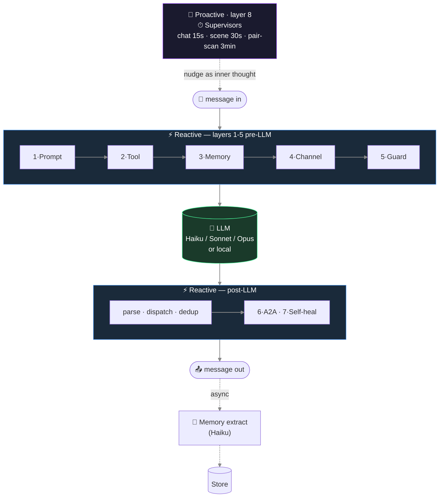
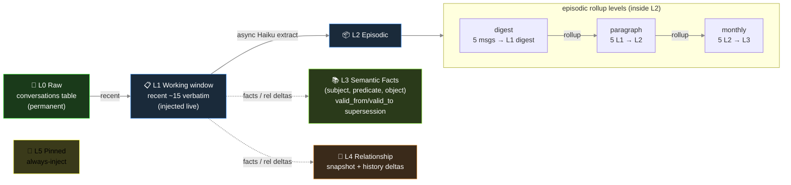
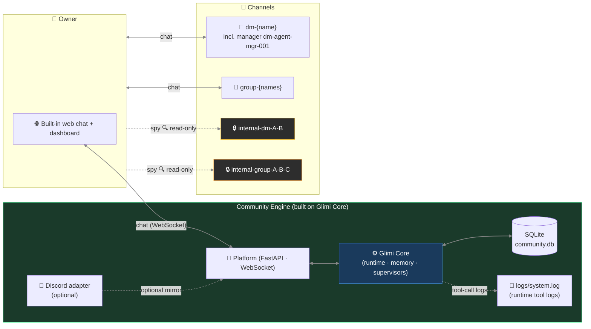

🇰🇷 [한국어 README](README.ko.md) · 📄 [START HERE — contributor onboarding](https://raw.githack.com/je-empty/Glimi/main/docs/START_HERE.html)

# Glimi

    

Glimi is a Python library for running groups of AI characters, each with its own persona, memory, and relationships that keep going when you're away. You assign a persona and model per character. They chat with you and each other. A background supervisor revives old conversations and starts new ones. When you return, all their messages are already there.

```python
from glimi import Glimi

chat = Glimi(backend="echo")          # offline: no API key, no network, no extra packages
chat.add_agent("nova", persona="a curious, upbeat friend")
print(chat.reply("nova", "hi there!"))  # real models: backend="claude_cli" or "ollama"
```

Setup takes two lines because **Glimi Core** handles state. Data lives in storage (SQLite by default), not the prompt, so relationships and memories survive restarts or model swaps (Haiku → local Llama). Core trims memory injection to fit the configured `num_ctx` window — from 4096 to 16384 — keeping personalities consistent across models. You can mix cloud (Claude) and local (Ollama) per character; Grok CLI works too. Fully local runs are free.

You can watch it live: a relationship graph, memory inspector, channel viewer, tool-call timeline, and LLM cost card — all in a built-in web dashboard.


**Glimi Community** is the main app — a chat group of AI friends with a web UI or Discord bridge. They remember, gossip, and keep secrets. **Glimi Workspace** is for work roles (Coordinator, Researcher, Builder, Critic) and has a real-time demo. Starters in `examples/` run on the same Core.

> Here *agent* means a *Generative Agent* — a character that remembers, forms opinions, and starts talks — not an autonomous task-runner. We say *agent* in code, *friends / characters* for users.

```
Glimi/                           one repo, three self-contained projects (a "workspace" monorepo)
├── glimi-core/                  ← Glimi Core — the kernel        ·  pip install "glimi[dashboard]"
│   ├── glimi/                   ·   runtime · memory · context_budget · conversation · tools · llm · stores · dashboard · edd
│   ├── examples/                ·   library starters (research_buddies · dev_pair · dashboard_demo)
│   ├── eval/                    ·   golden-set capability eval (LLM-judge · regression gate); glimi.edd = generational E2E EDD
│   └── pyproject.toml           ·   builds the `glimi` / `glimi[dashboard]` wheel (the only PyPI artifact)
├── glimi-community/             ← Glimi Community — the flagship app (Core was extracted FROM here)
│   ├── community/               ·   FastAPI platform · built-in web chat · scenes · achievements · Discord adapter
│   ├── assets/ · i18n/          ·   profile images · localization
│   └── pyproject.toml · run.sh  ·   depends on glimi[dashboard]
├── glimi-workspace/             ← Glimi Workspace — a 2nd app built ON the kernel (proof of reuse)
│   ├── workspace/               ·   a Coordinator delegates to Researcher · Builder · Critic
│   └── pyproject.toml · run.sh  ·   depends on glimi[dashboard], zero Community imports
├── docs/ · tests/ · scripts/ · skills/
├── run.sh · run.bat             ·   dev launcher (bootstraps the shared venv; runs either app)
├── LICENSE · NOTICE · CITATION.cff  ·  AGPL-3.0 + authorship/citation
└── README.md · README.ko.md         ·  this file + Korean mirror
```

> **One repo, three projects.** Glimi Core (`glimi-core/`, `glimi` package) came from a working app — Glimi Community (`glimi-community/`) — so it's battle-tested. **Glimi Workspace** (`glimi-workspace/`) was built purely on the `glimi` package, proving Core is reusable. Each folder is standalone with its own `pyproject.toml`; both apps depend on `glimi[dashboard]` (editable local install, to hit PyPI at launch). You can `cd` into any and run it. `glimi` itself publishes separately.

---

## What makes Glimi different

Glimi Core is the engine behind agents that persist between sessions. Usual frameworks spawn a short-lived agent, compress context when full, and rebuild from notes next run. Glimi skips that: each agent keeps its own context — work done, decisions and reasons, your preferences and ties — in storage across sessions and model swaps. The same core powers **Glimi Workspace** (shared workbench) and **Glimi Community** (remembering friends). Both show what Core does.

Other open-source frameworks (LangChain/LangGraph, AutoGen, CrewAI, OpenAI Agents SDK, Letta, etc.) mostly run a **task** and discard the agent. Some (Letta) persist memory or explore open worlds (Stanford's Generative Agents, AI Town). Glimi unifies these ideas into **one pip-installable runtime** with two key traits:

**1. Memory sized to context (Elastic Memory).** Glimi fits memory injection to a set context window (`num_ctx`), trimming by token budget so prompts stay within limit. Same agents run on 4096 or 16384 windows without losing personality. Others trim history (CrewAI, Letta, OpenAI Agents SDK, AutoGen, LangGraph) but don't auto-size by target. Ollama's open request to adapt window to VRAM remains unimplemented.

**2. Anti-drift memory, free and shipped.** Facts expire by time; if a new one conflicts, the old is marked superseded, not erased. Agents drop stale beliefs but keep record. Zep's Graphiti uses a closed hosted graph; Mem0 dropped contradiction handling in 2026. Glimi includes supersession logic, runtime, and dashboard for free. Scope is simpler — row-level SQLite instead of Graphiti's full graph — but keeps the core mechanic.

Integration is the point:

- **Persistent population.** Each agent has persona and model (Claude or Ollama). State is stored, not prompted, so memory survives model swaps. Per-agent model choice exists elsewhere, persistent swap-safe state does not.
- **Autonomous activity.** A timed supervisor triggers agent-to-agent threads, revives idle ones, and advances scenes while you're away. Others stay reactive; autonomy outside research stacks (AI Town) is rare.
- **Light hardware load.** Agents share one resident local model, swapping only context. Runs a fleet on 16 GB. Relies on Ollama's resident model; Glimi maintains the per-agent state.
- **Built-in dashboard.** Ships with web UI: relationship graph, memory viewer (L0–L5), live channel, and model inspector. Free dashboards exist (Letta ADE, Hermes HUD) but view single agents. Glimi shows *relations* across agents.

Status: alpha (0.1.0, not on PyPI). Other tools lead specific areas — Letta for memory, AI Town for autonomy, SillyTavern for characters, Zep for graphs. Glimi's focus is their combination.
<!--
### Glimi vs. the alternatives

Each project pushes a direction. Glimi's place is where they meet.
| Capability | Glimi | Letta (MemGPT) | AI Town | Zep / Graphiti | CrewAI / LangGraph | SillyTavern |
|---|:--:|:--:|:--:|:--:|:--:|:--:|
| Pip-install library, you design the fleet | ✅ | ✅ | ❌ TS game stack | ✅ engine only | ✅ | ❌ chat front-end |
| Per-agent model, cloud + local in one fleet | ✅ | ✅ | ❌ one shared model | — | ✅ | ◐ |
| Memory survives a model swap (state in storage) | ✅ | ✅ | ✅ | ✅ | ◐ | ◐ |
| Temporal fact supersession (anti-drift) | ✅ scoped | ❌ | ❌ | ✅ the reference | ❌ | ❌ |
| Autonomous agent-to-agent (self-initiated) | ✅ | ❌ | ✅ | ❌ | ❌ | ◐ |
| Hardware-aware elastic context budgeting | ✅ | ❌ | ❌ | ❌ | ❌ | ❌ |
| Built-in relationship-graph + memory dashboard | ✅ | ◐ one agent | ◐ sim viewer | ❌ hosted | ❌ separate | ❌ |

✅ yes · ◐ partial · ❌ no · — not applicable. Honest view: Letta handles memory paging deeper, AI Town builds a richer world with more users, Zep's graph is fuller, SillyTavern offers better character tools. Glimi alone covers all seven rows in one AGPL-3.0 package.
---

## Glimi Core — the harness


### What's in the box

| Feature | Detail |
|---|---|
| **Multi-agent runtime** | Per-agent model override stored in DB. Cloud (Claude) and local (Ollama) coexist in one fleet — Grok CLI too; vLLM / llama.cpp are planned via the pluggable backend seam. Swappable without restart. |
| **Tool protocol** | `<tools><call id="1" name="...">...</call></tools>` inline XML — declarative `ToolSpec` registry with permission, type, env-gating |
| **Layered persistent memory (L0–L5)** | L0 raw (`conversations`) → L1 working window (recent verbatim, injected live) → L2 episodic rollup (L1→L2→L3 digests in `memories`) → L3 semantic facts (`agent_facts`: subject·predicate·object with `valid_from`/`valid_to` supersession) → L4 relationship (`relationships` + history) → L5 pinned (`memories.is_pinned`). Async Haiku extraction off the response path. |
| **Autonomous A2A conversation** | 1:1 and multi-agent channels. Turn-limited, closure-detected. Agents start conversations with each other via the tool protocol. |
| **Proactive supervisor layer** | The one layer that ticks without input. A pair scanner opens new agent-to-agent channels, a chat watcher revives idle ones, and a scene watcher progresses stuck workflows. |
| **Live observability dashboard** (`glimi[dashboard]`, read-only) | Cytoscape.js agent graph, per-agent memory inspector (L0–L5), real-time channel viewer, tool-call timeline, LLM usage/cost card, runtime state badges. (Live model-swap *writes* are a Community/Workspace platform feature; the Core dashboard surfaces the per-agent model for inspection.) |
| **Evaluation harness** | A golden set across persona / tool-use / memory / fallback / supervisor capabilities; deterministic checks + an LLM-as-judge (reused, not reinvented); a backend-tagged **regression gate** (fails CI on a pass-rate or judge-score drop); a production-feedback loop that promotes a flagged bad turn into a golden case. Runs free on the offline `echo` backend. |
| **End-to-end EDD QA (generational)** | The integration counterpart to the golden-set eval: an autonomous **owner agent** drives a full app from onboarding through the core journey, scored across weighted dimensions into a **0–100 quality score**, each run a **git-SHA-anchored "generation"** (SQLite + committed JSON) so quality is tracked commit-over-commit. The flagship differentiator — **[real measured generations + the flywheel](#edd--eval-driven-development-quality-tracked-per-commit-)** get their own section above. |
| **Cost & latency accounting** | Every LLM call records tokens, estimated cost, and latency at one choke-point; every tool call records args/result/latency/ok at another. Honest by construction — local/echo priced at $0, CLI/estimate rows labeled *est.*, dollars shown only for real priced spend. |
| **Human-in-the-loop gate** (Workspace) | An approval policy (`approve / edit / reject` + fallback + decision trail) around a consequential action, used by Workspace; never hangs (non-interactive auto-approves). |
| **Self-healing (experimental, off by default)** | Agent emits `request_dev_fix` → enqueues a dev_requests row → a dev-queue supervisor triages → on approval an Opus subprocess (`GLIMI_DEV_DISPATCH=1`) patches source → bot restart with the patch summary injected. |

### The 8 layers

Each response passes through **8 layers**. Some happen inline around the LLM call (prompt, tools, memory); others in subsystems (A2A loop, supervisors, self-heal). Seven react to messages; one runs on its own clock.



Three layers — channel discipline, anti-echo guards, self-healing — are more app-side and sit near Community. The rest stay in Core.

**1 · Prompt assembly** — combines language + agent-type dispatch (`ko/` on `en/`), provider dialect (Claude `<tools>` XML, OpenAI function call, local tag), and locale snippets (short-acks, chat-platform tone).

**2 · Tool protocol** — `ToolSpec` registry validates permission, types, required fields. Dispatcher runs handlers; outputs feed next prompt.

**3 · Memory pipeline** — every N turns a Haiku call extracts `{summary, facts[], relationships[], emotion, entities, importance}`. Handles episodic rollup, semantic supersession (Zep style), and intimacy bumps. Injection budget ≈1000 toks/turn, scaled by load: pinned + relationship + episodic-current + self-recent + retrieved + facts. Retrieval weights: `0.4·semantic + 0.3·importance + 0.2·recency_decay + 0.1·relational`.

**4 · Channel discipline** — each prompt declares listeners. Stops role bleed, e.g. agent pushing owner lines in private A2A chat.

**5 · Anti-echo / dedup / reality guard** — ends goodbye loops, skips tool re-calls on acks, drops duplicates, blocks fake action claims.

**6 · A2A conversation loop** — `start_conversation(channel, participants, …)` launches an agent-to-agent dialogue with turn limits and closure check.

**7 · Self-healing** (off by default) — `request_dev_fix` logs a dev_request. Supervisor triages (organize, escalate, clarify). On approval, Opus subprocess (`GLIMI_DEV_DISPATCH=1`) patches source and restarts with patch summary injected.

**8 · Supervisors** — three timed ones (conversation trio; more exist per system/channel/scene). A pair scanner (DB scoring intimacy + idle-time, no LLM) opens new A2A channels. A chat watcher (Haiku judge) revives idle ones. A scene watcher moves stuck phases. Nudges show as the agent's inner thought, not commands.

```
Bad:  "Switch to a new topic now."             ← LLM parses as command, awkward output
Good: "(oh, I should bring up something else)" ← LLM reads as self-talk, natural flow
```

Commands expose system noise; self-talk blends into the next line.

### Memory architecture



Hardening:
- `_validate_fact()` drops vague subjects (`"new member"`), transient objects (`"recently"`), and self-facts already stored.
- `PREDICATE_ALIASES` collapses 40+ variants to a small canon so retrieval stays unified.
- A2A memories get a disclosure tag before showing in owner-facing channels.

### Why it survives model swaps and profile edits

- State stays outside prompts. Swapping Haiku → Sonnet → local Llama keeps relationships, facts, pinned memories; the new model reads the same injection.
- Profile-edit tools pair `invalidate_cache()` with `runtime.refresh_agent()` so updates land next turn — fixes the repeated-question bug.

### Elastic Memory — memory that fits any context window

Local models use small windows (Ollama 4096). A full Glimi prompt — character system + L0–L5 memory + chat history — easily exceeds that, and early tokens get cut, erasing character + memory.
`Elastic Memory` (`glimi/context_budget.py`) manages it:

- **Memory scales with window** — baseline `num_ctx` 8192; 4096 shrinks, 16384 doubles recall.
- **Best-effort fit** — trims oldest conversation first. Logs a warning if even system prompt overflows.
- **Backend-agnostic** — works with Claude or any. Mostly used for locals; cloud windows (200 k) seldom need it.
- **Per-community, hardware-aware** — `community/core/system_specs.py` reads RAM/VRAM, suggests Low 4096 / Mid 8192 / High 16384 tiers, and writes config. Tuned like a game quality slider.

### Quick Start (library)

Glimi Core is **alpha (0.1.0, not on PyPI)**. Install from source. Kernel ships with an in-memory store and an **offline `echo` backend**, so it runs with **no deps or API key** — `echo` just shows wiring and conversation storage.

```python
from glimi import Glimi

chat = Glimi(backend="echo")          # offline: no deps, no API key, no network
chat.add_agent("nova", persona="A curious, upbeat companion who loves questions.")

print(chat.reply("nova", "Hi! What's your name?"))
print(chat.reply("nova", "Nice — tell me something fun."))
```

Switch backend to use a real model; nothing else changes.

```python
chat = Glimi(backend="claude_cli")    # Claude via the Claude CLI login (no SDK); metered API credits, not a free subscription
chat = Glimi(backend="ollama")        # fully local via Ollama — the free option (set GLIMI_OLLAMA_MODEL)
```

`Glimi` wires the pieces — in-memory `KernelStore`, simple `ProfileProvider`/`OwnerContext`, `NullObserver`, and chosen backend. You can import each part directly if you outgrow defaults.

```python
from glimi import (
    InMemoryKernelStore, SimpleProfileProvider, SimpleOwnerContext,
    KernelStore, ProfileProvider, OwnerContext, KernelObserver,  # seams to implement
    LLMBackend, LLMResponse, EchoBackend,
)
```

To use your DB, implement `KernelStore` (and optional `ProfileProvider`/`OwnerContext`/`KernelObserver`) and inject via `glimi.runtime.set_store(...)`. Example production wiring (SQLite + Discord):

- `community/adapters/kernel_store.py` — `SqliteKernelStore` plus profile/observer adapters
- `community/core/runtime.py` — injects them and exports API

### Web dashboard (Glimi Core's observability)

The Core dashboard covers all agents — graph, memory inspector (L0–L5), channel view, tool log. It's **read-only**; live model-swap writes need Community or Workspace.

| Connection Graph | Memory Inspector |
|---|---|
|  |  |

- **Cytoscape.js graph** — agent links, channel activity, supervisor overlay
- **Memory inspector (L0–L5)** — pinned, episodic rollup, semantic facts, relationship history
- **Live channel viewer** — shows what each agent saw and said
- **Tool call timeline** — `<tools>` call args + results
- **Per-agent model (read-only)** — lists cloud/local model and override badge (live swap done in Community/Workspace)

### LLM model roles (default config)

| Role | Model | Why |
|---|---|---|
| Memory extraction | `claude-haiku-4-5` | Cheap + fast, runs on every batch in background |
| Supervisor / judge | `claude-haiku-4-5` | Lightweight state classification |
| Agent reply (default) | `claude-haiku-4-5` | High-volume, latency-sensitive |
| Reasoning / orchestration | `claude-sonnet-4-6` | Per-agent override from dashboard |
| One-shot structured output | `claude-opus-4-6` | Profile JSON, complex generation |
| Self-healing | `claude-opus-4-6` | Runtime-error source patching |

Roughly ten × cheaper than Sonnet-only.

### Fully local mode (zero Claude dependency)

`GLIMI_LLM_BACKEND=ollama` routes all LLM calls (persona, manager tools, memory extraction, supervisor checks, achievement judging) to local Ollama — no Anthropic key. Choose tier with `GLIMI_LOCAL_TIER` (`run.sh --local-models` sets it).

| Tier | Config | Mac | VRAM | Notes |
|---|---|---|---|---|
| lite | `e2b` single | 16 GB | 8 GB | fastest, weaker tool calls |
| standard *(default)* | `e4b` single | 16 GB | 12 GB | balanced |
| quality | `iq3-26b` single | 24 GB | **12 GB** | 26b quality on 12 GB (MoE, ~1 GB offload) |
| prod | `iq3-26b` manager + `e4b` rest (split) | 32 GB | 24 GB | both resident, no swap |

A 12 GB GPU can't hold the two-model split; `quality` (26b single) is best. See table, model-selection notes, and setup in: **[`docs/local_models.md`](docs/local_models.md)**.

---

## Glimi Community — the flagship app


> *"AI friends that keep living when you're not looking."*

Community is a **real application** built on Glimi Core — the original app the Core came from, and still its main showcase. It's not a demo; you actually run it.

Friends in Community remember you. No re-introducing every time. Hours spent, jokes, rough weeks, secrets — each friend keeps their own memory. Come back after days and they ask, "did that thing work out?" Swap a friend's model from Haiku to Llama and the tone stays the same. They don't reset like chatbots — they already know you.


### Talk to them — the built-in web chat

You don't need Discord. Community has its own chat: Discord-style layout, per-character sidebar, grouped messages, replies, reactions, threads, dark/light themes, phone-ready. The dashboard room is the same one you type into. Graph and chat share one store — click a line in the graph and it drops you into that chat.

| Web chat (light) | Web chat (dark) | On mobile |
|---|---|---|
|  |  |  |

Discord still works, now as one adapter, not required. Chat moves over WebSocket through Core's neutral outbox/inbox seam, the same place Telegram and others will plug in.

**A demo is included.** On setup, a read-only **demo community** appears automatically — a mockup with no tokens or bots so you can see Glimi in action. Posting is off, and a banner makes that clear:


### The defining UX move

Each character has its own channels — DMs with you, **secret DMs with each other**, and group chats you can read but not join — on web or Discord. Key idea: **context leaks between channels** — what you tell A can surface in A↔B, and B's reply carries that vibe without quoting.

```
14:02 — you DM A in #dm-A
  You: "hey, is B mad at me or something? they've been short with me all week"
  A:   "lol why would they be 🤷 probably just busy"

14:05 — A and B gossip in #internal-dm-A-B  (you read silently; they don't see you here)
  A: "bruh the owner just DM'd me asking if you're mad at them 😂"
  B: "???? no lmao"
  A: "apparently you've been 'short' all week"
  B: "I've literally been on deadline crunch..."
  A: "I didn't snitch, just said you were busy"
  B: "ok ty"

14:30 — you DM B in #dm-B
  You: "how's your day going"
  B:   "surviving — crunch week 😮‍💨"
```

B says "crunch week" — the real reason they've been short. No quoting A, no "I heard." But B's memory now notes: *owner asked about me in A's DM*. Two days later, when you ask "are we cool?", that memory gets injected. The reply warms or cools — naturally.

That's Glimi Core: channel discipline (layer 4) keeps borders; memory injection (layer 3) moves context; supervisor (layer 8) sparks the gossip.

### Community-specific feature set

| Feature | Description |
|---|---|
| **Owner-absence simulation & return briefing** (roadmap) | Agents keep talking while you're away; Manager briefs you on return |
| **Channel context leakage** | Memory of secret conversations naturally affects later replies without direct quotation |
| **Spy mode** | `internal-*` channels are read-only for the owner — agents don't know you're there |
| **Manager + Creator characters** | Yuna (admin / tutorial / DM approval) and Hana (persona design / avatar prompts) |
| **Scene system** | `tutorial` shipped; `birthday` / `healing` / `outing` planned |
| **Achievements** | 7 default unlocks tracked as the user explores: first chat, three friends, group chat, peek-internal, autonomous-chat, long-relationship, fourth-wall break |
| **Multi-community isolation** | One platform process spawns N community bot subprocesses; each gets its own SQLite DB and Discord server |

### Community architecture (web-first; Discord = optional adapter)



Note: **Web chat is primary; Discord is optional.** Core doesn't import `discord`. Community ships a FastAPI + WebSocket chat; Discord just mirrors channels. Telegram and others are next.

### Channel structure (Community)

| Channel | Created | Purpose |
|---|---|---|
| `dm-{agent}` (incl. manager `dm-agent-mgr-001`) | first boot / on agent creation | Owner ↔ agent 1:1 |
| `group-{names}` | on demand | Owner + agents multi-DM |
| `internal-dm-{A}-{B}` | on demand | Agent-to-agent secret 1:1 (**owner read-only**) |
| `internal-group-{names}` | on demand | Agent-to-agent secret group (**owner read-only**) |
| `logs/system.log` (file) | runtime | Runtime tool-call logs — a file, not a channel |

### Quick Start (Community) — cross-platform

**Prerequisites (all platforms)**:
- Python 3.12+
- Node.js (Claude Code CLI)
- [Claude Code CLI](https://docs.anthropic.com/en/docs/claude-code): `npm install -g @anthropic-ai/claude-code`
- For Claude agents: **Claude CLI login** (default) or `.env` `ANTHROPIC_API_KEY`. Claude uses **metered credits**. **Free**: **Local-only** (Ollama) or **Hybrid** (personas local/free, mgr/creator/dev on Claude — cheapest full Glimi feel).
- Discord bot token (only if you enable Discord)

**Fresh Mac** — one command installs all (Homebrew, Python, Node, Claude CLI), sets up, and opens the wizard:

```bash
git clone https://github.com/je-empty/Glimi.git && cd Glimi && ./scripts/bootstrap.sh
```
Already on Python 3.12+? Skip to `./run.sh` below.

**macOS / Linux**:
```bash
git clone https://github.com/je-empty/Glimi.git
cd Glimi
./run.sh                    # platform + dashboard → http://localhost:8000
                            # first run opens the browser /setup wizard to set the admin password
                            # (or set GLIMI_ADMIN_PASSWORD for headless/non-interactive)
```

**Windows** (native):
```powershell
git clone https://github.com/je-empty/Glimi.git
cd Glimi
run.bat
```
(WSL2 + `./run.sh` also works.)

**Useful commands**:
```bash
./run.sh workspace                      # Glimi Workspace server (home + demo + create) → http://127.0.0.1:8800
./run.sh --port 9000                    # change dashboard port
./run.sh --local-models                 # local LLM mode (dev opt-in) — auto-installs Ollama + pulls default model, skips what exists. See docs/local_models.md
./run.sh --setup-only                   # run setup (venv/deps/ollama/model) then exit
./run.sh --imagegen                     # enable local LoRA portrait generation (opt-in, ~6min/portrait)
./run.sh --legacy <community>           # legacy single-bot mode (QA / debugging)
./scripts/community_e2e.sh --owner-agent --qa   # web E2E EDD QA — owner-agent-driven, scored generation (docs/qa_system.md)
./scripts/stop.sh                       # graceful shutdown
python -m community.platform.accounts list    # list platform accounts
python -m community.community list            # list communities (CLI)
```

> 🚀 See [`START_HERE.html`](START_HERE.html) for full setup and checklist.

| DM Channel View | Achievements |
|---|---|
|  |  |

| Connection Graph | Graph + Supervisor Overlay |
|---|---|
|  |  |

---

## Glimi Workspace — a team for work


Even solo users get a team. Glimi Workspace runs a Coordinator plus split roles (Researcher, Builder, Critic). You set project context once — goals, past decisions, work style. Each agent stores it, so new sessions start ready. Swap models (Haiku→Sonnet) or move local↔cloud, and context stays. It's not a temp tool but persistent staff.

Workspace and Community are separate apps on *one* Core: Workspace is the work team; Community holds your friends. Their split proves Core is modular. Workspace only imports `glimi` — no `discord`, no Community code.

Agents don't share one chat. The owner DMs the Coordinator, who assigns tasks; specialists debate **each other** in A2A channels, then regroup before delivery. Those exchanges form the same graph used in Community. Each member keeps its own L0–L5 memory.
#### One server, many workspaces

`./run.sh workspace` starts a host serving **many workspaces** (like Community hosts many communities). A read-only **demo workspace** is preloaded. Create a workspace with a name and goal to spawn a new team. Open one to watch it work.


#### Watch it live

The demo runs a live seeded team — stored and looped so the dashboard moves in real time (offline, no key, **$0**). One screen shows the graph, members' memories and facts, the channel viewer (owner DM, delegations, A2A debates, group round, `mgr-approvals` trail), plus panels for tool-call timeline and an LLM usage card (local/echo $0, counts *est.*).
| Live team dashboard | Agent detail — memory, facts, relationships |
|---|---|
|  |  |

```bash
./run.sh workspace                      # the workspace server (home + demo + create) → http://127.0.0.1:8800
./run.sh workspace --demo               # serve just the seeded demo team
./run.sh workspace --serve              # run a real goal once, then serve the result
./run.sh workspace --serve --approve final   # require owner sign-off on the deliverable
```

#### Human-in-the-loop — the approval gate

Before the Coordinator ships the final synthesis, Workspace can route it through an **approval gate**. The owner approves, edits, or rejects; rejected ones use deterministic fallback and log to `mgr-approvals`. Control via `--approve auto|final|off`. Runs never hang — CI, pipes, demo auto-approve. It's the HITL checkpoint reviewers expect, visible afterward.
---

## EDD — eval-driven development (quality tracked per commit) ⭐

A multi-agent product is hard to *prove*: "the friends feel more real" is a vibe, not data. Glimi uses **EDD — eval-driven development**. An autonomous **owner agent** drives the full app run from onboarding through core flow. Each session scores **weighted dimensions** into a **0–100 composite**, committed as a **git-SHA generation**. `git log` becomes a measurable timeline—each commit shows its quality effect. The framework **`glimi.edd`** sits in the `glimi` kernel, shared by Community and Workspace, which define their own dimensions and owner agent.

**Scoring**: each dimension 0–10 with a weight; composite = weighted average normalized to 0–100. `critical` means all-or-nothing—one fail voids the run. LLM-judge dimensions are **skipped** on `echo` or when no judge exists, so no fake boost. Community has six dimensions:

| Dimension | Kind | Weight | Critical | What it checks |
|---|---|:--:|:--:|---|
| `onboarding` | structural | 1.0 | | A fresh owner greets the manager and gets oriented |
| `friend_creation` | structural | 1.5 | ⭐ | An owner request actually creates a new friend, and conversation follows |
| `conversation_quality` | LLM-judge | 2.0 | | Replies are human, coherent, in-character (5 axes: in_character · coherence · naturalness · engagement · no_meta) |
| `no_hallucination` | LLM-judge | 1.5 | | No invented facts, no claiming actions it never took |
| `no_leaks` | structural | 1.0 | | Zero meta / error / tool-block leakage into chat |
| `responsiveness` | structural | 1.0 | | Every driven DM gets a distinct reply, no stalls |

### The flywheel, with real measurements

**Actual generations in this repo** (`tests/e2e/qa_generations/*.json`) are real `claude_cli` runs scored by the judge, tagged with the git SHA. N is small—the system is new. The point is **methodology accumulating data over generations**, not history length. Even short, they tell a story.

| Gen | git SHA | Branch | Composite / 100 | Verdict | `conversation_quality` | `friend_creation` (critical) | Failing |
|:--:|:--:|---|:--:|:--:|:--:|:--:|---|
| **1** | `1eb4c46`* | `feat/community-qa-system` | **69.4** | ❌ FAIL | 6.0 | **0.0** | friend_creation, conversation_quality |
| **2** | `b3eaf74`* | `feat/community-qa-system` | **75.0** | ❌ FAIL | **9.0** ▲ | **0.0** | friend_creation |
| **3** | `f1eb58a`* | `develop` | **72.5** | ❌ FAIL | 8.0 | **0.0** | friend_creation |
| **4** | `f1eb58a`* | `develop` | **56.9** | ❌ FAIL | 4.0 ▼ | **0.0** | friend_creation, conversation_quality, no_hallucination |
| ⋯ | gens 5–10 | the web-native onboarding build | 56.9 → 85.0 | building | — | 0.0 → **10.0** | — |
| **11** | `a8d874d`* | `feat/web-native-onboarding` | **85.0** | ✅ **PASS** | 7.0 | **10.0** ▲▲ | — *(first PASS)* |

`*` = working tree was dirty at run time. Composite and dimensions come from committed JSON. **Gen 11 is the milestone**. Onboarding went web-native (gens 5–10 prepared it) and flipped critical `friend_creation` **0 → 10**, first ✅ PASS (85/100). Exactly what the harness predicted.

Why show failures too:

- **`conversation_quality` 6.0 → 9.0 → 8.0 → 4.0 → 7.0** shows LLM variance. Gen-1→2 fixed the manager repeating a question; gen-4 regressed; gen-11 steadied at 7.0. Without the harness, that pattern was invisible.
- **`friend_creation` critical, 0.0 for gens 1–10** — intentional fails marking a known gap. The onboarding supervisor lived in the Discord-bot subprocess, so pure web E2E couldn't reach it (see [`docs/qa_system.md`](docs/qa_system.md) and `analysis/platform_decoupling_review.md`). Web-native onboarding closed it. **Gen-11 `friend_creation` = 10.0 → first ✅ PASS (85/100)**. `conversation_quality` 7.0 and `no_hallucination` 6.0 stay weak; the harness leaves them visible.

Core idea: **product quality is git-tracked**. Every commit's effect—good or bad—is visible. The dashboard and PDF below show that timeline.

### See it: the `/admin/qa` dashboard + PDF reports

The platform hosts a **QA dashboard** at `/admin/qa` (admin login → "QA"). It displays the latest score, a **trend chart**, and per-generation breakdown. Any run exports to a **PDF** via `glimi.edd.report`, which renders print-ready HTML through Playwright. The trend SVG is server-rendered for identical print output.


```bash
# one scored generation (free self-test: echo backend, judge skipped, structural dims only)
GLIMI_LLM_BACKEND=echo .venv/bin/python -m tests.e2e.community_e2e --owner-agent --rounds 2 --qa

# a real, judged generation → SQLite + a committable gen-NNNN-*.json
GLIMI_LLM_BACKEND=claude_cli .venv/bin/python -m tests.e2e.community_e2e \
    --owner-agent --rounds 10 --qa --report

# + a PDF report (trend chart + dimensions; needs Playwright). --pdf implies --qa.
GLIMI_LLM_BACKEND=claude_cli .venv/bin/python -m tests.e2e.community_e2e \
    --owner-agent --rounds 10 --pdf --report
```

```bash
git log -- tests/e2e/qa_generations/   # the quality timeline (committed generations)
git log --grep "qa:"                   # every quality-affecting change, with its score delta
```

**For adopters.** `glimi.edd` is domain-neutral in the `glimi` wheel. Define your dimensions and owner-agent driver to get composite scoring, git-anchored generation store (SQLite + JSON), and HTML/PDF reporting.

```python
from glimi.edd import Dimension, DimResult, build_assessment, GenerationStore

DIMS = [Dimension("onboarding", "Onboarding", 1.0, "structural", "fresh user gets oriented"),
        Dimension("core_journey", "Core journey", 1.5, "structural", "...", critical=True)]
results = [DimResult.for_dim(d, score=..., passed=..., detail="...") for d in DIMS]  # you evaluate
assessment = build_assessment(results, min_overall=70)                              # core scores → 0–100
store = GenerationStore(db_path="qa.db", generations_dir="qa_generations/")          # core persists
store.record(assessment.as_dict(), run_id="run-1")                                   # → SQLite + git-SHA JSON
```

Community builds its six dimensions on this core. Glimi Workspace uses the same `glimi.edd` with deliverable / delegation / A2A dimensions. One framework, two apps. Full design: [`docs/qa_system.md`](docs/qa_system.md).

---

## Examples

Lightweight starters using Glimi Core directly, skipping the Community social-sim layer:

| Example | What it shows |
|---|---|
| `glimi-core/examples/research_buddies/` | Two agents collaborate on a research topic, take turns reading and summarizing, build up shared notes |
| `glimi-core/examples/dev_pair/` | Planner + executor pattern — one agent breaks the task into steps, the other carries them out, both share a memory store |
| `glimi-core/examples/dashboard_demo/` | Seed a small population on an in-memory store and serve it in the read-only Core dashboard (`glimi[dashboard]`) |

---

## Tech Stack

| Component | Technology |
|---|---|
| **Glimi Core runtime** | Python 3.12+. Claude (Claude CLI subprocess + Anthropic SDK), a fully-local Ollama backend, and a Grok CLI backend; the LLMBackend seam is pluggable (vLLM / llama.cpp planned, not yet shipped) |
| **Memory store (default)** | SQLite — pluggable via the `KernelStore` ABC (the kernel never touches the DB directly) |
| **Tool protocol** | `<tools>` inline XML — alias resolution, JSON-typed args, deferred execution |
| **Web dashboard** | FastAPI + Jinja2 + Cytoscape.js + htmx |
| **Community adapter** | `discord.py` with per-agent Webhook avatars |
| **Community image gen** (opt-in) | Local LoRA portrait via Animagine XL 4.0 (~6min/portrait, 186MB weights) |

---

## Roadmap

**Done — Kernel extraction and packaging**
- ✅ Moved `community/core/{runtime, tools, memory, llm, conversation}` → top `glimi/` — fully standalone imports, no Discord/DB
- ✅ Added `KernelStore` ABC and `AgentProfile`, `OwnerContext`, `KernelObserver` protocols; adapters live in `community/adapters/`
- ✅ `pyproject`: `pip install glimi` (core, **no runtime deps**), extras `glimi[sdk]` (Anthropic) and `glimi[dashboard]` (FastAPI). Kernel builds as standalone wheel; apps depend on it.

**Now — First PyPI release**
- Alpha 0.1.0 of `pip install glimi` on PyPI.

**Next — Examples and docs**
- `examples/research_buddies/`, `examples/dev_pair/`
- English architecture post
- `kernel.tests/` coverage

**Then — Local-model backends**
- Add vLLM / llama.cpp (Ollama, Grok live; stubs in `AVAILABLE_MODELS`)
- Dashboard per-agent local override

**Then — Per-agent RAG memory** ⭐
- L0–L5 works *in context*, but long runs outgrow any window. Next: **per-agent RAG corpus** using a retrieval core. History embeds and indexes; agent fetches relevant bits per turn. Memory shifts from budget to query store.
- **Effect**: recall stays stable (`O(top-k)`, not `O(history)`); each agent gets its own inspectable knowledge base; recall is sourced, not summarized.
- **Latency as character**: retrieval adds delay, triggered as a **skill/tool** during load; agent fills wait *in character* — *"잠시만…", "기억 더듬는 중…"* — so the pause feels natural.

**Community-specific**
- Owner-absence simulation and briefing
- Emotion layer (sentiment → state)
- New scenes: birthday, healing, outing
- Telegram and web chat adapters

---

## Contributing

> 🆕 **First time?** Open **[`START_HERE.html`](START_HERE.html)**. It covers setup, first contributor task (local model support), Claude Code workflow, branch strategy, and the TODO roadmap. **Read before any PR.**

### Local-model support — shipped ✅ (Gemma 4 / Qwen 3.5)

Ollama now routes all LLM calls locally. Gemma 4 (26b-a4b / e4b / e2b) and Qwen 3.5 were benchmarked for persona chat, supervisor judge, memory extraction, and manager tool calls. Details like per-agent config, VRAM, hardware, and full results are in **[`docs/local_models.md`](docs/local_models.md)**. Setup: [`docs/ollama_setup.md`](docs/ollama_setup.md). Next steps: vLLM / llama.cpp backends, reranker-based memory retrieval, and small-model tool-call tuning.

### Other entry points

- **easy**: new `examples/`, doc fixes, Community `community/scenes/`
- **medium**: vLLM / llama.cpp backends, dashboard visuals, ToolSpecs
- **hard**: Windows native (`run.ps1`), Telegram adapter (`community/adapters/telegram/`), `pyproject` packaging split (`pip install glimi`), embedding-based memory retrieval

### Branch strategy

| Branch | Role |
|---|---|
| `main` | Stable. **No direct work / push.** Maintainers fast-forward from `develop`. |
| `develop` | Working branch. All integration happens here. |
| `feat/<name>` · `fix/<name>` · `docs/<name>` · `refactor/<name>` | Short-lived contributor branches. **PR base = `develop`**. |

### Code conventions (the easy-to-regress ones)

- **Discord = adapter.** `community/core/*` never imports it. Community code under `community/bot/`, `community/scenes/`, `community/achievements/`, etc.
- **Memory / emotion = user-prompt injections**, not baked system-prompts. `AgentRuntime` assembles per channel and turn.
- **Timestamps = UTC ISO** (`community.core.timeutil.now_utc_iso()`). SQLite `CURRENT_TIMESTAMP` is naive—don't use directly.
- **Meta words** like "agent", "bot", "AI" banned in user text. `<tools>` blocks stay internal. Tool-call logs → `logs/system.log`.
- **Profile edits** need both `invalidate_cache()` and `runtime.refresh_agent()`.

### Commit rules

- Subject: 1 line, ~50 chars. Short body (1–2 lines) if needed.
- Prefix: `feat:` / `fix:` / `docs:` / `ui:` / `refactor:` / `test:`.
- **No AI co-author trailers** (`Co-Authored-By: Claude` etc.).
- **No bypasses** like `--no-verify` or `--no-gpg-sign`; fix the hook instead.

See `CLAUDE.md` for full guardrails (auto-loaded by Claude Code).

---

## License

**AGPL-3.0-or-later** — strong copyleft. You can use, study, modify, and share Glimi, but **any distributed or network-served derivative must stay open under AGPL and keep attribution**. It can't be closed or sold. Contributions follow the same license; the author keeps copyright and may grant commercial licenses. Same stance as MongoDB, Grafana, and Mastodon: open use, shared growth, no proprietary forks.

See `LICENSE` and `NOTICE` for details.
