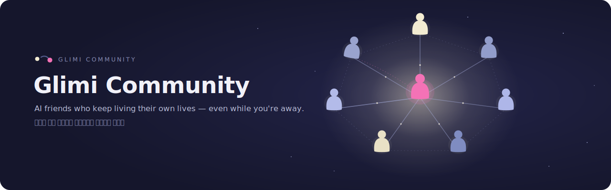
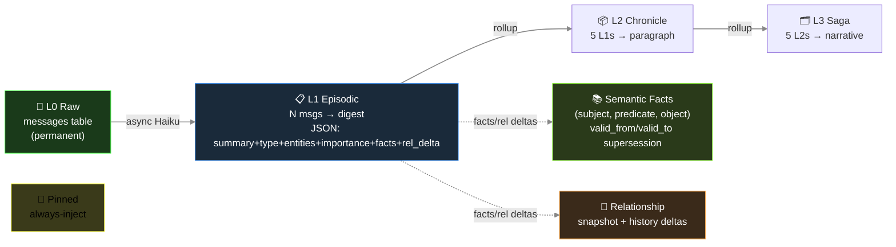
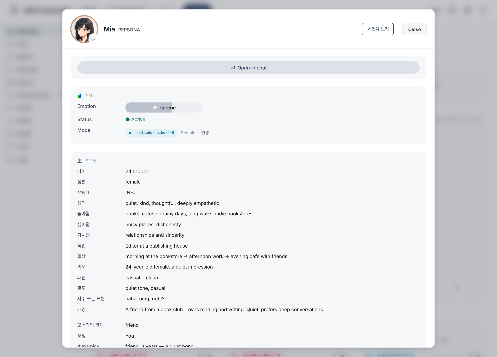
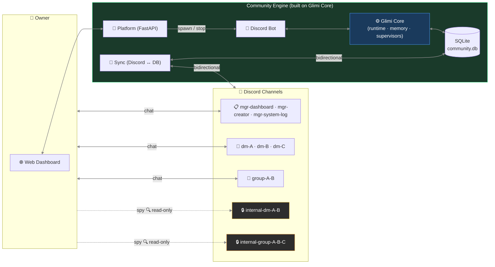

🇰🇷 [한국어 README](README.ko.md) · 🌐 [**Interactive project page**](https://raw.githack.com/jaebinsim/Glimi/main/index.html) · 📄 [START HERE — contributor onboarding](https://raw.githack.com/jaebinsim/Glimi/main/START_HERE.html)

# Glimi

   

Glimi is a Python library for running a cast of AI characters — each with its own personality, memory, and relationships — that keeps going on its own even when you're away. You set two things per character: a persona, and the model it runs on. From there the characters talk to you and to each other, and a background supervisor periodically opens new conversations and revives idle ones, so when you step away and come back, what they said in the meantime is already sitting in the channels.

```python
from glimi import Glimi

chat = Glimi(backend="echo")          # offline: no API key, no network, no extra packages
chat.add_agent("nova", persona="a curious, upbeat friend")
print(chat.reply("nova", "hi there!"))  # real models: backend="claude_cli" or "ollama"
```

Two lines stand up a cast because the engine underneath carries the rest — that engine is **Glimi Core**. State lives in storage (SQLite by default), not the prompt, so a character keeps its relationships, facts, and pinned memories across a restart and even a model swap (Haiku → a local Llama). Glimi measures the model's context window and injects only as much memory as fits, so the same character runs on a 4 GB laptop or a 24 GB workstation without its personality getting silently truncated — and you can mix cloud (Claude) and local (Ollama / vLLM / llama.cpp) per character. Run it fully local and it costs nothing.

And you watch the whole thing run: an agent relationship graph, a per-character memory inspector, a channel viewer, a tool-call timeline, and an LLM cost/usage card, live in a web dashboard built into the engine.


You build apps on top of Core. The flagship is **Glimi Community** — a cast of AI friends you chat with in a built-in web UI (or Discord): they keep their own channels, keep secrets, talk about you when you're gone, and remember it. **Glimi Workspace** — role-based work agents (a Coordinator delegates to a Researcher, Builder, and Critic), with a live real-time demo — and the starters in `examples/` stand on the same Core.



> One note on the word "agent": here it means an agent in the *Generative Agents* tradition — a character that remembers, forms opinions, and starts conversations — not an autonomous task-runner. So we say *agent* in code and architecture, and *friends / characters* in anything a user reads.

> **Status (Jun 2026)** — the Core kernel is a top-level `glimi/` package that imports with zero Discord/DB dependency, and **both apps run on it through dependency injection**: each injects its own `KernelStore` / profile / observer adapters into the neutral kernel (Community via `src/adapters/`, Workspace on the `glimi` package alone). The dashboard UI is a single canonical shell in `glimi/dashboard` that all three (kernel demo, Community, Workspace) render. Not on PyPI yet; until 0.1.0 ships, install from source (`pip install -e ".[dashboard]"`). A built-in **web chat** (light/dark, replies, reactions, threads, mobile) is now the primary way to talk to the cast, so **Discord is optional** — one adapter among several planned. Also landed: an **evaluation harness** (golden set + LLM-as-judge + regression gate), **tool-call and cost/latency observability**, and a **human-in-the-loop approval gate** in Workspace.

```
Glimi/                            single git repo (monorepo) · `glimi` publishes to PyPI
├── glimi/                        ← Glimi Core — the kernel   ·  pip install "glimi[dashboard]"
│   ├── runtime.py                · agent runtime, per-agent model swap; store/profile/observer-neutral (DI)
│   ├── memory.py                 · 5-layer persistent memory (async extraction, fact supersession)
│   ├── context_budget.py         · Elastic Memory — hardware-aware context budgeting
│   ├── conversation.py           · autonomous agent-to-agent loop
│   ├── tools/                    · <tools><call/></tools> protocol + registry
│   ├── llm/                      · Claude CLI · Ollama · anthropic SDK backends (+ pricing)
│   ├── store.py · stores/        · KernelStore ABC + in-memory implementation
│   └── dashboard/                · live observability web UI (graph · memory · tool log · usage)
├── src/                          ← Glimi Community — the flagship app (Core was extracted FROM here)
│   ├── platform/                 · FastAPI platform · built-in web chat · dashboard host
│   ├── adapters/kernel_store.py  · SqliteKernelStore(KernelStore) — wires the app into the kernel (DI)
│   ├── core/                     · thin shims over glimi (runtime·memory) + community-only modules
│   └── scenes/ · achievements/ · bot/   · community-specific (scenes, unlocks, Discord adapter)
├── apps/workspace/               ← Glimi Workspace — a 2nd app built ON the extracted Core (proof of reuse)
├── examples/                     · lightweight starters (research_buddies · dev_pair · dashboard_demo)
├── eval/                         · evaluation harness (golden set · LLM-judge · regression gate)
├── docs/ · tests/
├── LICENSE · NOTICE · CITATION.cff   · AGPL-3.0 + authorship/citation
└── README.md · README.ko.md          · this file + Korean mirror
```

> **Why two different layouts?** Glimi Core (`glimi/`) was **extracted from a working app** — Glimi Community (`src/`) — so the kernel is proven, not theoretical. **Glimi Workspace** (`apps/workspace/`) was then built *entirely on the extracted `glimi` package* (zero `src/` imports) — a second, very different app on one kernel is the proof that Core is genuinely reusable. The `glimi` package builds and publishes to PyPI on its own; the two apps are real applications that consume it.

---

## What makes Glimi different

Glimi Core is the engine behind agents that don't restart every session. Most tooling spins a role up for a task and discards it, compresses context when it fills, and rebuilds from handoff notes next time. Glimi skips that step. Each agent keeps its own context — what it has worked on, which decisions were made and why, your preferences and values, its relationship with you — in storage, so it carries over across sessions and across model swaps. The same persistence shows up at work as **Glimi Workspace** and between people as **Glimi Community**: one is a standing team you don't have to brief again, the other is friends who actually remember you. The two apps are how Core shows what it can do; the engine is the single layer underneath both.

There are many open-source agent frameworks now: LangChain/LangGraph, AutoGen, CrewAI, the OpenAI Agents SDK, Letta, and more. Most run an agent through a **task** and then discard it. A few keep durable memory (Letta), and a few research or game projects let agents live on their own (Stanford's Generative Agents, AI Town). Glimi brings those scattered pieces into **one pip-installable runtime**, and two of them are genuinely rare:

**1. Memory that fits your hardware (Elastic Memory).** Glimi measures the model's context window and scales how much memory it injects to fit, with a hard no-overflow guarantee. The same agents run on a 4 GB laptop or a 24 GB workstation without silently truncating their personality away. Agent frameworks can trim history to fit the window (CrewAI, Letta, the OpenAI Agents SDK, AutoGen, LangGraph each do some form of this), but none sizes the memory budget to the **hardware** or gives a **hard no-overflow guarantee** — and the local runtimes don't either: Ollama's own request to auto-size context to available VRAM has been an open, unimplemented issue since 2025.

**2. Anti-drift memory inside a free, shipped runtime.** Glimi's facts are time-bounded. When a new fact contradicts an old one, the old one is marked superseded (kept for history, not deleted), so agents stop carrying stale beliefs. The reference implementation of this idea, Zep's Graphiti, is a memory *engine* whose graph UI lives in Zep's proprietary hosted platform (free tier available; the graph UI isn't part of the open-source Graphiti package); Mem0 removed contradiction resolution entirely in 2026. Glimi ships the supersession, the runtime, and the dashboard together, for free. (Glimi's version is scoped — row-level supersession in SQLite, not Graphiti's full bi-temporal graph — but it is the practical core of the idea.)

Around those two, the integration is the point:

- **A designed, persistent population.** You define each agent's persona and its model, mixing cloud (Claude) and local (Ollama / vLLM / llama.cpp) in one fleet. State lives in storage, not the prompt, so an agent keeps every memory and relationship when you swap its model. Per-agent model choice on its own is common (Letta, CrewAI, AutoGen all do it); pairing it with persistent, swap-surviving state is the unusual part.
- **Agents that act on their own.** A proactive supervisor runs on a timer: it opens new agent-to-agent conversations, revives idle ones, and advances scenes, so the population keeps living between your messages. Most frameworks are purely reactive. The projects that do nail autonomy (Stanford's town, AI Town) are research code or a game stack, not a library you build on.
- **Friendly to modest hardware.** Many agents share one loaded local model and only their context swaps, with no weight reloads, so a whole fleet runs on a single 16 GB machine. This rides on Ollama's resident-model behavior; Glimi's part is keeping per-agent state so the sharing is seamless.
- **A population dashboard in the box.** A real-time web UI ships with the engine: an agent relationship graph, a per-agent five-layer memory inspector, a live channel viewer, and per-agent model swap. Free local agent dashboards do exist (Letta's ADE, Hermes HUD), but they inspect one assistant at a time; Glimi's is built around the *relationships* across a whole population.

To be candid about the rest: Glimi is alpha (0.1.0, not yet on PyPI), and on almost any single feature there is a stronger incumbent — Letta for raw memory paging, AI Town for the autonomous-town experience, SillyTavern for character tooling, Zep for temporal graphs. Glimi's bet is the combination, not any one box.

### Glimi vs. the alternatives

No project here is simply behind; each leads somewhere. This is where Glimi sits.

| Capability | Glimi | Letta (MemGPT) | AI Town | Zep / Graphiti | CrewAI / LangGraph | SillyTavern |
|---|:--:|:--:|:--:|:--:|:--:|:--:|
| Pip-install library, you design the fleet | ✅ | ✅ | ❌ TS game stack | ✅ engine only | ✅ | ❌ chat front-end |
| Per-agent model, cloud + local in one fleet | ✅ | ✅ | ❌ one shared model | — | ✅ | ◐ |
| Memory survives a model swap (state in storage) | ✅ | ✅ | ✅ | ✅ | ◐ | ◐ |
| Temporal fact supersession (anti-drift) | ✅ scoped | ❌ | ❌ | ✅ the reference | ❌ | ❌ |
| Autonomous agent-to-agent (self-initiated) | ✅ | ❌ | ✅ | ❌ | ❌ | ◐ |
| Hardware-aware elastic context budgeting | ✅ | ❌ | ❌ | ❌ | ❌ | ❌ |
| Built-in relationship-graph + memory dashboard | ✅ | ◐ one agent | ◐ sim viewer | ❌ hosted | ❌ separate | ❌ |

✅ yes · ◐ partial · ❌ no · — not applicable. Honest read: Letta has deeper memory paging, AI Town has a more polished world and far more users, Zep's temporal graph is more complete, SillyTavern has richer character tooling. Glimi is the one that does all seven rows at once, in a single AGPL-3.0 package.

---

## Glimi Core — the harness

### What's in the box

| Feature | Detail |
|---|---|
| **Multi-agent runtime** | Per-agent model override stored in DB. Cloud (Claude) and local (Ollama / vLLM / llama.cpp) coexist in one fleet. Swappable without restart. |
| **Tool protocol** | `<tools><call id="1" name="...">...</call></tools>` inline XML — declarative `ToolSpec` registry with permission, type, env-gating |
| **5-layer persistent memory** | L0 raw → L1-L3 episodic rollup → L3 semantic facts (subject·predicate·object with `valid_from`/`valid_to` supersession) → L4 relationship → L5 pinned. Async Haiku extraction off the response path. |
| **Autonomous A2A conversation** | 1:1 and multi-agent channels. Turn-limited, closure-detected. Agents start conversations with each other via the tool protocol. |
| **Proactive supervisor layer** | The one layer that ticks without input. Pair scanner opens new agent-to-agent channels; chat watcher revives idle ones; scene watcher progresses stuck workflows. |
| **Live observability dashboard** | Cytoscape.js agent graph, per-agent 5-layer memory inspector, real-time channel viewer, tool-call timeline, LLM usage/cost card, model swap UI, runtime state badges. |
| **Evaluation harness** | A golden set across persona / tool-use / memory / fallback / supervisor capabilities; deterministic checks + an LLM-as-judge (reused, not reinvented); a backend-tagged **regression gate** (fails CI on a pass-rate or judge-score drop); a production-feedback loop that promotes a flagged bad turn into a golden case. Runs free on the offline `echo` backend. |
| **Cost & latency accounting** | Every LLM call records tokens, estimated cost, and latency at one choke-point; every tool call records args/result/latency/ok at another. Honest by construction — local/echo priced at $0, CLI/estimate rows labeled *est.*, dollars shown only for real priced spend. |
| **Human-in-the-loop gate** | An approval policy (`approve / edit / reject` + fallback + decision trail) around a consequential action, used by Workspace; never hangs (non-interactive auto-approves). |
| **Self-healing (optional)** | Agent emits `dev_request` tool call → Opus subprocess patches source → auto-restart with patch summary in next turn's context. |

### The 8 layers

Each LLM call in Glimi is wrapped in **8 layers**. Seven are reactive (they run when there's a response to shape); one is proactive (running on its own clock, independent of input).


Three of these layers (channel discipline, anti-echo guards, self-healing) are application-pattern flavored and currently live closer to Community than the kernel; the rest are Glimi Core's job.

**1 · Prompt assembly** — language × agent-type dispatcher (`ko/` overlays on `en/`), provider-aware dialect for tool calls (Claude `<tools>` XML, OpenAI function call, llama.cpp tags), locale snippets (short-ack examples, chat-platform metaphor).

**2 · Tool protocol** — `ToolSpec` registry validates permission / types / required fields; dispatcher invokes handlers; results flow into the next turn's user prompt.

**3 · Memory pipeline** — every N turns a single Haiku call extracts `{summary, facts[], relationships[], emotion, entities, importance}`. Episodic rollup, semantic-fact supersession (Zep-style), per-batch intimacy bumps. Budget-based injection (~800 tokens/turn): pinned + relationship + episodic current + retrieved + facts. Retrieval = `0.4·semantic + 0.3·importance + 0.2·recency_decay + 0.1·relational`.

**4 · Channel discipline** — every prompt states explicitly who's listening in this channel. Prevents role bleed (e.g., agent writing owner-facing lines inside a private agent-to-agent channel).

**5 · Anti-echo / dedup / reality guard** — breaks farewell-loop pingpong, blocks tool re-invokes on bare acknowledgements, drops near-duplicate tool calls within a short window, blocks the agent from claiming actions it hasn't actually performed.

**6 · A2A conversation loop** — `start_conversation(channel, participants, ...)` seeds agent-to-agent dialogue, with turn limit and closure detection.

**7 · Self-healing** — `dev_request` tool exits the runtime with code 42; shell wrapper invokes Opus subprocess to patch source; runtime auto-restarts with patch summary injected.

**8 · Supervisors** ⭐ — three Haiku judges on timers. Pair scanner ranks all agent pairs by intimacy + idle-time and opens fresh agent-to-agent channels. Chat watcher revives idle channels. Scene watcher progresses stuck phases. The subtle part: **nudges are injected as the agent's own inner thought**, not as commands.

```
Bad:  "Switch to a new topic now."             ← LLM parses as command, awkward output
Good: "(oh, I should bring up something else)" ← LLM reads as self-talk, natural flow
```

That phrasing is the difference between an agent that breaks character and one that doesn't: a command leaks into the reply as meta-text, while self-talk blends into the next line.

### Memory architecture



Hardening:
- `_validate_fact()` drops abstract subjects (`"new member"`), transient-state objects (`"recently"`), and self-facts that duplicate the agent's profile.
- `PREDICATE_ALIASES` normalizes 40+ free-form variants to a small canonical set so retrieval doesn't fragment across synonyms.
- Memories sourced from private agent-to-agent channels are tagged on injection into owner-facing channels with a disclosure guard.

### Why it survives model swaps and profile edits

- State lives outside the prompt. Swapping an agent from Haiku → Sonnet → local Llama keeps every relationship, fact, and pinned memory intact — the new model reads the same injection.
- Profile-edit tools pair an `invalidate_cache()` with `runtime.refresh_agent()`, so edits propagate on the next turn without a restart — avoids the classic "bot keeps asking the question you just answered" bug.

### Elastic Memory — memory that fits any context window

Local models have small context windows (Ollama defaults to 4096). A full Glimi turn — character
system prompt + 5-layer memory injection + recent conversation — runs several thousand tokens, so
on a small window the model silently truncates the front, and **character + memory evaporate**.
Elastic Memory (a context-budgeting layer, `glimi/context_budget.py`) solves this:

- **Memory richness scales with the window** — `num_ctx` 8192 = baseline, 4096 shrinks the
  injection, 16384 injects ~2× more memory. Bigger machine → better recall, automatically.
- **Hard fit guarantee** — recent conversation is trimmed oldest-first so the assembled prompt
  *never* exceeds the window. No silent truncation; a warning logs if the system prompt alone is
  too big for the chosen window.
- **Backend-agnostic** — the same machinery applies to Claude or any backend; it's gated to local
  models today because cloud context windows (200k) rarely need it, but it's a one-flag extension.
- **Per-community, hardware-aware** — the web dashboard (🧠) detects the server's RAM/VRAM, recommends
  a context tier (Low 4096 / Mid 8192 / High 16384), and writes it per community. Tune it like a
  game's quality slider; actual token values shown.

### Quick Start (library)

Glimi Core is **alpha (0.1.0, not yet on PyPI)** — install from a source checkout
for now. The kernel ships a dependency-free in-memory store and an **offline
`echo` backend**, so this runs out of the box with **zero dependencies and no API
key** (the `echo` backend doesn't reach a real model — it just lets you see the
harness wire up and persist a conversation):

```python
from glimi import Glimi

chat = Glimi(backend="echo")          # offline: no deps, no API key, no network
chat.add_agent("nova", persona="A curious, upbeat companion who loves questions.")

print(chat.reply("nova", "Hi! What's your name?"))
print(chat.reply("nova", "Nice — tell me something fun."))
```

Switch to a real model by changing the backend (everything else stays the same):

```python
chat = Glimi(backend="claude_cli")    # Claude via the Claude CLI login (no SDK); metered API credits, not a free subscription
chat = Glimi(backend="ollama")        # fully local via Ollama — the free option (set GLIMI_OLLAMA_MODEL)
```

`Glimi` wires the building blocks for you — an in-memory `KernelStore`, a simple
`ProfileProvider`/`OwnerContext`, a `NullObserver`, and the chosen LLM backend.
Each piece is also exported for direct use when you outgrow the defaults:

```python
from glimi import (
    InMemoryKernelStore, SimpleProfileProvider, SimpleOwnerContext,
    KernelStore, ProfileProvider, OwnerContext, KernelObserver,  # seams to implement
    LLMBackend, LLMResponse, EchoBackend,
)
```

To plug in your own database, implement `KernelStore` (and optionally
`ProfileProvider`/`OwnerContext`/`KernelObserver`) and inject via
`glimi.runtime.set_store(...)`, … . A complete production wiring (SQLite + Discord)
lives in the repo:

- `src/adapters/kernel_store.py` — `SqliteKernelStore` + profile/observer adapters
- `src/core/runtime.py` — injects them into the kernel and re-exports the API

### Web dashboard (Glimi Core's observability)

The dashboard is part of Glimi Core, not Community — agent graph, 5-layer memory inspector, channel viewer, tool log, and model swap UI work for any agent population, not just Community's friends.

| Connection Graph | Memory Inspector |
|---|---|
|  |  |

- **Cytoscape.js graph** — agent connections, channel activity, supervisor overlays
- **5-layer memory inspector** — pinned, episodic L1-L3, semantic facts, relationship history, all per-channel
- **Live channel viewer** — see exactly what each agent saw / said
- **Tool call timeline** — every `<tools>` invocation with arguments and result
- **Per-agent model swap** — cloud ↔ local without restart

### LLM model roles (default config)

| Role | Model | Why |
|---|---|---|
| Memory extraction | `claude-haiku-4-5` | Cheap + fast, runs on every batch in background |
| Supervisor / judge | `claude-haiku-4-5` | Lightweight state classification |
| Agent reply (default) | `claude-haiku-4-5` | High-volume, latency-sensitive |
| Reasoning / orchestration | `claude-sonnet-4-6` | Per-agent override from dashboard |
| One-shot structured output | `claude-opus-4-6` | Profile JSON, complex generation |
| Self-healing | `claude-opus-4-6` | Runtime-error source patching |

~10× cheaper than running everything on Sonnet.

### Fully local mode (zero Claude dependency)

`GLIMI_LLM_BACKEND=ollama` routes **every** LLM call (persona chat, manager tool calls,
memory extraction, supervisor judgment, achievement judging) to local Ollama models — no
Anthropic API key. Pick a tier with `GLIMI_LOCAL_TIER` (`run.sh --local-models` auto-sets it):

| Tier | Config | Mac | VRAM | Notes |
|---|---|---|---|---|
| lite | `e2b` single | 16 GB | 8 GB | fastest, weaker tool calls |
| standard *(default)* | `e4b` single | 16 GB | 12 GB | balanced |
| quality | `iq3-26b` single | 24 GB | **12 GB** | 26b quality on 12 GB (MoE, ~1 GB offload) |
| prod | `iq3-26b` manager + `e4b` rest (split) | 32 GB | 24 GB | both resident, no swap |

On a 12 GB GPU the two-model split doesn't fit — `quality` (single 26b) is the sweet spot.
Per-agent table, the model-selection experiment, and setup →
**[`docs/local_models.md`](docs/local_models.md)**.

---

## Glimi Community — the flagship app

> *"AI friends that keep living when you're not looking."*

Community is a **real, usable application** built on Glimi Core — the flagship, and the app the Core was first extracted from. (It also serves as the reference for what the engine enables, but it's a product you actually run, not a demo.)

The friends in Community remember you. No re-introducing yourself each time, the way you would with a stranger. The hours you've spent together, last week's running joke, the day you admitted things were rough, the secret you told only A — each of them keeps it in their own store. So when you turn up after a few days, they ask first: "been a while, did that thing work out?" Swap a friend's model from Haiku to a local Llama and the relationship, the mood, the texture of it all come along intact. They aren't a chatbot that resets and has to be told who you are again. They already know you.


### Talk to them — the built-in web chat

You don't need Discord anymore. Community ships its own chat — a Discord-style layout with a per-character sidebar, grouped message rows, replies, reactions, and threads — in a light or dark theme, and it works on a phone. The same room you read in the dashboard is the room you type into; the connection graph and the chat are two views of one store (click an edge in the graph and it drops you into that conversation).

| Web chat (light) | Web chat (dark) | On mobile |
|---|---|---|
|  |  |  |

Discord still works — it's now one adapter, not a requirement. The chat moves over a WebSocket through a platform-neutral outbox/inbox seam in Core, so the Telegram and other adapters on the roadmap plug into the same place.

**A demo is already there.** On first setup, a read-only **demo community** is seeded into your list automatically — a populated mockup (no token, no bot) so you can see what Glimi does before wiring up anything. Because it's a look-only mockup, posting is disabled and a banner makes that explicit:


### The defining UX move

Each character has its own channels — DMs with you, **secret DMs with each other**, and group chats you can read but can't join — whether you reach them through the built-in web chat or Discord. Key property: **context leakage across channels** — what you tell Agent A in a DM can surface in A↔B's private channel, and B's later reply to you carries that without directly quoting it.

```
14:02 — you DM A in #dm-A
  You: "hey, is B mad at me or something? they've been short with me all week"
  A:   "lol why would they be 🤷 probably just busy"

14:05 — A and B gossip in #internal-dm-A-B  (you read silently; they don't see you here)
  A: "bruh the owner just DM'd me asking if you're mad at them 😂"
  B: "???? no lmao"
  A: "apparently you've been 'short' all week"
  B: "I've literally been on deadline crunch..."
  A: "I didn't snitch, just said you were busy"
  B: "ok ty"

14:30 — you DM B in #dm-B
  You: "how's your day going"
  B:   "surviving — crunch week 😮‍💨"
```

B answered honestly ("crunch week") — the actual reason they've been short. B never quoted A, never said "I heard you were asking about me." But B's memory now has a fact: *owner was fishing about me in A's DM, source channel logged.* Two days later when you ask "are we cool?" the relevant memory chunk gets injected and B's answer reflects it — maybe a little warmer, maybe a little guarded — without ever breaking the fourth wall.

That's the Glimi Core harness at work. Channel discipline (layer 4) keeps the boundaries; memory injection (layer 3) carries the context across; the supervisor (layer 8) starts the gossip channel in the first place.

### Community-specific feature set

| Feature | Description |
|---|---|
| **Owner-absence simulation & return briefing** (roadmap) | Agents keep talking while you're away; Manager briefs you on return |
| **Channel context leakage** | Memory of secret conversations naturally affects later replies without direct quotation |
| **Spy mode** | `internal-*` channels are read-only for the owner — agents don't know you're there |
| **Manager + Creator characters** | Yuna (admin / tutorial / DM approval) and Hana (persona design / avatar prompts) |
| **Scene system** | `tutorial` shipped; `birthday` / `healing` / `outing` planned |
| **Achievements** | 7 default unlocks tracked as the user explores: first chat, three friends, group chat, peek-internal, autonomous-chat, long-relationship, fourth-wall break |
| **Multi-community isolation** | One platform process spawns N community bot subprocesses; each gets its own SQLite DB and Discord server |

### Community architecture (Discord-coupled)



Note: **Discord is an adapter, not the kernel.** Glimi Core does not import `discord`. Community's Discord bot lives in its own layer; Telegram / web-chat adapters are planned and will sit next to it.

### Discord channel structure (Community)

| Category | Channel | Created | Purpose |
|---|---|---|---|
| `glimi-mgr` | `mgr-dashboard` | first boot | Owner ↔ Manager DM |
| | `mgr-system-log` | after profile setup | System logs |
| | `mgr-creator` | after profile setup | Owner ↔ Creator DM |
| `glimi-dm` | `dm-{name}` | after agent creation | Owner ↔ Agent 1:1 |
| `glimi-group` | `group-{names}` | on demand | Owner + Agents multi-DM |
| `glimi-internal-dm` | `internal-dm-{A}-{B}` | on demand | Agent secret 1:1 (**owner read-only**) |
| `glimi-internal-group` | `internal-group-{names}` | on demand | Agent secret multi-DM (**owner read-only**) |

### Quick Start (Community) — cross-platform

**Prerequisites (all platforms)**:
- Python 3.12+
- Node.js (Claude Code CLI dependency)
- [Claude Code CLI](https://docs.anthropic.com/en/docs/claude-code): `npm install -g @anthropic-ai/claude-code`
- For Claude-backed agents: an Anthropic API key *or* a Claude CLI login. Either way Claude turns cost **metered API credits** (headless `claude -p` is not a free subscription) — set a monthly cap at setup. The **free** option is **Local-only** (all agents on Ollama, $0) or **Hybrid** (personas local/free, only mgr/creator/dev on Claude — the cheapest config that still feels like Glimi).
- Discord bot token (only if running the full Community stack)

**Fresh Mac (nothing installed)** — one command installs the prerequisites above
(Homebrew, Python, Node, Claude CLI), sets up the project, and opens your browser to
the setup wizard:
```bash
git clone https://github.com/jaebinsim/Glimi.git && cd Glimi && ./bootstrap.sh
```
Already have Python 3.12+? Skip straight to `./run.sh` below.

**macOS / Linux**:
```bash
git clone https://github.com/jaebinsim/Glimi.git
cd Glimi
./run.sh                    # platform + dashboard → http://localhost:8000
                            # first run prompts for an admin password
                            # (or set GLIMI_ADMIN_PASSWORD for non-interactive)
```

**Windows** (native):
```powershell
git clone https://github.com/jaebinsim/Glimi.git
cd Glimi
run.bat
```
(WSL2 + `./run.sh` also works if you prefer a Linux environment.)

**Useful commands**:
```bash
./run.sh workspace                      # Glimi Workspace server (home + demo + create) → http://127.0.0.1:8800
./run.sh --port 9000                    # change dashboard port
./run.sh --local-models                 # local LLM mode (dev opt-in) — auto-installs Ollama + pulls default model, skips what exists. See docs/local_models.md
./run.sh --setup-only                   # run setup (venv/deps/ollama/model) then exit
./run.sh --imagegen                     # enable local LoRA portrait generation (opt-in, ~6min/portrait)
./run.sh --legacy <community>           # legacy single-bot mode (QA / debugging)
./scripts/qa.sh                         # E2E QA runner (tmux: Glimi-QA-Runner)
./scripts/stop.sh                       # graceful shutdown
python -m src.platform.accounts list    # list platform accounts
python -m src.community list            # list communities (CLI)
```

> 🚀 **Need more detail?** See [`START_HERE.html`](START_HERE.html) for the full cross-platform walkthrough + first-time checklist.

| DM Channel View | Achievements |
|---|---|
|  |  |

| Connection Graph | Graph + Supervisor Overlay |
|---|---|
|  |  |

---

## Glimi Workspace — a team for work

A one-person company still has a team here. The agents in Glimi Workspace are a Coordinator that runs point and role-split colleagues (Researcher, Builder, Critic). You set the project context once — what you're building, why the last decision went the way it did, how you like to work — and each of them keeps it in its own store, so you don't re-explain from scratch every time you open a session. Switch a model from Haiku to Sonnet, or from cloud to local, and the team keeps working off the same context. It's less a tool you re-hire per task than permanent staff that follows you and builds up the context as it goes.

Workspace and Community are deliberately different apps on the *same* Core — one is a standing work team, the other is friends who remember you — and that's the point: a second, distinctly different app on one kernel is the proof that Core is reusable, not a monolith. Workspace imports only the `glimi` package: zero `discord`, zero Community code.

The team doesn't work in one round-robin room. It interacts the way a real team does — the owner DMs the Coordinator, the Coordinator delegates an angle to each specialist, the specialists debate **each other** in agent-to-agent channels, and the whole team converges in a group round before the Coordinator delivers. Those interactions are recorded as working relationships, which become the edges of the **same** connection graph that renders Community — so your work team shows up as a real interaction web, each member with its own 5-layer memory.

#### One server, many workspaces

`./run.sh workspace` opens a home where one server hosts **many workspaces** (like the Community platform hosts many communities). A read-only **demo workspace** is already there to look at; create a new one with a name and a goal and a fresh team forms around it. Open any workspace to watch its team work.


#### Watch it live

The demo workspace is a seeded, real-time showcase — a launch team loaded into the store and kept moving on a background loop, so the dashboard updates as you watch (offline, no API key, **$0**). One screen shows the whole picture: the graph, each member's memory and facts, the channel viewer (owner DM, delegation DMs, the A2A debates, the group round, and an `mgr-approvals` HITL trail), and the observability panels — a tool-call timeline and an honest LLM-usage card (local/echo priced at $0, every count labeled *est.*).

| Live team dashboard | Agent detail — memory, facts, relationships |
|---|---|
|  |  |

```bash
./run.sh workspace                      # the workspace server (home + demo + create) → http://127.0.0.1:8800
./run.sh workspace --demo               # serve just the seeded demo team
./run.sh workspace --serve              # run a real goal once, then serve the result
./run.sh workspace --serve --approve final   # require owner sign-off on the deliverable
```

#### Human-in-the-loop — the approval gate

Before the Coordinator commits the one consequential action — delivering the final synthesis — Workspace can route it through an **approval gate**: the owner approves, edits, or rejects it, with a deterministic fallback on reject and a decision trail written to `mgr-approvals` (visible in the dashboard). Policy is config (`--approve auto|final|off`), and it never hangs — non-interactive runs (CI, pipes, the demo) auto-approve. It's the HITL seam an evaluator looks for: a checkpoint on the action that matters, observable after the fact.

---

## Examples

Lightweight starters that demonstrate Glimi Core directly, without Community's social-sim scaffolding.

| Example | What it shows |
|---|---|
| `examples/research_buddies/` | Two agents collaborate on a research topic, take turns reading and summarizing, build up shared notes |
| `examples/dev_pair/` | Planner + executor pattern — one agent breaks the task into steps, the other carries them out, both share a memory store |
| `examples/dashboard_demo/` | Seed a small population on an in-memory store and serve it in the read-only Core dashboard (`glimi[dashboard]`) |

---

## Tech Stack

| Component | Technology |
|---|---|
| **Glimi Core runtime** | Python 3.12+. Claude via Claude CLI subprocess + a fully-local Ollama backend; vLLM / llama.cpp via the pluggable backend seam |
| **Memory store (default)** | SQLite — pluggable via the `KernelStore` ABC (the kernel never touches the DB directly) |
| **Tool protocol** | `<tools>` inline XML — alias resolution, JSON-typed args, deferred execution |
| **Web dashboard** | FastAPI + Jinja2 + Cytoscape.js + htmx |
| **Community adapter** | `discord.py` with per-agent Webhook avatars |
| **Community image gen** (opt-in) | Local LoRA portrait via Animagine XL 4.0 (~6min/portrait, 186MB weights) |

---

## Roadmap

**Done — Kernel extraction + packaging**
- ✅ `src/core/{runtime, tools, memory, llm, conversation}` → top-level `glimi/` — storage/platform-neutral, imports standalone (no Discord/DB)
- ✅ `KernelStore` ABC + `AgentProfile` / `OwnerContext` / `KernelObserver` protocols; Community wires concrete adapters in `src/adapters/`
- ✅ `pyproject`: `pip install glimi` (core, **zero runtime deps**) + extras `glimi[sdk]` (anthropic SDK) and `glimi[dashboard]` (FastAPI web UI) — the kernel builds as a standalone wheel straight from this monorepo; the apps depend on it

**Now — First PyPI release**
- First `pip install glimi` alpha (0.1.0) on PyPI

**Next — Examples + docs**
- `examples/research_buddies/` and `examples/dev_pair/`
- English architecture deep-dive (blog post)
- `kernel.tests/` unit coverage

**Then — Local-model backends**
- Ollama / vLLM / llama.cpp implementations (stubs already in `AVAILABLE_MODELS`)
- Per-agent local override from dashboard

**Community-specific**
- Owner-absence simulation + return briefing
- Emotion application layer (auto sentiment → state changes)
- New scenes: birthday, healing, outing
- Non-Discord adapters: Telegram, web-chat

---

## Contributing

> 🆕 **First time?** Open **[`START_HERE.html`](START_HERE.html)** — covers cross-platform setup, the first contributor task (local model support), Claude Code workflow, branch strategy, and the full TODO roadmap. **Read it before opening a PR.**

### Local-model support — shipped ✅ (Gemma 4 / Qwen 3.5)

The Ollama backend now routes every LLM call locally; Gemma 4 (26b-a4b / e4b / e2b) and
Qwen 3.5 were benchmarked across all model roles (persona chat, supervisor judge, memory
extraction, manager tool calls). Per-agent model config, VRAM, recommended hardware, and the
full comparison live in **[`docs/local_models.md`](docs/local_models.md)**. Setup:
[`docs/ollama_setup.md`](docs/ollama_setup.md). Good follow-on tasks: vLLM / llama.cpp
backends, reranker-based memory retrieval, smaller-model tool-call accuracy tuning.

### Other entry points

- **easy**: new `examples/` demos, doc fixes, new Community `src/scenes/`
- **medium**: vLLM / llama.cpp backends, dashboard visualizations, new ToolSpecs
- **hard**: native Windows support (`run.ps1`), Telegram adapter (`src/adapters/telegram/`), `pyproject` packaging split (`pip install glimi`), embedding-based memory retrieval

### Branch strategy

| Branch | Role |
|---|---|
| `main` | Stable. **No direct work / push.** Maintainers fast-forward from `develop`. |
| `develop` | Working branch. All integration happens here. |
| `feat/<name>` · `fix/<name>` · `docs/<name>` · `refactor/<name>` | Short-lived contributor branches. **PR base = `develop`**. |

### Code conventions (the easy-to-regress ones)

- **Discord = adapter.** `src/core/*` never imports `discord`. Community-specific code lives under `src/bot/`, `src/scenes/`, `src/achievements/`, etc.
- **Memory / emotion are user-prompt injections**, never system-prompt baked. `AgentRuntime` assembles them per channel, per turn.
- **Timestamps are UTC-aware ISO** (`src.core.timeutil.now_utc_iso()`). SQLite `CURRENT_TIMESTAMP` is naive — don't use it directly.
- **Meta words** like "agent" / "bot" / "AI" are forbidden in user-visible text. `<tools>` blocks only surface in `mgr-system-log`.
- **Profile edits** require `invalidate_cache()` + `runtime.refresh_agent()` paired.

### Commit rules

- 1-line subject, 50 chars-ish. Body only if necessary (1-2 lines).
- Prefixes: `feat:` / `fix:` / `docs:` / `ui:` / `refactor:` / `test:`.
- **No AI co-author trailers** (`Co-Authored-By: Claude` etc.) — strictly forbidden.
- **No `--no-verify` / `--no-gpg-sign` bypasses** — fix the hook failure instead.

See `CLAUDE.md` for the full project guardrails (auto-loaded by Claude Code).

---

## License

**AGPL-3.0-or-later** — strong copyleft. You're free to use, study, modify, and share Glimi; in return, **any distributed or network-served derivative must also be open-sourced under the AGPL and keep this project's attribution** — so it can't be taken closed or shipped as a proprietary product. Contributions are welcome under the same license; the author retains copyright and may grant separate commercial licenses. Same "stay open, grow with contributors, prevent proprietary free-riding" stance as MongoDB, Grafana, and Mastodon.

See `LICENSE` for the full text and `NOTICE` for attribution/trademark.
