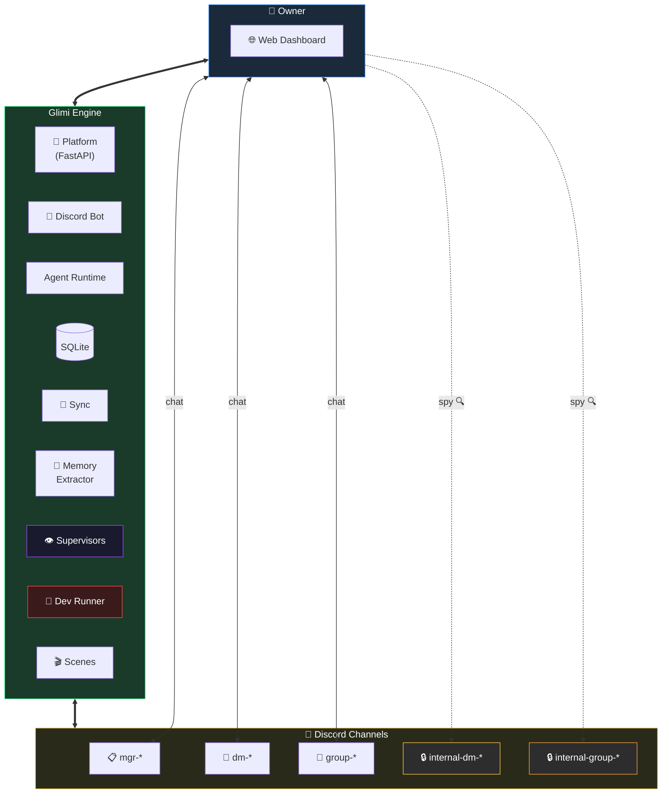
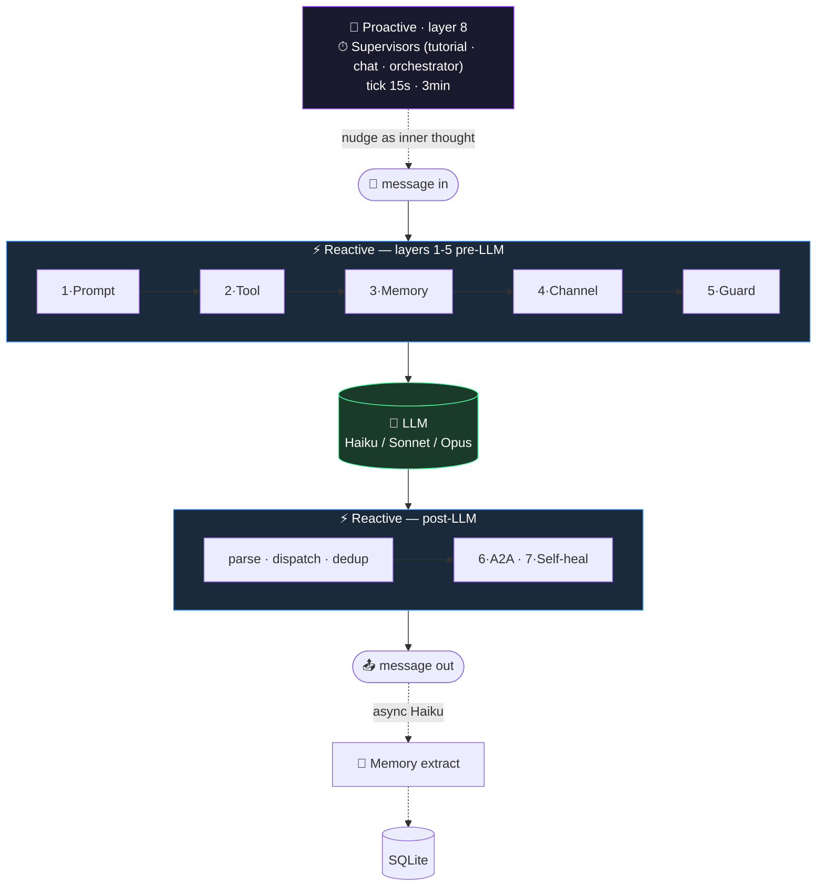
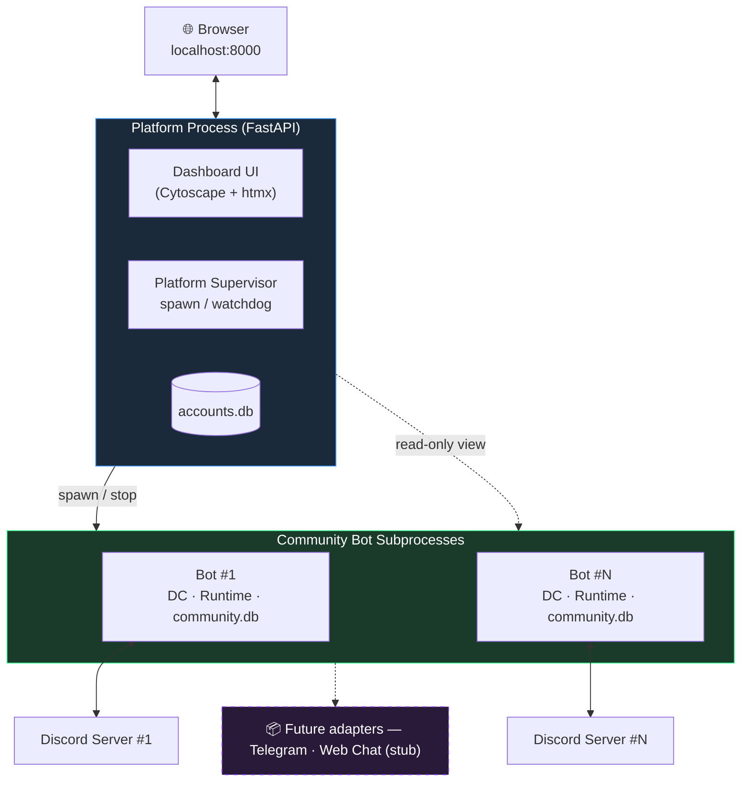
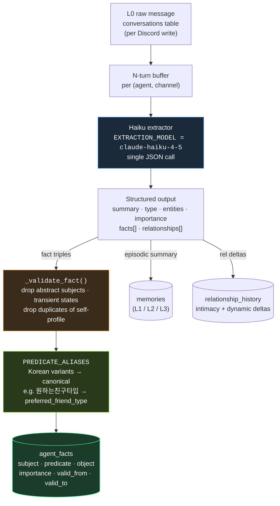
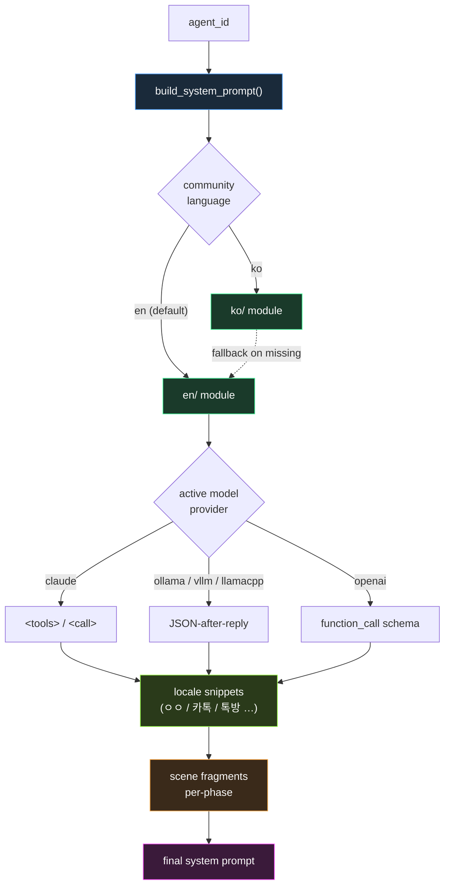

🇰🇷 [한국어 README](README.ko.md)

# Project Glimi

> **A community of AI friends that keeps living even when the owner is away — and tells you what happened when you come back.**

Each agent has a unique personality, speech pattern, emotion state, and memory. They don't just reply to you — they **talk to each other behind your back**, form opinions, gossip, and evolve relationships autonomously. You can spy on their private conversations in read-only channels, but they will never directly tell you what they said.

### System at a glance

Three axes — **Owner / Engine / Discord channels** — give a complete picture of how Glimi works. The Owner talks to the Engine via the web dashboard; the Engine drives Discord; agents in Discord feed back into the Engine's memory store.



- **Solid arrows** = live two-way chat / sync. **Dotted arrows** = passive or asynchronous — spy peeks, supervisor nudges, background memory work.
- **Owner → `internal-*` (dotted spy)** is the defining UX move: the owner *reads* gossip channels but never appears as a participant, so the conversations stay in-character.
- **One Platform, many bots**: each community is its own subprocess with its own `community.db` and Discord server.
- **Memory extraction is off the response path** — personas reply instantly; Haiku summarizes / pulls facts / bumps intimacy in the background.
- **Three supervisors** (`tutorial` · `chat` · `orchestrator`) live invisibly behind the UI; their nudges are emitted as the agent's own thoughts, not as announcements.


> Screenshots / GIFs placeholder — drop new captures under `docs/screenshots/`.

---

## Quick Start

```bash
git clone https://github.com/jaebinsim/Glimi.git
cd Glimi

./run.sh                    # platform + dashboard → http://localhost:8000
./scripts/qa.sh             # E2E QA runner (tmux session: Glimi-QA-Runner)
./scripts/stop.sh           # graceful shutdown (platform + all community bots)
```

**Requirements**: Python 3.12+, Node.js, [Claude Code CLI](https://docs.anthropic.com/en/docs/claude-code) (`npm install -g @anthropic-ai/claude-code`).
Default login: `admin / rmfflal` or `test / 0000`.

```bash
./run.sh --port 9000                    # change dashboard port
./run.sh --legacy <community>           # legacy single-bot mode (QA / debugging)
python -m src.platform.accounts list    # list platform accounts
python -m src.community list            # list communities (CLI)
```

---

## What Makes This Different

Most AI chatbots are 1:1 — you ask, it replies. Multi-agent frameworks pipe tasks through a graph. **Glimi is neither.**

Agents live inside a Discord server as real members. They have DMs with you, **secret DMs with each other**, and group chats you can't participate in but can read. Key property: **context leakage across channels** — what you tell Agent A in a DM can surface in A↔B's private channel, and B's later reply to you carries that without directly quoting it.

Minimum viable scenario:
- You ask A (in `dm-A`) if B seems off lately.
- A and B gossip in `internal-dm-A-B` (you can silently read this; they don't know).
- Later you DM B — B answers honestly, without quoting A, but their memory *knows* you were fishing. Two days later when you ask B something related, the relevant memory chunk gets injected and colors the reply.

Full narrative walkthrough of this scenario: [`docs/blog/harness-engineering.ko.md`](docs/blog/harness-engineering.ko.md) (Korean).

### Feature Highlights

| Feature | Description |
|---|---|
| **Owner-absence simulation & return briefing** (Phase 1 roadmap) | Agents keep talking while you're away; Manager briefs you on return |
| **5-layer memory system** | L0 raw → L1-L3 episodic rollup → L3 semantic facts → L4 relationship → L5 pinned; async Haiku extract |
| **Autonomous agent-to-agent chat** | 1:1 and multi-DM started via `<tools>` protocol + orchestrator supervisor |
| **Autonomous intimacy / emotion evolution** | L1 extraction bumps partner intimacy; relationship deltas apply to state; emotion updates per batch |
| **Fourth-wall `meta_breach` achievement** | Agents occasionally sense they're in a simulation — logged as a rare unlock |
| **Scene system** | `tutorial` shipped; `birthday` / `healing` / `outing` planned with shared scaffold |
| **Model dialect** | Provider-aware prompt helpers for Claude / Ollama / vLLM / llama.cpp |
| **Real-time dashboard** | Cytoscape.js graph, per-agent 5-layer memory inspector, live channel viewer |
| **Self-healing** | Runtime error → Opus Dev Runner patches source → auto-restart |

---

## Harness Engineering

LLMs are request-response. Each call is wrapped in **7 reactive layers** (running per response) and **1 proactive layer** (Supervisors on timers) that lets the community keep going without owner input.



| # | Layer | Files | Trigger |
|---|---|---|---|
| 1 | Prompt assembly — locale · model dialect · scene · memory budget | `src/core/prompts/` (~610 LOC) | per call |
| 2 | Tool protocol — `<tools>` XML · validator · dispatcher | `src/core/tools/` (~559 LOC) | per call |
| 3 | Memory pipeline — L0~L5 · PREDICATE_ALIASES · budget inject · auto intimacy / emotion | `src/core/memory.py` (~1638 LOC) | per call + async |
| 4 | Channel discipline — audience model · role-bleed guard | `src/core/runtime.py` + `mgr.py` rules 13-14 | per call |
| 5 | Anti-echo / dedup / reality guard | `mgr.py` rules 11/11-a · `persona.py` | per call |
| 6 | A2A conversation loop — `start_conversation` · auto channel · turn limit | `src/core/conversation.py` | tool-triggered |
| 7 | Self-healing — `dev_request` → Opus patch → auto-restart | `src/tools/dev_runner.py` (~137 LOC) | on error |
| **8** | **Supervisors** ⭐ — only proactive layer; nudges injected as agent's inner thought | `src/supervisors/` + `src/scenes/*/supervisor.py` (~838 LOC) | **timer** |

Long-form writeup (problem framing · A/B/C scenario walkthrough · layer internals · design trade-offs): [`docs/blog/harness-engineering.ko.md`](docs/blog/harness-engineering.ko.md) (Korean).

---

## Architecture

### A. System Overview — one platform, many community bots



Core principle: **Discord is an adapter**. `src/core/*` never imports `discord`. `src/bot/` is the current Discord exit; `src/adapters/telegram/` and `src/adapters/web_chat/` will drop in next to it.

### B. Agent Runtime & Memory


**Extraction**: after every response, `(agent, channel, batch)` is enqueued to a background Haiku worker. A single call returns JSON: `{summary, type, entities, importance, facts[], relationships[]}` — episodic summary → `memories`, semantic facts → `agent_facts` (Zep-style supersession), relationship deltas → `relationship_history`. Main thread never blocks on summarization.

**Injection (~800-token budget per turn)**: Pinned 400c + Relationship 200c + Episodic-current 700c + Episodic-retrieved 400c + Semantic Facts 400c. Retrieval scoring = `0.4·semantic + 0.3·importance + 0.2·recency_decay + 0.1·relational`.

#### Extraction pipeline (end-to-end)



Key hardening in recent passes:
- **`_validate_fact()`** (`src/core/memory.py`) drops facts whose subject is abstract (`"새_멤버"`, `"이 커뮤니티"`), not a registered real person, or whose object is just a transient state (`"오랜만"`, `"지금"`). It also skips self-facts that merely duplicate the agent's own profile.
- **`PREDICATE_ALIASES`** (`src/core/memory.py`) maps 40+ free-form Korean predicate phrasings to a small canonical set (`preferred_friend_type`, `preferred_mood`, `hobby`, `personality`, …) so retrieval never fragments across synonyms.
- **`scripts/cleanup_memory.py`** is a one-shot janitor that invalidates legacy junk facts and re-normalizes predicates in place (dry-run default, `--apply` to commit).

#### 5-layer roles at a glance

| Layer | Table | What lives there |
|-------|-------|------------------|
| L0 raw | `conversations` | Every Discord message, verbatim — permanent audit log |
| L1 episodic digest | `memories` (level=1) | N-turn summary + entities + importance, written by Haiku |
| L2 chronicle | `memories` (level=2) | 5 × L1 → paragraph (daily-ish rollup) |
| L3 saga | `memories` (level=3) | 5 × L2 → weekly/monthly narrative anchored on scenes |
| Semantic facts | `agent_facts` | `(subject, predicate, object)` triples with `valid_from/valid_to` supersession |
| Pinned | `memories.is_pinned=1` | Always-inject memories (owner-pinned or auto-pinned by importance) |
| Relationship | `relationships` + `relationship_history` | Intimacy / dynamic / nickname snapshot + timeline of inflection points |

#### LLM model roles

| Role | Model | Why |
|------|-------|-----|
| Memory extraction | `claude-haiku-4-5` | Cheap + fast — runs on every N-turn batch in a background worker |
| Supervisor / judge | `claude-haiku-4-5` | Lightweight scene / channel state classification |
| Persona reply (default) | `claude-haiku-4-5` | High-volume, latency-sensitive chat — per-agent override to Sonnet from the dashboard |
| Manager (Yuna) / Creator (Hana) reply | `claude-sonnet-4-6` | Longer reasoning, tool orchestration |
| Creator profile JSON | `claude-opus-4-6` | One-shot structured persona generation |
| Dev Runner self-healing | `claude-opus-4-6` | Source patching from runtime errors |
| *Planned* | Ollama / vLLM / llama.cpp | `AVAILABLE_MODELS` already has commented stubs (`src/core/runtime.py`) |

#### Why it survives model swaps and profile edits

- Memory lives in SQLite, not the prompt. Switching an agent's model from Haiku to Sonnet (or later to a local model) keeps every relationship, fact, and pinned memory intact — the new model just reads the same injection.
- **`update_profile`** tool calls pair an `invalidate_cache()` with `runtime.refresh_agent()`, so a profile edit propagates on the next turn without a restart — avoids the classic "bot keeps asking the question you just answered" bug.
- Memories sourced from `internal-*` are tagged on injection into owner-facing channels ("shared privately, don't volunteer this unless asked"). If the agent still discloses, a fresh memory is written with `owner` added to `knows` so it never re-triggers the disclosure guard.

**Pointers**: `src/core/memory.py` (extraction entry, `_validate_fact`, `PREDICATE_ALIASES`), `src/core/runtime.py` (`AGENT_MODELS`, `AVAILABLE_MODELS`, `_resolve_agent_model`), `scripts/cleanup_memory.py` (one-shot janitor).

### C. Prompt Build Flow — i18n × model dialect × scene fragments



- **`src/core/prompts/__init__.py`** — `build_system_prompt(agent_id)` dispatches by `agent_type` (`persona` / `mgr` / `creator`), resolves language, imports `ko/{module}` with automatic `en/{module}` fallback.
- **`src/core/prompts/locale.py`** — culture-aware snippets: short-ack examples (`ㅇㅇ` / `ok`), chat-platform metaphor (`카톡` / `Discord`), group-chat term (`톡방` / `group chat`), conversation closers.
- **`src/core/prompts/model.py`** — provider-aware tool-calling dialect via `ContextVar`. `AgentRuntime.activate_agent` sets the active model; helpers emit the right syntax for `claude` / `ollama` / `vllm` / `llamacpp` / `openai`.
- **`src/core/prompts/helpers.py`** — DB / context helpers (tools reference, formatting guide, speech, pet names).
- **Scene fragments** — each active scene contributes a prompt fragment via `src/scenes/base.build_prompt_fragments()`, scoped to the agent type and current phase.

### D. Directory Map


---

## Directory Structure (text)

```
src/
├── core/                       # platform-/model-/language-neutral core logic
│   ├── prompts/                # prompt builders
│   │   ├── __init__.py         # build_system_prompt() + lang dispatch
│   │   ├── helpers.py          # DB / context helpers
│   │   ├── locale.py           # ko/en culture-aware snippets
│   │   ├── model.py            # provider dialect (claude / ollama / vllm / ...)
│   │   ├── en/                 # canonical English prompts (persona/mgr/creator/...)
│   │   └── ko/                 # Korean overrides (falls back to en/ when missing)
│   ├── memory.py               # 5-layer memory system + PREDICATE_ALIASES
│   ├── runtime.py              # AgentRuntime + AVAILABLE_MODELS catalog
│   ├── profile.py              # agent profiles
│   ├── sync.py                 # Discord ↔ DB sync (adapter-owned transitional)
│   └── tools/                  # <tools> dispatcher · parser · registry · validator
├── scenes/                     # scene-scoped modules
│   ├── base.py                 # Scene / Phase / SceneSupervisor / registry
│   └── tutorial/               # prompts · greeting · judge_prompts · supervisor · scene · handlers
├── bot/                        # Discord adapter (core.py · handlers · tasks · tool_handlers ...)
├── platform/                   # FastAPI platform + dashboard
│   ├── app.py · auth.py · supervisor.py · accounts.py
│   ├── dashboard/              # actions · api · context
│   └── routers/                # auth · communities · pages
├── supervisors/                # cross-scene supervisors
│   ├── base.py                 # Supervisor / SupervisorPool
│   ├── chat.py                 # ChannelConversationSupervisor
│   └── orchestrator.py         # agent-pair autonomous chat scheduler
├── achievements/               # user-level progress flags
├── llm/                        # claude_cli · anthropic_sdk backends
├── tools/                      # CLI · dev_runner · migrate
├── tui/                        # legacy wizard / dashboard (deprecated)
├── db.py · community.py · discord_bot.py · knowledge.py · log_writer.py
```

---

## Agent Hierarchy

| Role | Agent | Model | Visible | Function |
|------|-------|-------|---------|----------|
| Manager | Yuna | Sonnet | ✅ | Community admin, tutorial, DM approval, error → dev bot |
| Creator | Hana | Sonnet (Opus for profile JSON) | ✅ | Persona design, avatar prompts |
| Persona | user-defined | **Haiku (default)** · Sonnet / local (Ollama·vLLM·llama.cpp) override | ✅ | Chat partners, autonomous social actors |
| Scene Supervisors | tutorial / birthday / ... | Haiku | ❌ | Per-scene watchdogs, inner-thought nudges |
| Channel Supervisor | chat | Haiku | ❌ | Per-`internal-*` channel continuity |
| Orchestrator | orchestrator | Haiku | ❌ | Pair-scans for autonomous agent chats |
| Dev Runner | — | Opus | ❌ | Patches source on detected errors |

Persona agents do not know the Manager, Creator, or Supervisors exist. Supervisor nudges feel like the agent's own thoughts.

---

## Tools Protocol

Manager and Creator emit tool calls inline via a `<tools>` XML block (replacing the older `[CMD:...]` / `[QUERY:...]` tag system):

```
(natural reply to the user)

<tools>
  <call id="1" name="create_room">
    <arg name="participants">["Sue", "Mia"]</arg>
    <arg name="topic">plan for the weekend</arg>
  </call>
  <call id="2" name="update_profile">
    <arg name="agent">Sue</arg>
    <arg name="field">personality.hobby</arg>
    <arg name="value">["photography", "camping"]</arg>
  </call>
</tools>
```

Covers channel management, profile / relationship edits, DB queries (agent listing, channel logs, search), agent-to-agent conversation seeding, `recall_memory` / `pin_memory`, and `dev_request` (exits the bot → Opus Dev Runner patches source → auto-restart).

---

## Discord Channel Structure

| Category | Channel | Created | Purpose |
|----------|---------|---------|---------|
| `glimi-mgr` | `mgr-dashboard` | first boot | Owner ↔ Manager DM |
| | `mgr-system-log` | after profile setup | System logs |
| | `mgr-creator` | after profile setup | Owner ↔ Creator DM |
| `glimi-dm` | `dm-{name}` | after agent creation | Owner ↔ Agent 1:1 |
| `glimi-group` | `group-{names}` | on demand | Owner + Agents multi-DM |
| `glimi-internal-dm` | `internal-dm-{A}-{B}` | on demand | Agent secret 1:1 (**owner read-only**) |
| `glimi-internal-group` | `internal-group-{names}` | on demand | Agent secret multi-DM (**owner read-only**) |

---

## Developer Guide

Everything below is just a pointer — full detail lives in the docs.

- **`CLAUDE.md`** — architecture principles, working rules, do / don't
- **`docs/architecture.md`** — directory structure, core modules, DB schema, `<tools>` protocol, channels, IDs
- **`docs/memory_system.md`** — 5-layer memory internals
- **`docs/scenes_and_supervisors.md`** — Scene / Achievement / Supervisor
- **`docs/formatting.md`** — `#channel` → `<#id>` rewrite rules
- **`docs/community_isolation.md`** — multi-community isolation + demo showcase
- **`docs/execution.md`** — exec commands + platform CLI + QA automation
- **`docs/yuna_knowledge.md`** — Manager (Yuna) public FAQ (must be updated when scenes / achievements change)

Project guardrails (lifted from `CLAUDE.md`):

1. **Discord = adapter.** `src/core/*` never imports `discord`. New features must be implementable on Telegram / web chat too.
2. **Memory / emotion are user-prompt injections**, never system prompt. `AgentRuntime` assembles them per channel, per turn.
3. **Timestamps are UTC-aware ISO** (`datetime.now(timezone.utc).isoformat()` or `src.core.timeutil.now_utc_iso()`).
4. **Meta words** like "agent" / "bot" / "AI" are forbidden in user-visible text. `<tools>` blocks only surface in `mgr-system-log`.
5. **Profile edits** require `invalidate_cache` + `runtime.refresh_agent`.

---

## Tech Stack

| Component | Technology |
|-----------|-----------|
| **Agent Brain** | Claude Code CLI — Sonnet (personas / Manager / Creator), Opus (Dev Runner, Creator profile JSON), Haiku (Supervisors + memory extraction) |
| **Runtime** | Python 3.12+, FastAPI, asyncio |
| **Discord** | `discord.py` with Webhook-based per-agent avatars |
| **Database** | SQLite per-community (`communities/{id}/community.db`) |
| **Web Dashboard** | FastAPI + Jinja2 + Cytoscape.js graph |
| **Tool Protocol** | `<tools>` inline XML — alias resolution, JSON-typed args, deferred execution |
| **Planned** | Ollama / vLLM / llama.cpp local-model backends (`AVAILABLE_MODELS` slot already open) |

---

## Roadmap

- **Phase 0 — Emotion Application Layer** (2 weeks, in progress) — conversation-sentiment driven emotion updates surfacing into responses.
- **Phase 1 — Community Vitality** (4–6 weeks) — owner-absence simulation, return briefing, richer scene library (birthday / healing / outing), orchestrator tuning.
- **Phase 2 — Competitor-parity attacks** (2–3 weeks) — local-model support (Ollama / vLLM / llama.cpp), cost-reduced persona operation.
- **Phase 3 — Zeta parity** (6–8 weeks) — voice, richer multi-modal, public-lobby mode.
- **Phase 4 — Platform expansion** — first-party web PWA, full i18n, marketplace, non-Discord adapters (Telegram / web-chat).

---

## Contributing & License

Project is under active development; external contributions welcome once the platform decoupling lands (see `analysis/platform_decoupling_review.md` if you have access). Until then, issues and PRs targeting `src/core/*` refactors, `src/scenes/*` new scenes, and local-model `src/llm/*` backends are the highest-leverage entry points.

License: **TBD** — the project is preparing for open-source release; license will be finalized before the first public tagged version.
