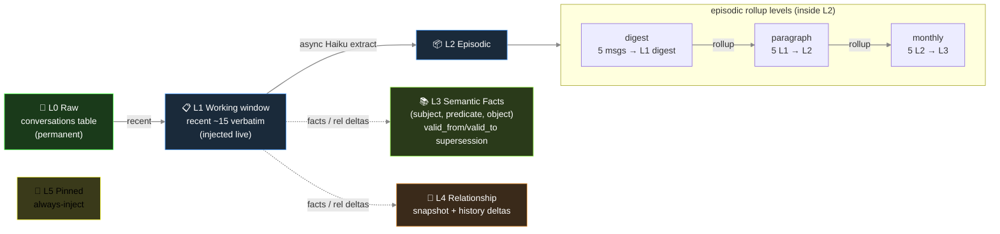
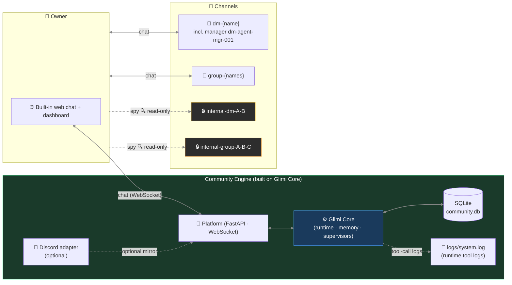

🇰🇷 [한국어 README](README.ko.md) · 📄 [START HERE — contributor onboarding](https://raw.githack.com/je-empty/Glimi/main/docs/START_HERE.html)

# Glimi

    

Glimi is a Python library for running a group of AI characters, each with its own personality, memory, and relationships, that keeps going even when you're away. For each character, you set two things: a persona and the model it runs on. From there, the characters talk to you and to each other. A background supervisor periodically starts new conversations and reopens idle ones. When you come back, what they said while you were gone is already waiting in the channels.

```python
from glimi import Glimi

chat = Glimi(backend="echo")          # offline: no API key, no network, no extra packages
chat.add_agent("nova", persona="a curious, upbeat friend")
print(chat.reply("nova", "hi there!"))  # real models: backend="claude_cli" or "ollama"
```

Two lines are enough to set up a cast because the engine underneath handles the rest — that engine is **Glimi Core**. State is kept in storage (SQLite by default), not in the prompt, so a character keeps its relationships, facts, and pinned memories across a restart or even when you swap models (Haiku → a local Llama). Glimi adjusts its memory injection to fit a configured context-window target and only includes what fits. That way, the same character works on a 4 GB laptop or a 24 GB workstation without losing personality silently. You can mix cloud (Claude) and local (Ollama) per character (Grok CLI also supported), and running fully local costs nothing.

You can watch everything run live: an agent relationship graph, a per-character memory inspector, a channel viewer, a tool-call timeline, and an LLM cost/usage card, all in a web dashboard built into the engine.


You build apps on top of Core. The main one is **Glimi Community** — a group of AI friends you chat with in a built-in web UI (or Discord). They have their own channels, keep secrets, talk about you when you're gone, and remember it. **Glimi Workspace** has role-based work agents (a Coordinator delegates to a Researcher, Builder, and Critic) with a live real-time demo. The starters in `examples/` also stand on that same Core.

> A note on the word "agent": here it means one in the *Generative Agents* tradition — a character that remembers, forms opinions, and starts conversations — not an autonomous task-runner. So we use *agent* in code and architecture, and *friends / characters* in anything a user reads.

```
Glimi/                           one repo, three self-contained projects (a "workspace" monorepo)
├── glimi-core/                  ← Glimi Core — the kernel        ·  pip install "glimi[dashboard]"
│   ├── glimi/                   ·   runtime · memory · context_budget · conversation · tools · llm · stores · dashboard · edd
│   ├── examples/                ·   library starters (research_buddies · dev_pair · dashboard_demo)
│   ├── eval/                    ·   golden-set capability eval (LLM-judge · regression gate); glimi.edd = generational E2E EDD
│   └── pyproject.toml           ·   builds the `glimi` / `glimi[dashboard]` wheel (the only PyPI artifact)
├── glimi-community/             ← Glimi Community — the flagship app (Core was extracted FROM here)
│   ├── community/               ·   FastAPI platform · built-in web chat · scenes · achievements · Discord adapter
│   ├── assets/ · i18n/          ·   profile images · localization
│   └── pyproject.toml · run.sh  ·   depends on glimi[dashboard]
├── glimi-workspace/             ← Glimi Workspace — a 2nd app built ON the kernel (proof of reuse)
│   ├── workspace/               ·   a Coordinator delegates to Researcher · Builder · Critic
│   └── pyproject.toml · run.sh  ·   depends on glimi[dashboard], zero Community imports
├── docs/ · tests/ · scripts/ · skills/
├── run.sh · run.bat             ·   dev launcher (bootstraps the shared venv; runs either app)
├── LICENSE · NOTICE · CITATION.cff  ·  AGPL-3.0 + authorship/citation
└── README.md · README.ko.md         ·  this file + Korean mirror
```

> **One repo, three projects.** Glimi Core (`glimi-core/`, the `glimi` package) was **extracted from a working app** — Glimi Community (`glimi-community/`) — so the kernel is proven, not theoretical. **Glimi Workspace** (`glimi-workspace/`) was then built *entirely on the `glimi` package* (no Community imports). This second, very different app on one kernel shows that Core is genuinely reusable. Each folder is a self-contained project with its own `pyproject.toml`; the two apps depend on `glimi[dashboard]` (the local editable install here; to be published to PyPI after launch). You can `cd` into any one and run it on its own — `glimi` publishes to PyPI separately.

---

## What makes Glimi different

Glimi Core is the engine behind agents that persist between sessions. Most tooling spins up a temporary role for a task, compresses context when it fills, and rebuilds from handoff notes the next time. Glimi skips that: each agent keeps its own context — what it has worked on, which decisions were made and why, your preferences and values, its relationship with you — in storage, so it carries over across sessions and model swaps. The same persistence appears at work as **Glimi Workspace** and between people as **Glimi Community**. One is a standing team you don't have to brief again; the other is friends who remember you. Those two apps show what Core can do, and the engine runs underneath both.

There are many open-source agent frameworks now: LangChain/LangGraph, AutoGen, CrewAI, the OpenAI Agents SDK, Letta, and more. Most run an agent through a **task** and then discard it. A few keep durable memory (Letta), and some research or game projects let agents live on their own (Stanford's Generative Agents, AI Town). Glimi brings those scattered parts into **one pip-installable runtime**, and two traits stand out:

**1. Memory that fits your hardware (Elastic Memory).** Glimi sizes its memory injection to a configured context-window target (`num_ctx`), trimming to a token-estimate budget so the prompt stays within the window. The same agents run on a 4 GB laptop or a 24 GB workstation without silently cutting away their personality. Other frameworks trim history to fit the window (CrewAI, Letta, the OpenAI Agents SDK, AutoGen, and LangGraph each do this in some form), but none sizes the memory budget to a context-window target as Glimi does. The local runtimes don't either: Ollama's request to auto-size context to available VRAM has been open and unimplemented since 2025.

**2. Anti-drift memory in a free, shipped runtime.** Glimi's facts are time-bounded. When a new fact contradicts an old one, the old one is marked superseded (kept for history, not deleted), so agents stop carrying stale beliefs. The reference for this idea, Zep's Graphiti, is a memory *engine* whose graph UI lives in Zep's proprietary hosted platform (a free tier exists, but the graph UI isn't part of the open-source Graphiti package). Mem0 removed contradiction resolution in 2026. Glimi ships the supersession logic, the runtime, and the dashboard together for free. (Glimi's version is scoped — row-level supersession in SQLite, not Graphiti's full bi-temporal graph — but it covers the core of the idea.)

Around those two, the integration is the point:

- **A designed, persistent population.** You define each agent's persona and its model, mixing cloud (Claude) and local (Ollama) in one fleet. State lives in storage, not in the prompt, so an agent keeps its memories and relationships when you swap models. Per-agent model choice on its own is common (Letta, CrewAI, and AutoGen all do it). Pairing it with persistent, swap-surviving state is what's unusual.
- **Agents that act on their own.** A proactive supervisor runs on a timer, opening new agent-to-agent conversations, reviving idle ones, and advancing scenes so the population keeps living between your messages. Most frameworks are reactive. The few that do autonomy well (Stanford's town, AI Town) are research or game stacks, not general libraries.
- **Friendly to modest hardware.** Many agents share one loaded local model and swap only their context — no weight reloads — so a fleet can run on a single 16 GB machine. This uses Ollama's resident-model behavior; Glimi's job is keeping per-agent state so sharing works smoothly.
- **A population dashboard in the box.** A real-time web UI ships with the engine: an agent relationship graph, a per-agent memory inspector (L0–L5), a live channel viewer, and per-agent model inspection. Free local dashboards do exist (Letta's ADE, Hermes HUD), but they inspect one assistant at a time. Glimi's view centers on the *relationships* across a population.

For context: Glimi is alpha (0.1.0, not yet on PyPI). On most single features, there's a stronger project — Letta for raw memory paging, AI Town for the autonomous-town setup, SillyTavern for character tooling, Zep for temporal graphs. Glimi's focus is the combination, not any one piece.

<!--
### Glimi vs. the alternatives

No project here is simply behind; each points somewhere. This is where Glimi fits.

| Capability | Glimi | Letta (MemGPT) | AI Town | Zep / Graphiti | CrewAI / LangGraph | SillyTavern |
|---|:--:|:--:|:--:|:--:|:--:|:--:|
| Pip-install library, you design the fleet | ✅ | ✅ | ❌ TS game stack | ✅ engine only | ✅ | ❌ chat front-end |
| Per-agent model, cloud + local in one fleet | ✅ | ✅ | ❌ one shared model | — | ✅ | ◐ |
| Memory survives a model swap (state in storage) | ✅ | ✅ | ✅ | ✅ | ◐ | ◐ |
| Temporal fact supersession (anti-drift) | ✅ scoped | ❌ | ❌ | ✅ the reference | ❌ | ❌ |
| Autonomous agent-to-agent (self-initiated) | ✅ | ❌ | ✅ | ❌ | ❌ | ◐ |
| Hardware-aware elastic context budgeting | ✅ | ❌ | ❌ | ❌ | ❌ | ❌ |
| Built-in relationship-graph + memory dashboard | ✅ | ◐ one agent | ◐ sim viewer | ❌ hosted | ❌ separate | ❌ |

✅ yes · ◐ partial · ❌ no · — not applicable. Honest view: Letta has deeper memory paging, AI Town has a more polished world and far more users, Zep's temporal graph is more complete, SillyTavern has richer character tooling. Glimi is the one that covers all seven rows in a single AGPL-3.0 package.
-->

---

## Glimi Core — the harness


### What's in the box

| Feature | Detail |
|---|---|
| **Multi-agent runtime** | Per-agent model override stored in DB. Cloud (Claude) and local (Ollama) coexist in one fleet — Grok CLI too; vLLM / llama.cpp are planned via the pluggable backend seam. Swappable without restart. |
| **Tool protocol** | `<tools><call id="1" name="...">...</call></tools>` inline XML — declarative `ToolSpec` registry with permission, type, env-gating |
| **Layered persistent memory (L0–L5)** | L0 raw (`conversations`) → L1 working window (recent verbatim, injected live) → L2 episodic rollup (L1→L2→L3 digests in `memories`) → L3 semantic facts (`agent_facts`: subject·predicate·object with `valid_from`/`valid_to` supersession) → L4 relationship (`relationships` + history) → L5 pinned (`memories.is_pinned`). Async Haiku extraction off the response path. |
| **Autonomous A2A conversation** | 1:1 and multi-agent channels. Turn-limited, closure-detected. Agents start conversations with each other via the tool protocol. |
| **Proactive supervisor layer** | The one layer that ticks without input. A pair scanner opens new agent-to-agent channels, a chat watcher revives idle ones, and a scene watcher progresses stuck workflows. |
| **Live observability dashboard** (`glimi[dashboard]`, read-only) | Cytoscape.js agent graph, per-agent memory inspector (L0–L5), real-time channel viewer, tool-call timeline, LLM usage/cost card, runtime state badges. (Live model-swap *writes* are a Community/Workspace platform feature; the Core dashboard surfaces the per-agent model for inspection.) |
| **Evaluation harness** | A golden set across persona / tool-use / memory / fallback / supervisor capabilities; deterministic checks + an LLM-as-judge (reused, not reinvented); a backend-tagged **regression gate** (fails CI on a pass-rate or judge-score drop); a production-feedback loop that promotes a flagged bad turn into a golden case. Runs free on the offline `echo` backend. |
| **End-to-end EDD QA (generational)** | The integration counterpart to the golden-set eval: an autonomous **owner agent** drives a full app from onboarding through the core journey, scored across weighted dimensions into a **0–100 quality score**, each run a **git-SHA-anchored "generation"** (SQLite + committed JSON) so quality is tracked commit-over-commit. The flagship differentiator — **[real measured generations + the flywheel](#edd--eval-driven-development-quality-tracked-per-commit-)** get their own section above. |
| **Cost & latency accounting** | Every LLM call records tokens, estimated cost, and latency at one choke-point; every tool call records args/result/latency/ok at another. Honest by construction — local/echo priced at $0, CLI/estimate rows labeled *est.*, dollars shown only for real priced spend. |
| **Human-in-the-loop gate** (Workspace) | An approval policy (`approve / edit / reject` + fallback + decision trail) around a consequential action, used by Workspace; never hangs (non-interactive auto-approves). |
| **Self-healing (experimental, off by default)** | Agent emits `request_dev_fix` → enqueues a dev_requests row → a dev-queue supervisor triages → on approval an Opus subprocess (`GLIMI_DEV_DISPATCH=1`) patches source → bot restart with the patch summary injected. |

### The 8 layers

Each response goes through up to **8 conceptual layers** — some inline around the LLM call (prompt, tools, memory), others in separate subsystems (the A2A loop, supervisors, optional self-heal). Seven layers react to responses; one runs proactively on its own clock.


Three layers (channel discipline, anti-echo guards, self-healing) lean toward application patterns and sit closer to Community than the kernel. The rest are handled by Glimi Core.

**1 · Prompt assembly** — language × agent-type dispatcher (`ko/` overlays on `en/`), provider-aware dialect for tool calls (Claude `<tools>` XML, OpenAI-style function call, local-model tag syntax), locale snippets (short-ack examples, chat-platform metaphor).

**2 · Tool protocol** — `ToolSpec` registry validates permission, types, and required fields. The dispatcher calls handlers, and results feed into the next user prompt.

**3 · Memory pipeline** — every N turns a Haiku call extracts `{summary, facts[], relationships[], emotion, entities, importance}`. Includes episodic rollup, semantic-fact supersession (Zep-style), and per-batch intimacy bumps. Injection is budgeted (~1000 tokens/turn baseline, scaled elastically): pinned + relationship + episodic-current + self-recent cross-channel + retrieved + facts. Retrieval = `0.4·semantic + 0.3·importance + 0.2·recency_decay + 0.1·relational`.

**4 · Channel discipline** — each prompt states who's listening in that channel. Prevents role bleed (for example, an agent writing owner-facing lines inside a private agent-to-agent channel).

**5 · Anti-echo / dedup / reality guard** — stops farewell pingpong loops, blocks tool re-calls on bare acknowledgements, drops near-duplicate tool calls within a short window, and prevents the agent from claiming actions it didn't perform.

**6 · A2A conversation loop** — `start_conversation(channel, participants, ...)` starts an agent-to-agent dialogue with a turn limit and closure detection.

**7 · Self-healing** (experimental, off by default) — `request_dev_fix` adds a row to dev_requests. A dev-queue supervisor triages it (organize, escalate, clarify). On approval an Opus subprocess (`GLIMI_DEV_DISPATCH=1`) patches source and restarts the bot with the patch summary injected.

**8 · Supervisors** ⭐ — three timed supervisors (the conversation-driving trio; the full system has several across system, channel, and scene scopes). A pair scanner (deterministic DB scoring on intimacy + idle-time — no LLM) opens new agent-to-agent channels. A chat watcher (Haiku judge) revives idle ones. A scene watcher advances stuck phases. The key part: **nudges appear as the agent's own inner thought**, not as commands.

```
Bad:  "Switch to a new topic now."             ← LLM parses as command, awkward output
Good: "(oh, I should bring up something else)" ← LLM reads as self-talk, natural flow
```

That difference matters: a command leaks as meta-text, but self-talk folds naturally into the next line.

### Memory architecture



Hardening:
- `_validate_fact()` drops abstract subjects (`"new member"`), transient-state objects (`"recently"`), and self-facts already in the agent's profile.
- `PREDICATE_ALIASES` normalizes 40+ free-form variants to a small canonical set so retrieval doesn't fragment across synonyms.
- Memories from private agent-to-agent channels are tagged with a disclosure guard when injected into owner-facing channels.

### Why it survives model swaps and profile edits

- State stays outside the prompt. Swapping an agent from Haiku → Sonnet → local Llama keeps relationships, facts, and pinned memories intact — the new model reads the same injection.
- Profile-edit tools pair `invalidate_cache()` with `runtime.refresh_agent()`, so edits apply on the next turn without restart — avoids the "bot keeps asking the question you just answered" bug.

### Elastic Memory — memory that fits any context window

Local models have small context windows (Ollama defaults to 4096). A full Glimi turn — character
system prompt + layered (L0–L5) memory injection + recent conversation — runs several thousand tokens. On a small window, the model silently truncates the front and **character + memory evaporate**.
Elastic Memory (a context-budgeting layer, `glimi/context_budget.py`) handles this:

- **Memory richness scales with the window** — `num_ctx` 8192 = baseline, 4096 shrinks the
  injection, 16384 adds about twice the memory. Bigger machine, better recall, automatically.
- **Best-effort fit** — recent conversation is trimmed oldest-first to a token budget so
  the assembled prompt stays within the window. A warning logs if the system prompt alone overflows.
- **Backend-agnostic** — the same system works for Claude or any backend. It's enabled for local
  models now since cloud windows (200k) rarely need it, but only one flag to turn on.
- **Per-community, hardware-aware** — the Community dashboard (🧠, `community/core/system_specs.py`)
  detects server RAM/VRAM, recommends a context tier (Low 4096 / Mid 8192 / High 16384), and
  writes it per community. Tune it like a game quality slider; exact token counts shown.

### Quick Start (library)

Glimi Core is **alpha (0.1.0, not yet on PyPI)** — install from a source checkout
for now. The kernel includes a dependency-free in-memory store and an **offline
`echo` backend**, so it runs out of the box with **no dependencies and no API
key** (the `echo` backend doesn't call a real model — it just shows the harness wiring and conversation persistence):

```python
from glimi import Glimi

chat = Glimi(backend="echo")          # offline: no deps, no API key, no network
chat.add_agent("nova", persona="A curious, upbeat companion who loves questions.")

print(chat.reply("nova", "Hi! What's your name?"))
print(chat.reply("nova", "Nice — tell me something fun."))
```

Switch to a real model by changing the backend; nothing else changes.

```python
chat = Glimi(backend="claude_cli")    # Claude via the Claude CLI login (no SDK); metered API credits, not a free subscription
chat = Glimi(backend="ollama")        # fully local via Ollama — the free option (set GLIMI_OLLAMA_MODEL)
```

`Glimi` connects the core parts for you — an in-memory `KernelStore`, a simple
`ProfileProvider`/`OwnerContext`, a `NullObserver`, and your chosen LLM backend.
Each component is also exported for direct use if you outgrow the defaults:

```python
from glimi import (
    InMemoryKernelStore, SimpleProfileProvider, SimpleOwnerContext,
    KernelStore, ProfileProvider, OwnerContext, KernelObserver,  # seams to implement
    LLMBackend, LLMResponse, EchoBackend,
)
```

To use your own database, implement `KernelStore` (and optionally
`ProfileProvider`/`OwnerContext`/`KernelObserver`) and inject via
`glimi.runtime.set_store(...)`, … . A full production wiring (SQLite + Discord)
is in the repo:

- `community/adapters/kernel_store.py` — `SqliteKernelStore` plus profile and observer adapters
- `community/core/runtime.py` — injects them into the kernel and re-exports the API

### Web dashboard (Glimi Core's observability)

The dashboard is part of Glimi Core, not Community — agent graph, memory inspector (L0–L5), channel viewer, and tool log all work for any agent population, not just Community's friends. It offers **read-only observability**; live model-swap *write* requires Community or Workspace.

| Connection Graph | Memory Inspector |
|---|---|
|  |  |

- **Cytoscape.js graph** — agent connections, channel activity, supervisor overlays
- **Memory inspector (L0–L5)** — pinned, episodic rollup, semantic facts, relationship history, all per-channel
- **Live channel viewer** — see exactly what each agent saw and said
- **Tool call timeline** — each `<tools>` call with arguments and result
- **Per-agent model (read-only)** — shows each agent's cloud/local model and override badge (the live cloud ↔ local *swap* is done in Community/Workspace)

### LLM model roles (default config)

| Role | Model | Why |
|---|---|---|
| Memory extraction | `claude-haiku-4-5` | Cheap + fast, runs on every batch in background |
| Supervisor / judge | `claude-haiku-4-5` | Lightweight state classification |
| Agent reply (default) | `claude-haiku-4-5` | High-volume, latency-sensitive |
| Reasoning / orchestration | `claude-sonnet-4-6` | Per-agent override from dashboard |
| One-shot structured output | `claude-opus-4-6` | Profile JSON, complex generation |
| Self-healing | `claude-opus-4-6` | Runtime-error source patching |

About ten times cheaper than running everything on Sonnet.

### Fully local mode (zero Claude dependency)

`GLIMI_LLM_BACKEND=ollama` routes **all** LLM calls (persona chat, manager tool calls,
memory extraction, supervisor judgment, achievement judging) to local Ollama models — no
Anthropic API key. Choose a tier with `GLIMI_LOCAL_TIER` (`run.sh --local-models` sets it automatically):

| Tier | Config | Mac | VRAM | Notes |
|---|---|---|---|---|
| lite | `e2b` single | 16 GB | 8 GB | fastest, weaker tool calls |
| standard *(default)* | `e4b` single | 16 GB | 12 GB | balanced |
| quality | `iq3-26b` single | 24 GB | **12 GB** | 26b quality on 12 GB (MoE, ~1 GB offload) |
| prod | `iq3-26b` manager + `e4b` rest (split) | 32 GB | 24 GB | both resident, no swap |

On a 12 GB GPU, the two-model split doesn't fit. `quality` (single 26b) is the sweet spot.
Per-agent table, model-selection experiment, and setup in:
**[`docs/local_models.md`](docs/local_models.md)**.

---

## Glimi Community — the flagship app


> *"AI friends that keep living when you're not looking."*

Community is a **real, usable application** built on Glimi Core. It's the flagship, and the app the Core was first extracted from. It also acts as the reference for what the engine enables, but it's a product you actually run, not a demo.

The friends in Community remember you. No re-introducing yourself each time like with a stranger. The hours you've spent together, last week's running joke, the day you said things were rough, the secret you told only A — each of them keeps it in their own store. So when you turn up after a few days, they ask: "been a while, did that thing work out?" Swap a friend's model from Haiku to a local Llama and the relationship, the mood, and the tone stay the same. They aren't a chatbot that resets and has to be told who you are again — they already know you.


### Talk to them — the built-in web chat

You don't need Discord anymore. Community includes its own chat — a Discord-style layout with a per-character sidebar, grouped message rows, replies, reactions, and threads — in light or dark theme, and it works on a phone. The same room you read in the dashboard is the room you type into. The connection graph and the chat are two views of one store, so clicking an edge in the graph drops you into that conversation.

| Web chat (light) | Web chat (dark) | On mobile |
|---|---|---|
|  |  |  |

Discord still works — it's now one adapter, not a requirement. The chat moves over a WebSocket through a platform-neutral outbox/inbox seam in Core, so the Telegram and other adapters on the roadmap plug into the same place.

**A demo is already there.** On first setup, a read-only **demo community** is added to your list automatically — a populated mockup (no token, no bot) so you can see what Glimi does before wiring up anything. Because it's look-only, posting is disabled and a banner shows that clearly:


### The defining UX move

Each character has its own channels — DMs with you, **secret DMs with each other**, and group chats you can read but can't join — whether you reach them through the built-in web chat or Discord. Key property: **context leakage across channels** — what you tell Agent A in a DM can surface in A↔B's private channel, and B's later reply to you carries that without quoting it directly.

```
14:02 — you DM A in #dm-A
  You: "hey, is B mad at me or something? they've been short with me all week"
  A:   "lol why would they be 🤷 probably just busy"

14:05 — A and B gossip in #internal-dm-A-B  (you read silently; they don't see you here)
  A: "bruh the owner just DM'd me asking if you're mad at them 😂"
  B: "???? no lmao"
  A: "apparently you've been 'short' all week"
  B: "I've literally been on deadline crunch..."
  A: "I didn't snitch, just said you were busy"
  B: "ok ty"

14:30 — you DM B in #dm-B
  You: "how's your day going"
  B:   "surviving — crunch week 😮‍💨"
```

B answered honestly ("crunch week") — the real reason they've been short. B never quoted A or said "I heard you were asking about me." But B's memory now holds a fact: *owner was fishing about me in A's DM, source channel logged.* Two days later, when you ask "are we cool?", the related memory chunk gets injected and B's answer shows it — maybe a bit warmer, maybe a bit guarded — without breaking the fourth wall.

That's the Glimi Core harness at work. Channel discipline (layer 4) keeps the boundaries. Memory injection (layer 3) carries the context across. The supervisor (layer 8) starts the gossip channel in the first place.

### Community-specific feature set

| Feature | Description |
|---|---|
| **Owner-absence simulation & return briefing** (roadmap) | Agents keep talking while you're away; Manager briefs you on return |
| **Channel context leakage** | Memory of secret conversations naturally affects later replies without direct quotation |
| **Spy mode** | `internal-*` channels are read-only for the owner — agents don't know you're there |
| **Manager + Creator characters** | Yuna (admin / tutorial / DM approval) and Hana (persona design / avatar prompts) |
| **Scene system** | `tutorial` shipped; `birthday` / `healing` / `outing` planned |
| **Achievements** | 7 default unlocks tracked as the user explores: first chat, three friends, group chat, peek-internal, autonomous-chat, long-relationship, fourth-wall break |
| **Multi-community isolation** | One platform process spawns N community bot subprocesses; each gets its own SQLite DB and Discord server |

### Community architecture (web-first; Discord = optional adapter)



Note: **The built-in web chat is the main surface; Discord is an optional adapter, not the core.** Glimi Core does not import `discord`. Community ships a first-class web chat (FastAPI + WebSocket); the Discord adapter is optional and mirrors the same channels. Telegram and other adapters are planned next.

### Channel structure (Community)

| Channel | Created | Purpose |
|---|---|---|
| `dm-{agent}` (incl. manager `dm-agent-mgr-001`) | first boot / on agent creation | Owner ↔ agent 1:1 |
| `group-{names}` | on demand | Owner + agents multi-DM |
| `internal-dm-{A}-{B}` | on demand | Agent-to-agent secret 1:1 (**owner read-only**) |
| `internal-group-{names}` | on demand | Agent-to-agent secret group (**owner read-only**) |
| `logs/system.log` (file) | runtime | Runtime tool-call logs — a file, not a channel |

### Quick Start (Community) — cross-platform

**Prerequisites (all platforms)**:
- Python 3.12+
- Node.js (Claude Code CLI dependency)
- [Claude Code CLI](https://docs.anthropic.com/en/docs/claude-code): `npm install -g @anthropic-ai/claude-code`
- For Claude-backed agents: a **Claude CLI login** (the setup wizard's default; an `ANTHROPIC_API_KEY` in `.env` also works). Either way Claude uses **metered API credits** (headless `claude -p` isn't free). The **free** option is **Local-only** (all agents on Ollama, $0) or **Hybrid** (personas local/free, only mgr/creator/dev on Claude — the cheapest config that still feels like Glimi).
- Discord bot token (only if you enable the optional Discord adapter)

**Fresh Mac (nothing installed)** — one command installs the prerequisites above
(Homebrew, Python, Node, Claude CLI), sets up the project, and opens your browser to
the setup wizard:

```bash
git clone https://github.com/je-empty/Glimi.git && cd Glimi && ./scripts/bootstrap.sh
```
Already have Python 3.12+? Skip straight to `./run.sh` below.

**macOS / Linux**:
```bash
git clone https://github.com/je-empty/Glimi.git
cd Glimi
./run.sh                    # platform + dashboard → http://localhost:8000
                            # first run opens the browser /setup wizard to set the admin password
                            # (or set GLIMI_ADMIN_PASSWORD for headless/non-interactive)
```

**Windows** (native):
```powershell
git clone https://github.com/je-empty/Glimi.git
cd Glimi
run.bat
```
(WSL2 + `./run.sh` also works if you prefer a Linux environment.)

**Useful commands**:
```bash
./run.sh workspace                      # Glimi Workspace server (home + demo + create) → http://127.0.0.1:8800
./run.sh --port 9000                    # change dashboard port
./run.sh --local-models                 # local LLM mode (dev opt-in) — auto-installs Ollama + pulls default model, skips what exists. See docs/local_models.md
./run.sh --setup-only                   # run setup (venv/deps/ollama/model) then exit
./run.sh --imagegen                     # enable local LoRA portrait generation (opt-in, ~6min/portrait)
./run.sh --legacy <community>           # legacy single-bot mode (QA / debugging)
./scripts/community_e2e.sh --owner-agent --qa   # web E2E EDD QA — owner-agent-driven, scored generation (docs/qa_system.md)
./scripts/stop.sh                       # graceful shutdown
python -m community.platform.accounts list    # list platform accounts
python -m community.community list            # list communities (CLI)
```

> 🚀 **Need more detail?** See [`START_HERE.html`](START_HERE.html) for the full cross-platform walkthrough + first-time checklist.

| DM Channel View | Achievements |
|---|---|
|  |  |

| Connection Graph | Graph + Supervisor Overlay |
|---|---|
|  |  |

---

## Glimi Workspace — a team for work


A one-person company still has a team here. The agents in Glimi Workspace are a Coordinator who leads, plus role-split colleagues (Researcher, Builder, Critic). You set the project context once — what you're building, why the last decision went the way it did, and how you like to work. Each agent keeps that in its own store, so you don't have to explain everything again when you start a new session. Switch a model from Haiku to Sonnet, or from cloud to local, and the team keeps running on the same context. It's not a tool you hire per task but staff that stays with you and builds up context over time.

Workspace and Community are separate apps on the *same* Core — one is a standing work team, the other is friends who remember you. That difference is the point: two distinct apps on one kernel prove that Core is reusable, not a monolith. Workspace imports only the `glimi` package: no `discord`, no Community code.

The team doesn't sit in one round-robin room. It acts like a real team: the owner DMs the Coordinator, the Coordinator assigns parts to specialists, the specialists debate **each other** in agent-to-agent channels, and the team meets in a group round before the Coordinator delivers. Those interactions are saved as working relationships, forming the edges of the **same** connection graph that renders Community. The work team appears as a real interaction web, each member with its own layered (L0–L5) memory.

#### One server, many workspaces

`./run.sh workspace` opens a home where one server hosts **many workspaces** (like the Community platform hosts many communities). A read-only **demo workspace** is already there to explore. Create a new one with a name and goal, and a fresh team forms around it. Open any workspace to watch its team in action.


#### Watch it live

The demo workspace is a seeded, real-time showcase — a launch team loaded into the store and kept running on a background loop, so the dashboard updates as you watch (offline, no API key, **$0**). One screen shows the whole setup: the graph, each member's memory and facts, the channel viewer (owner DM, delegation DMs, the A2A debates, the group round, and an `mgr-approvals` HITL trail), and the observability panels showing the tool-call timeline and an LLM usage card (local/echo priced at $0, every count marked *est.*).

| Live team dashboard | Agent detail — memory, facts, relationships |
|---|---|
|  |  |

```bash
./run.sh workspace                      # the workspace server (home + demo + create) → http://127.0.0.1:8800
./run.sh workspace --demo               # serve just the seeded demo team
./run.sh workspace --serve              # run a real goal once, then serve the result
./run.sh workspace --serve --approve final   # require owner sign-off on the deliverable
```

#### Human-in-the-loop — the approval gate

Before the Coordinator commits the one consequential action — delivering the final synthesis — Workspace can send it through an **approval gate**. The owner can approve, edit, or reject it, with a deterministic fallback if rejected and a decision trail recorded in `mgr-approvals` (visible in the dashboard). The policy is set with config (`--approve auto|final|off`), and runs never hang — non-interactive runs (CI, pipes, the demo) auto-approve. It's the HITL seam evaluators expect: a checkpoint on the key action, visible afterward.

---

## EDD — eval-driven development (quality tracked per commit) ⭐

A multi-agent product is hard to *prove*: "the friends feel more real now" is a vibe, not a number. Glimi's answer is **EDD — eval-driven development**. An autonomous **owner agent** (a persona, not a script) drives a real app end-to-end from onboarding through the core journey. The session is scored across **weighted dimensions** into a single **0–100 composite**, and every run is a **git-SHA-anchored "generation"** committed to the repo. `git log` becomes a measurable quality timeline. Each commit's effect on product quality is visible. The framework is **`glimi.edd`**. It is domain-neutral, part of the `glimi` kernel, and inherited by **both** Community and Workspace, which each supply their own dimensions and owner agent.

**How a generation is scored**: each dimension is 0–10 with a weight, and the composite is the weighted average normalized to 0–100. `critical` dimensions are all-or-nothing — if one fails, the whole run fails no matter the composite. A high chat score can't cover a broken core journey. LLM-judge dimensions are **skipped** — excluded from the composite and never faked — on the offline `echo` backend or when no judge is available. A free self-test can't inflate the score. Community's six dimensions:

| Dimension | Kind | Weight | Critical | What it checks |
|---|---|:--:|:--:|---|
| `onboarding` | structural | 1.0 | | A fresh owner greets the manager and gets oriented |
| `friend_creation` | structural | 1.5 | ⭐ | An owner request actually creates a new friend, and conversation follows |
| `conversation_quality` | LLM-judge | 2.0 | | Replies are human, coherent, in-character (5 axes: in_character · coherence · naturalness · engagement · no_meta) |
| `no_hallucination` | LLM-judge | 1.5 | | No invented facts, no claiming actions it never took |
| `no_leaks` | structural | 1.0 | | Zero meta / error / tool-block leakage into chat |
| `responsiveness` | structural | 1.0 | | Every driven DM gets a distinct reply, no stalls |

### The flywheel, with real measurements

These are the **actual generations committed to this repo** (`tests/e2e/qa_generations/*.json`) — real `claude_cli` runs, scored by the judge, each stamped with the git SHA it ran against. N is small because the system is new. The point is the **methodology that accumulates data over generations**, not the length of history. Read honestly, they already tell a story.

| Gen | git SHA | Branch | Composite / 100 | Verdict | `conversation_quality` | `friend_creation` (critical) | Failing |
|:--:|:--:|---|:--:|:--:|:--:|:--:|---|
| **1** | `1eb4c46`* | `feat/community-qa-system` | **69.4** | ❌ FAIL | 6.0 | **0.0** | friend_creation, conversation_quality |
| **2** | `b3eaf74`* | `feat/community-qa-system` | **75.0** | ❌ FAIL | **9.0** ▲ | **0.0** | friend_creation |
| **3** | `f1eb58a`* | `develop` | **72.5** | ❌ FAIL | 8.0 | **0.0** | friend_creation |
| **4** | `f1eb58a`* | `develop` | **56.9** | ❌ FAIL | 4.0 ▼ | **0.0** | friend_creation, conversation_quality, no_hallucination |
| ⋯ | gens 5–10 | the web-native onboarding build | 56.9 → 85.0 | building | — | 0.0 → **10.0** | — |
| **11** | `a8d874d`* | `feat/web-native-onboarding` | **85.0** | ✅ **PASS** | 7.0 | **10.0** ▲▲ | — *(first PASS)* |

`*` = working tree was dirty at run time. Composite and dimension scores are read directly from the committed JSON. **Gen 11 is the milestone**. The build that made onboarding web-native (gens 5–10 led toward it) flipped the critical `friend_creation` from **0 → 10**, marking the first ✅ PASS (85/100). It's the same 0→10 jump the harness predicted while it sat red.

What the numbers show — and why the failures are published along with the PASS:

- **`conversation_quality` swung 6.0 → 9.0 → 8.0 → 4.0 … → 7.0** across generations. That up‑and‑down pattern shows the nondeterministic nature of an LLM product. It's what a *trend* (not a screenshot) reveals. Gen‑1→2 recorded a real fix — the manager stopped re‑asking a question the owner had already answered twice. Gen‑4 saw the same bug return. By gen‑11 it steadied at 7.0. Without the harness, all of that would have stayed hidden.
- **`friend_creation` is `critical`, and for gens 1–10 it stayed at 0.0 — so every early run failed by design.** That was the harness working as intended, not the system broken. It pinned a known architectural gap. The autonomous onboarding supervisor ran only inside the Discord‑bot subprocess, so a pure web E2E couldn't reach it (the "Discord = adapter" decoupling — see [`docs/qa_system.md`](docs/qa_system.md) and `analysis/platform_decoupling_review.md`). The web‑native onboarding build closed that gap, and **gen‑11 shows `friend_creation` = 10.0 → first ✅ PASS (85/100)**. The number moved **0 → 10 exactly as the harness predicted while it sat red** — the loop proved itself. (`conversation_quality` 7.0 and `no_hallucination` 6.0 remain the weak spots; the harness leaves them visible instead of hiding them behind the green.)

That is the core idea: **product quality is a first-class, git-tracked metric — every commit's impact is measured and visible**, including regressions and unfinished work. The dashboard and PDF below let a reviewer read that timeline at a glance.

### See it: the `/admin/qa` dashboard + PDF reports

The platform serves a **QA dashboard** at `/admin/qa` (admin login → "QA" menu). It shows the latest score as a hero, a **quality‑over‑generations trend chart**, and a per‑generation table for every dimension. Any generation can export to a **self‑contained PDF**. `glimi.edd.report` renders a print‑ready HTML one‑pager through Playwright headless Chromium. The trend line is server‑rendered SVG, so it prints the same with no JS.


```bash
# one scored generation (free self-test: echo backend, judge skipped, structural dims only)
GLIMI_LLM_BACKEND=echo .venv/bin/python -m tests.e2e.community_e2e --owner-agent --rounds 2 --qa

# a real, judged generation → SQLite + a committable gen-NNNN-*.json
GLIMI_LLM_BACKEND=claude_cli .venv/bin/python -m tests.e2e.community_e2e \
    --owner-agent --rounds 10 --qa --report

# + a PDF report (trend chart + dimensions; needs Playwright). --pdf implies --qa.
GLIMI_LLM_BACKEND=claude_cli .venv/bin/python -m tests.e2e.community_e2e \
    --owner-agent --rounds 10 --pdf --report
```

```bash
git log -- tests/e2e/qa_generations/   # the quality timeline (committed generations)
git log --grep "qa:"                   # every quality-affecting change, with its score delta
```

**Reusable for adopters.** `glimi.edd` is domain‑neutral and ships in the `glimi` wheel. Bring your own dimensions and owner‑agent driver, and you get the composite scoring, the git‑anchored generation store (SQLite + committed JSON), and the HTML/PDF report.

```python
from glimi.edd import Dimension, DimResult, build_assessment, GenerationStore

DIMS = [Dimension("onboarding", "Onboarding", 1.0, "structural", "fresh user gets oriented"),
        Dimension("core_journey", "Core journey", 1.5, "structural", "...", critical=True)]
results = [DimResult.for_dim(d, score=..., passed=..., detail="...") for d in DIMS]  # you evaluate
assessment = build_assessment(results, min_overall=70)                              # core scores → 0–100
store = GenerationStore(db_path="qa.db", generations_dir="qa_generations/")          # core persists
store.record(assessment.as_dict(), run_id="run-1")                                   # → SQLite + git-SHA JSON
```

Community implements its six dimensions on top of this. Glimi Workspace uses the same `glimi.edd` core with deliverable / delegation / A2A dimensions. One EDD framework, two apps. Full design: [`docs/qa_system.md`](docs/qa_system.md).

---

## Examples

Lightweight starters showing Glimi Core directly, without the social-sim layer of Community:

| Example | What it shows |
|---|---|
| `glimi-core/examples/research_buddies/` | Two agents collaborate on a research topic, take turns reading and summarizing, build up shared notes |
| `glimi-core/examples/dev_pair/` | Planner + executor pattern — one agent breaks the task into steps, the other carries them out, both share a memory store |
| `glimi-core/examples/dashboard_demo/` | Seed a small population on an in-memory store and serve it in the read-only Core dashboard (`glimi[dashboard]`) |

---

## Tech Stack

| Component | Technology |
|---|---|
| **Glimi Core runtime** | Python 3.12+. Claude (Claude CLI subprocess + Anthropic SDK), a fully-local Ollama backend, and a Grok CLI backend; the LLMBackend seam is pluggable (vLLM / llama.cpp planned, not yet shipped) |
| **Memory store (default)** | SQLite — pluggable via the `KernelStore` ABC (the kernel never touches the DB directly) |
| **Tool protocol** | `<tools>` inline XML — alias resolution, JSON-typed args, deferred execution |
| **Web dashboard** | FastAPI + Jinja2 + Cytoscape.js + htmx |
| **Community adapter** | `discord.py` with per-agent Webhook avatars |
| **Community image gen** (opt-in) | Local LoRA portrait via Animagine XL 4.0 (~6min/portrait, 186MB weights) |

---

## Roadmap

**Done — Kernel extraction and packaging**
- ✅ `community/core/{runtime, tools, memory, llm, conversation}` → top-level `glimi/` — storage- and platform-neutral, imports standalone (no Discord/DB)
- ✅ `KernelStore` ABC plus `AgentProfile`, `OwnerContext`, and `KernelObserver` protocols; Community connects concrete adapters in `community/adapters/`
- ✅ `pyproject`: `pip install glimi` (core, **zero runtime deps**) + extras `glimi[sdk]` (anthropic SDK) and `glimi[dashboard]` (FastAPI web UI) — the kernel builds as a standalone wheel from this monorepo, and the apps depend on it

**Now — First PyPI release**
- First alpha (0.1.0) of `pip install glimi` on PyPI

**Next — Examples and docs**
- `glimi-core/examples/research_buddies/` and `glimi-core/examples/dev_pair/`
- English architecture deep dive (blog post)
- `kernel.tests/` unit coverage

**Then — Local-model backends**
- vLLM / llama.cpp implementations (Ollama and Grok already shipped; stubs already in `AVAILABLE_MODELS`)
- Per-agent local override from dashboard

**Then — Per-agent RAG memory (memory at scale)** ⭐
- The layered (L0–L5) memory works *in context*, but an agent that has been running a long time eventually exceeds any window. Plan: give **each agent its own RAG corpus** built on a proven retrieval core. The agent's accumulated history and knowledge are embedded and indexed, and it pulls only what's relevant each turn instead of keeping everything in the prompt. Memory changes from a limited budget to a queryable store.
- **Expected effect**: recall that stays consistent as history grows (retrieval is `O(top-k)`, not `O(history)`); a distinct, inspectable per-agent knowledge base; precise, *sourced* recall instead of drifting summaries.
- **Latency as character, not friction**: retrieval adds a delay that in-context memory does not. The agent triggers the RAG lookup as a **skill/tool while it's on load** and covers the wait *in character* — *"잠시만…", "그거 뭐였더라, 기억 더듬는 중…"* — so the retrieval pause feels like someone recalling, not a spinner. The same latency that might seem like lag becomes a natural human beat.

**Community-specific**
- Owner-absence simulation and return briefing
- Emotion layer (auto sentiment → state changes)
- New scenes: birthday, healing, outing
- Non-Discord adapters: Telegram, web chat

---

## Contributing

> 🆕 **First time?** Open **[`START_HERE.html`](START_HERE.html)**. It covers cross-platform setup, the first contributor task (local model support), Claude Code workflow, branch strategy, and the full TODO roadmap. **Read it before opening a PR.**

### Local-model support — shipped ✅ (Gemma 4 / Qwen 3.5)

The Ollama backend now routes every LLM call locally. Gemma 4 (26b-a4b / e4b / e2b) and Qwen 3.5 were benchmarked across all model roles (persona chat, supervisor judge, memory extraction, manager tool calls). Per-agent model config, VRAM, recommended hardware, and the full comparison are in **[`docs/local_models.md`](docs/local_models.md)**. Setup is in [`docs/ollama_setup.md`](docs/ollama_setup.md). Good follow-on tasks: vLLM / llama.cpp backends, reranker-based memory retrieval, and smaller-model tool-call accuracy tuning.

### Other entry points

- **easy**: new `examples/` demos, doc fixes, new Community `community/scenes/`
- **medium**: vLLM / llama.cpp backends, dashboard visualizations, new ToolSpecs
- **hard**: native Windows support (`run.ps1`), Telegram adapter (`community/adapters/telegram/`), `pyproject` packaging split (`pip install glimi`), embedding-based memory retrieval

### Branch strategy

| Branch | Role |
|---|---|
| `main` | Stable. **No direct work / push.** Maintainers fast-forward from `develop`. |
| `develop` | Working branch. All integration happens here. |
| `feat/<name>` · `fix/<name>` · `docs/<name>` · `refactor/<name>` | Short-lived contributor branches. **PR base = `develop`**. |

### Code conventions (the easy-to-regress ones)

- **Discord = adapter.** `community/core/*` never imports `discord`. Community-specific code lives under `community/bot/`, `community/scenes/`, `community/achievements/`, etc.
- **Memory / emotion are user-prompt injections**, never system-prompt baked. `AgentRuntime` assembles them per channel, per turn.
- **Timestamps are UTC-aware ISO** (`community.core.timeutil.now_utc_iso()`). SQLite `CURRENT_TIMESTAMP` is naive. Don't use it directly.
- **Meta words** like "agent", "bot", and "AI" are forbidden in user-visible text. `<tools>` blocks never surface in conversation channels. Runtime tool-call logs go to the `logs/system.log` file.
- **Profile edits** need `invalidate_cache()` and `runtime.refresh_agent()` used together.

### Commit rules

- 1-line subject, around 50 chars. Add a body only if needed (1-2 lines).
- Prefixes: `feat:` / `fix:` / `docs:` / `ui:` / `refactor:` / `test:`.
- **No AI co-author trailers** (`Co-Authored-By: Claude` etc.) — strictly forbidden.
- **No `--no-verify` or `--no-gpg-sign` bypasses**. Fix the hook failure instead.

See `CLAUDE.md` for the full project guardrails (auto-loaded by Claude Code).

---

## License

**AGPL-3.0-or-later** — strong copyleft. You can use, study, modify, and share Glimi. In return, **any distributed or network-served derivative must also be open-sourced under the AGPL and keep this project's attribution**. It can't be closed or sold as a proprietary product. Contributions are accepted under the same license, and the author keeps the copyright while being able to grant separate commercial licenses. The stance is the same as MongoDB, Grafana, and Mastodon: stay open, grow with contributors, and prevent proprietary free-riding.

See `LICENSE` for the full text and `NOTICE` for attribution/trademark.
