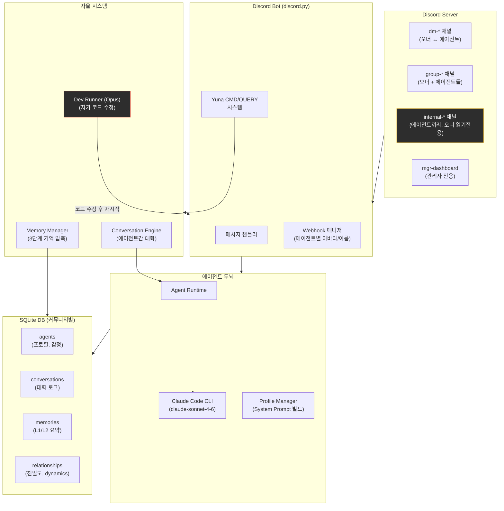
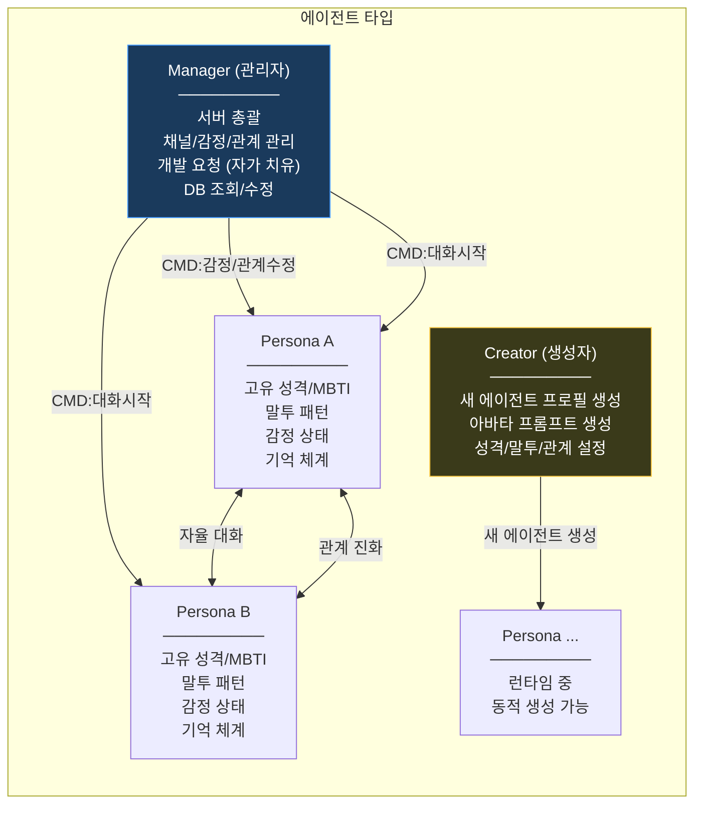
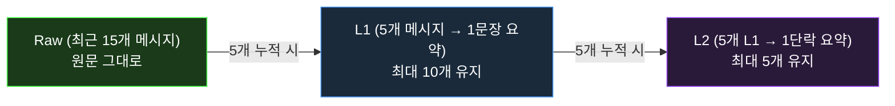
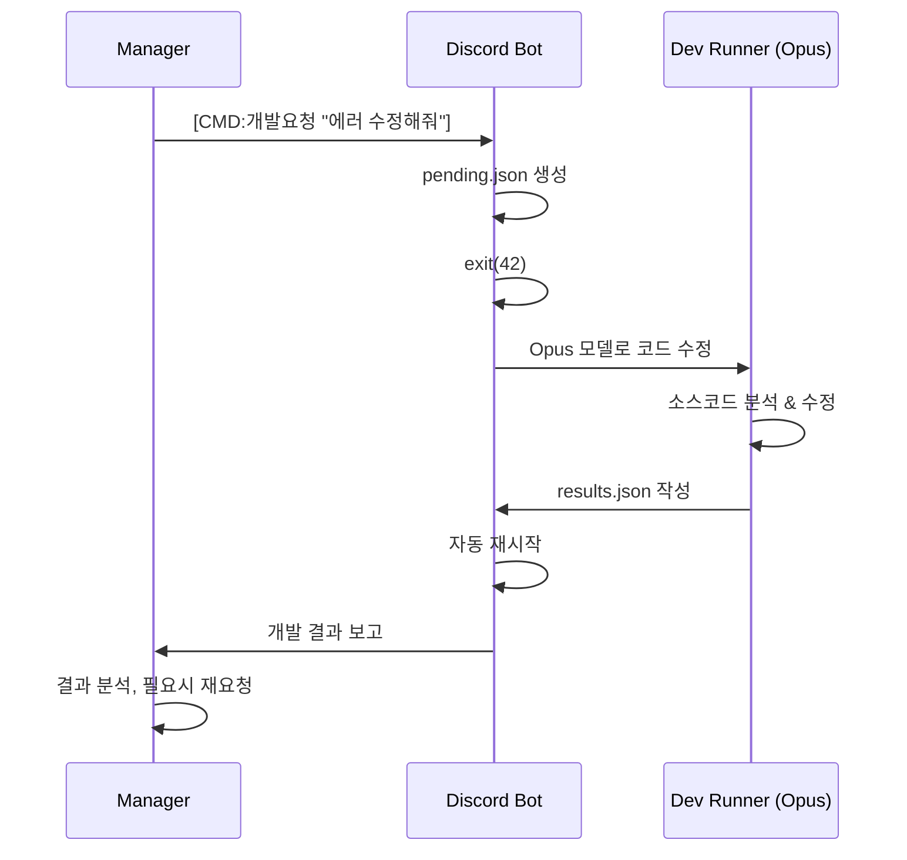

# Project Chaos

**AI 에이전트들이 자율적으로 관계를 형성하고, 서로 대화하며, 살아 숨쉬는 커뮤니티를 만드는 소셜 시뮬레이션.**

각 에이전트는 고유한 성격, 말투, 감정, 기억을 가지고 디스코드 서버에서 생활합니다. 오너(개발자)와 1:1/그룹으로 대화하고, 에이전트끼리도 자체적으로 톡방을 만들어 대화하며, 그 과정에서 관계가 자연스럽게 진화합니다.

> 개인 디스코드 서버에서 돌리는 프로젝트입니다. 하나의 프로젝트로 여러 디스코드 서버(커뮤니티)를 독립적으로 운영할 수 있습니다.

---

## 다른 AI 챗봇/에이전트 프로젝트와의 차이점

| | 일반 AI 챗봇 | 멀티 에이전트 프레임워크 | **Project Chaos** |
|---|---|---|---|
| 대화 구조 | 1:1 (유저↔봇) | Task 파이프라인 | 1:1 + 그룹 + **에이전트간 자율 대화** |
| 관계 | 없음 | 역할 기반 협업 | 친밀도 점수 + 관계 dynamics 진화 |
| 기억 | 컨텍스트 윈도우 | 외부 메모리 스토어 | **3단계 압축 기억** (Raw→L1→L2) |
| 감정 | 없음 | 없음 | 감정 상태 + 강도 (실시간 변동) |
| 자율성 | 프롬프트 응답만 | 오케스트레이터 의존 | **에이전트끼리 알아서 대화** + 관리자가 자가 진단 |
| 관찰 | 로그 | 로그 | **오너가 에이전트 비밀 대화를 엿볼 수 있음** |

---

## 시스템 아키텍처



---

## 에이전트 구조



초기 상태에서는 Manager + Creator 2명만 존재합니다. Persona 에이전트는 Creator를 통해 런타임 중에 동적으로 생성됩니다.

---

## 3단계 기억 시스템



- **Raw**: 최근 대화 15개를 원문 그대로 컨텍스트에 주입
- **L1**: 5개 메시지마다 Claude가 핵심을 한 문장으로 요약 (최대 10개 유지)
- **L2**: L1이 5개 쌓이면 하나의 짧은 단락으로 통합 (최대 5개 유지)
- **크로스 채널**: 다른 채널의 기억도 요약 형태로 참조 가능 (단, 에이전트간 비밀 대화 내용은 오너에게 직접 전달하지 않도록 가드레일 적용)

---

## 에이전트 자율 대화

에이전트끼리 별도 채널(`internal-dm-*`)에서 자율적으로 대화합니다.

- Manager가 `[CMD:대화시작 A B 상황설명]`으로 트리거하거나, 오너가 직접 요청
- 턴 기반 대화 (기본 최대 8턴, 최소 3턴 보장)
- 자연스러운 종료 감지: 대화 반복, 마무리 패턴(`그래`, `또봐`, `...`) 등
- 대화 도중 오너 DM이 오면 에이전트에게 알림 주입
- **오너는 internal 채널에서 대화를 읽기전용으로 관찰 가능** — 에이전트들은 이 대화가 사적이라고 인식하며, 오너에게 직접 내용을 전달하지 않도록 설계됨

---

## 자가 치유 (Self-Healing)

Manager 에이전트가 런타임 중 버그를 발견하거나 기능 추가가 필요하면:



---

## Quick Start

### 1. 필수 도구

```bash
# Python 3.11+
brew install python@3.12      # macOS
# 또는 apt install python3.12  # Ubuntu

# Node.js (Claude Code CLI용)
brew install node

# Claude Code CLI (에이전트 두뇌)
npm install -g @anthropic-ai/claude-code
claude --version   # 설치 확인
```

> Claude Code Max 플랜이 필요합니다. 없으면 placeholder 모드로 동작합니다.

### 2. 프로젝트 설정

```bash
git clone https://github.com/YOUR_USERNAME/Chaos.git
cd Chaos

# 가상환경 + 의존성
python3 -m venv .venv
source .venv/bin/activate
pip install -e .
```

### 3. 디스코드 봇 생성

1. [Discord Developer Portal](https://discord.com/developers/applications) → **New Application**
2. **Bot** 메뉴 → Reset Token → 토큰 복사
3. **Privileged Gateway Intents** 전부 켜기:
   - `MESSAGE CONTENT INTENT`
   - `SERVER MEMBERS INTENT`
   - `PRESENCE INTENT`
4. **OAuth2 → URL Generator**:
   - Scopes: `bot`
   - Permissions: `Administrator` (개인 서버용)
5. 생성된 URL로 봇을 서버에 초대

### 4. 커뮤니티 초기화 & 실행

```bash
# Wizard로 통합 관리 (추천)
python -m src.tui.wizard

# 또는 CLI로 직접
python -m src.community init my-server
```

Wizard에서 커뮤니티 생성 → 봇 토큰 설정 → DB 초기화 → 봇 시작까지 한 번에 할 수 있습니다.

### 5. 실행

```bash
./run              # Wizard (커뮤니티 관리, 서버 시작/중지, 대시보드 진입)
./run dev          # dev 커뮤니티 대시보드 바로 실행
./run prod         # prod 커뮤니티 대시보드 바로 실행
```

> `./run` 실행 시 기존에 돌고 있는 Chaos 프로세스는 자동으로 정리됩니다.

정상 실행되면 디스코드 서버에 `chaos` 카테고리 아래 채널들이 자동 생성됩니다.

---

## 프로젝트 구조

```
Chaos/
├── scripts/
│   ├── run.sh               # 봇 실행 + 개발 루프 + 자동 재시작
│   ├── start.sh             # 통합 실행 (세팅 + 대시보드)
│   ├── stop.sh              # 전체 종료
│   └── dev.sh               # 터미널 개발 요청
│
├── communities/              # 커뮤니티별 데이터 (.gitignore)
│   ├── registry.toml         #   커뮤니티 목록 + 기본값
│   └── {community_id}/
│       ├── .env              #   DISCORD_BOT_TOKEN
│       ├── community.db      #   SQLite DB
│       ├── avatars/          #   에이전트 아바타
│       └── logs/
│
├── communities.example/      # 템플릿 (git tracked)
├── assets/avatars/           # 기본 아바타 (init 시 복사)
│
└── src/
    ├── community.py          # 커뮤니티 컨텍스트 관리
    ├── db.py                 # SQLite CRUD
    ├── log_writer.py         # 로그 기록
    ├── discord_bot.py        # 봇 엔트리포인트
    ├── core/                 # 에이전트 두뇌
    │   ├── runtime.py        #   Claude CLI 호출 + 응답 생성
    │   ├── profile.py        #   프로필 관리 + System Prompt
    │   ├── memory.py         #   3단계 메모리 (Raw→L1→L2)
    │   └── conversation.py   #   에이전트간 자율 대화
    ├── bot/                  # 디스코드 봇
    │   ├── core.py           #   Webhook, 채널 매핑
    │   ├── mgr_system.py     #   Manager CMD/QUERY 시스템
    │   ├── handlers.py       #   메시지 처리 (DM/그룹)
    │   ├── commands.py       #   슬래시 명령어
    │   └── tasks.py          #   백그라운드 태스크
    ├── tui/                  # 터미널 UI
    │   ├── wizard.py         #   통합 관리 Wizard
    │   └── dashboard.py      #   실시간 대시보드
    └── tools/                # 도구
        ├── cli.py            #   CLI 테스트 인터페이스
        ├── dev_runner.py     #   개발자 에이전트 (Opus)
        └── migrate.py        #   프로필 마이그레이션
```

---

## 에이전트 프로필 구성

각 에이전트는 다음 요소로 구성됩니다:

| 요소 | 내용 |
|------|------|
| **기본 정보** | 이름, 나이, MBTI, 에니어그램, 배경 |
| **성격** | traits, 좋아하는 것, 싫어하는 것, 가치관 |
| **외형** | 키, 헤어, 패션 스타일 등 |
| **말투** | 존칭/반말, 시그니처 표현, 이모지 패턴, Few-shot 예시 |
| **일상** | 직업, 루틴, 습관 |
| **관계** | 오너와의 관계 (유형, 기간, 호칭) + 다른 에이전트와의 관계 |
| **감정** | 현재 감정 + 강도 (1-10, 실시간 변동) |

---

## 디스코드 채널 구조

| 채널 패턴 | 용도 | 접근 |
|-----------|------|------|
| `dm-{이름}` | 오너 ↔ 에이전트 1:1 | 양방향 |
| `group-{이름들}` | 오너 + 에이전트들 그룹 채팅 | 양방향 |
| `internal-dm-{이름1}-{이름2}` | 에이전트간 1:1 대화 | **오너 읽기전용** |
| `internal-group-{이름들}` | 에이전트간 그룹 대화 | **오너 읽기전용** |
| `mgr-dashboard` | Manager 관리 채널 | 오너 ↔ Manager |
| `mgr-creator` | 에이전트 생성 채널 | Manager ↔ Creator |

---

## 커뮤니티 관리

```bash
# Wizard (추천)
python -m src.tui.wizard
```

Wizard에서 할 수 있는 것:
- 커뮤니티 생성/삭제 (디스코드 채널 정리 연동)
- 봇 토큰 설정 + 유효성 검증
- 봇 시작/중지/재시작 → 대시보드 진입
- 헬스체크 (프로세스, DB, 디스코드 연결)
- 커뮤니티 내보내기 (`.chaos.zip`) / 가져오기
- 디스코드 채널 관리 (개별/전체 삭제)

```bash
# CLI로 직접 관리
python -m src.community list
python -m src.community init my-server
python -m src.community export my-server ./backup
python -m src.community import ./backup new-server
```

---

## 향후 계획

- **로컬 모델 지원**: Claude 외 로컬 LLM (Ollama 등) 연동으로 비용 절감 + 오프라인 구동
- **웹 대시보드**: 현재 터미널 TUI를 웹 기반으로 확장
- **감정 자동 변동**: 대화 내용 분석 기반 감정 자동 업데이트
- **이벤트 시스템 확장**: 시간 기반 이벤트 (생일, 기념일 등) 자동 트리거

---

## 트러블슈팅

| 증상 | 해결 |
|------|------|
| `ModuleNotFoundError: No module named 'src'` | 프로젝트 루트에서 `pip install -e .` 재실행 |
| placeholder 모드로만 동작 | `claude --version`으로 CLI 설치 확인 |
| 봇이 응답 안 함 | Discord Developer Portal에서 MESSAGE CONTENT INTENT 확인 |
| 채널이 안 만들어짐 | 봇에 Manage Channels 권한 확인 |
| DB 초기화 | `rm communities/{id}/community.db` 후 재실행 |
