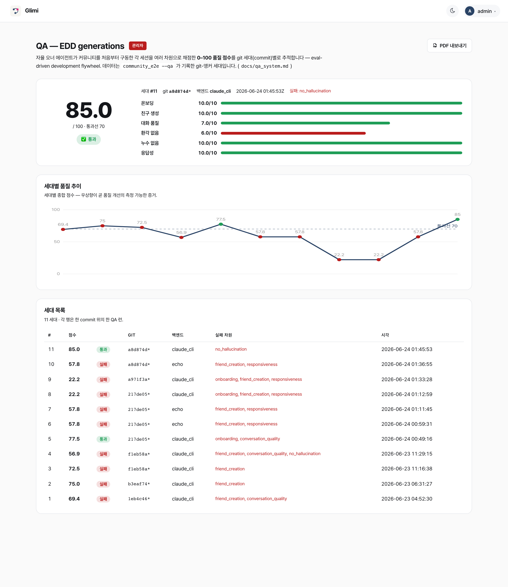

# EDD — eval-driven development (커밋마다 추적되는 품질)

[← README](../README.ko.md)

Glimi 는 **EDD(eval-driven development)** 로 멀티 에이전트 품질을 측정한다. 자율 **오너 에이전트**가 앱 온보딩과 주요 저니를 수행하고, 세션을 **가중 차원**으로 채점해 **0–100 종합 점수**를 낸다. 각 런은 **git-SHA "세대"** 로 커밋되어 `git log` 가 품질 타임라인이 된다. 프레임워크는 **`glimi.edd`**, `glimi` 커널 일부이며 Community·Workspace **모두 상속**한다(자기 차원 + 오너 에이전트만 구현).

**채점 규칙** — 각 차원 0–10 점과 가중치, 종합은 0–100 으로 정규화한 가중 평균. `critical` 은 하나만 실패해도 런 전체 무효. LLM-judge 차원은 `echo` 이거나 judge 가 없으면 **skip**. Community 기본 차원 6개:

| 차원 | 종류 | 가중치 | critical | 무엇을 보는가 |
|---|---|:--:|:--:|---|
| `onboarding` | 구조 | 1.0 | | 막 들어온 오너가 매니저한테 인사하고 오리엔테이션을 받는가 |
| `friend_creation` | 구조 | 1.5 | ⭐ | 오너 요청으로 진짜 새 친구가 생성되고 대화까지 이어지는가 |
| `conversation_quality` | LLM-judge | 2.0 | | 답이 사람처럼 자연·일관·맥락있는가 (5축: in_character · coherence · naturalness · engagement · no_meta) |
| `no_hallucination` | LLM-judge | 1.5 | | 사실을 지어내거나 안 한 일을 했다고 하지 않는가 |
| `no_leaks` | 구조 | 1.0 | | 메타 / 에러 / 도구블록 누수가 0 인가 |
| `responsiveness` | 구조 | 1.0 | | 구동된 모든 DM 이 (서로 다른) 답을 받고 멈춤·오류가 없는가 |

## flywheel, 실측치로

**레포 세대**(`tests/e2e/qa_generations/*.json`)는 judge 가 채점하고 git SHA 가 태깅된 실제 `claude_cli` 런이다. 시스템이 새것이라 데이터는 적다. 목표는 깊은 이력이 아니라 **채점된 세대를 쌓는 것**이다.

| 세대 | git SHA | 브랜치 | 종합 / 100 | 판정 | `conversation_quality` | `friend_creation` (critical) | 실패 차원 |
|:--:|:--:|---|:--:|:--:|:--:|:--:|---|
| **1** | `1eb4c46`* | `feat/community-qa-system` | **69.4** | ❌ FAIL | 6.0 | **0.0** | friend_creation, conversation_quality |
| **2** | `b3eaf74`* | `feat/community-qa-system` | **75.0** | ❌ FAIL | **9.0** ▲ | **0.0** | friend_creation *(종합 ≥ 70 이지만 critical = 0)* |
| **3** | `f1eb58a`* | `develop` | **72.5** | ❌ FAIL | 8.0 | **0.0** | friend_creation *(종합 ≥ 70 이지만 critical = 0)* |
| **4** | `f1eb58a`* | `develop` | **56.9** | ❌ FAIL | 4.0 ▼ | **0.0** | friend_creation, conversation_quality, no_hallucination |
| **5** | `217de05`* | `feat/web-native-onboarding` | **77.5** | ✅ **PASS** | 6.0 | **10.0** ▲▲ | — *(첫 PASS)* |
| ⋯ | gens 6–10 | `217de05` → `a8d874d` | 57.8 ↘ 22.2 ↗ 57.8 | ❌ FAIL (회귀) | — | **0.0** ▼ | friend_creation |
| **11** | `a8d874d`* | `feat/web-native-onboarding` | **85.0** | ✅ **PASS** | 7.0 | **10.0** ▲▲ | — *(최고점)* |

`*` 는 커밋 시점 dirty 상태다. 점수는 JSON 그대로. **최초 PASS 는 gen-5** (`217de05`, 77.5): web-native 온보딩이 critical `friend_creation` 을 0 → 10 으로 올렸다. 이후 gens 6–10 에서 0 으로 회귀했다가 gen-11 (`a8d874d`, **85.0 — 최고점**) 에서 다시 10 으로 안정화됐다.

세부 지표:
- **`conversation_quality` 6.0 → 9.0 → 8.0 → 4.0 … → 7.0** 은 LLM 변동성을 보여준다. gen-1→2 에서 중복 질문 제거, gen-4 회귀, gen-11 재안정화(7.0).
- **`friend_creation` (critical) 은 gens 1–4·6–10 에서 0, gen-5·gen-11 에서만 10 이다** — 예상된 실패였고, 구 부트스트랩 어댑터의 subprocess 격리에서 왔다(참고: [`docs/qa_system.md`](qa_system.md), `analysis/platform_decoupling_review.md`). web-native 온보딩이 **gen-5(77.5, 첫 ✅ PASS)** 에서 처음 통과시켰고, gens 6–10 회귀 후 **gen-11(85.0, 최고점)** 에서 복원됐다. `conversation_quality` 7.0, `no_hallucination` 6.0 은 아직 노출돼 있다.
- **종합 ≥ 70 으로는 부족하다.** gen-2(75.0)·gen-3(72.5)은 기준은 넘겼지만 `friend_creation` = 0 으로 FAIL 했다 — 높은 대화 점수가 망가진 critical 저니를 덮을 수 없다. 게이트가 설계대로 동작한 것이다.

**요약:** 품질을 git 에 1급 메트릭으로 기록한다. 모든 커밋의 영향이 수치로 보인다. 아래 대시보드·PDF 가 그 타임라인을 나타낸다.

## 보기: `/admin/qa` 대시보드 + PDF 리포트

`/admin/qa` 는 **QA 대시보드**다(admin 로그인 → "QA"). 최신 점수, **트렌드 차트**, 세대별 표를 보여준다. 각 세대를 **PDF** 로 내보낼 수 있다(`glimi.edd.report` 가 HTML 1페이지를 생성하고, Playwright headless Chromium 으로 출력. 서버 렌더 SVG 트렌드 라인을 포함).



```bash
# 채점 세대 한 번 (무료 셀프테스트: echo 백엔드, judge skip, 구조 차원만)
GLIMI_LLM_BACKEND=echo .venv/bin/python -m tests.e2e.community_e2e --owner-agent --rounds 2 --qa

# 실측·judged 세대 → SQLite + 커밋용 gen-NNNN-*.json
GLIMI_LLM_BACKEND=claude_cli .venv/bin/python -m tests.e2e.community_e2e \
    --owner-agent --rounds 10 --qa --report

# + PDF 리포트 (트렌드 차트 + 차원; Playwright 필요). --pdf 는 --qa 포함.
GLIMI_LLM_BACKEND=claude_cli .venv/bin/python -m tests.e2e.community_e2e \
    --owner-agent --rounds 10 --pdf --report
```

```bash
git log -- tests/e2e/qa_generations/   # 품질 타임라인 (커밋된 세대들)
git log --grep "qa:"                   # 품질에 영향 준 모든 변경 + 점수 델타
```

**채택자를 위해:** `glimi.edd` 는 `glimi` 휠 안에서 도메인 중립이다. 차원과 오너 에이전트 드라이버만 추가하면 종합 채점, git-앵커 SQLite + JSON 저장, HTML/PDF 리포트를 바로 쓸 수 있다.

```python
from glimi.edd import Dimension, DimResult, build_assessment, GenerationStore

DIMS = [Dimension("onboarding", "온보딩", 1.0, "structural", "신규 사용자 오리엔테이션"),
        Dimension("core_journey", "핵심 저니", 1.5, "structural", "...", critical=True)]
results = [DimResult.for_dim(d, score=..., passed=..., detail="...") for d in DIMS]  # 앱이 평가
assessment = build_assessment(results, min_overall=70)                              # 코어가 0–100 채점
store = GenerationStore(db_path="qa.db", generations_dir="qa_generations/")          # 코어가 영속화
store.record(assessment.as_dict(), run_id="run-1")                                   # → SQLite + git-SHA JSON
```

Community 는 6차원을 사용한다. Glimi Workspace 는 같은 `glimi.edd` 코어를 산출물/위임/A2A 차원에 확장한다. 하나의 EDD 프레임워크, 두 앱이다. 전체 설계는 [`docs/qa_system.md`](qa_system.md)에 있다.
