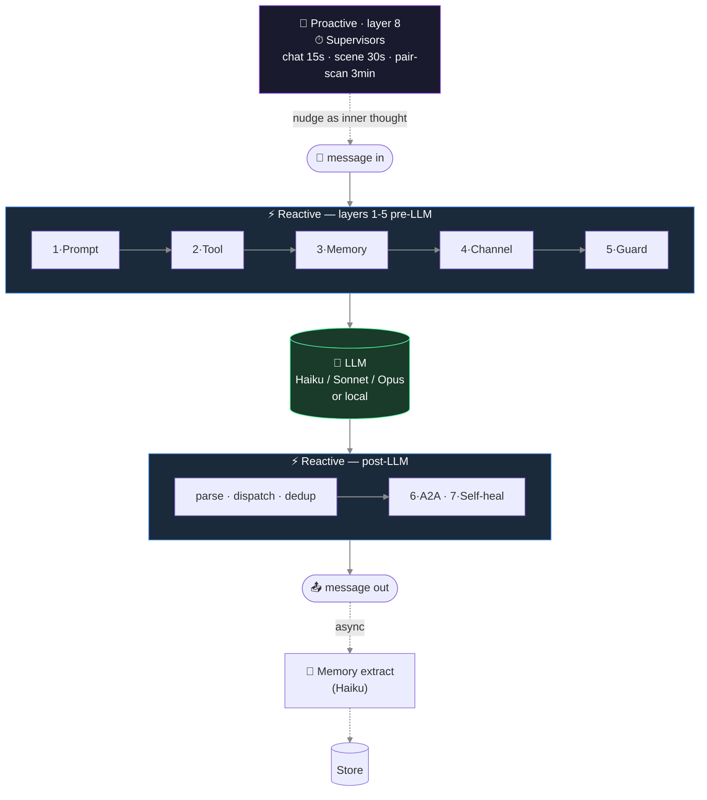
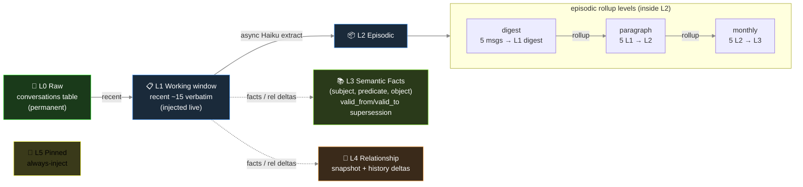
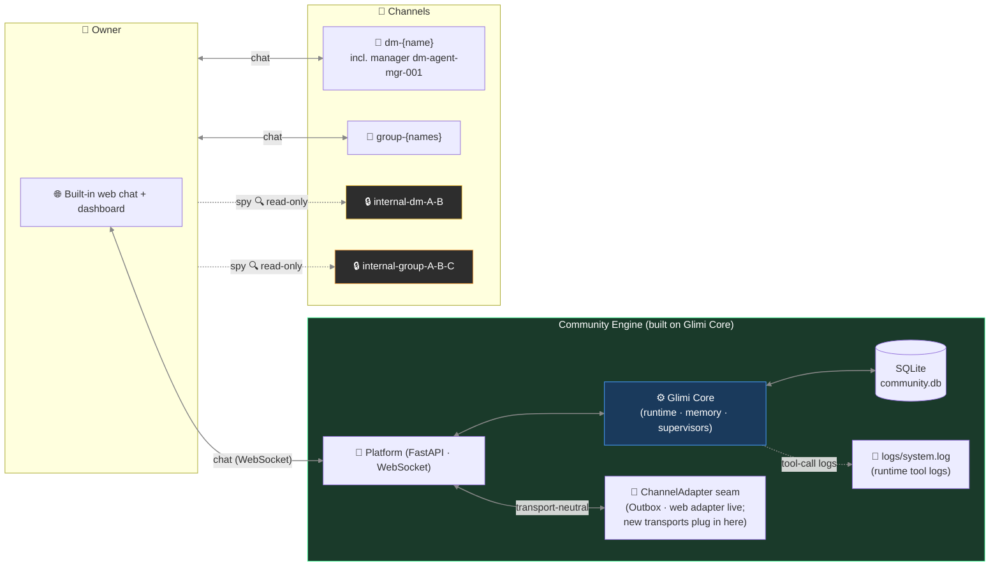

# Glimi — Internals

Deep architecture reference for Glimi Core and Glimi Community: the runtime pipeline, memory layers, dashboard observability, and the Community channel model. Pulled out of the README to keep it scannable; nothing here is lost, only relocated.

[← README](../README.md) · [← README (한국어)](../README.ko.md)

---

## The 8 layers

Each response runs through **8 layers**. Some wrap the LLM call (prompt, tools, memory). Others live in subsystems (A2A loop, supervisors, self-heal). Seven follow messages; one runs on schedule.



Three layers — channel discipline, anti-echo guards, self-healing — sit near Community; others stay in Core.

**1 · Prompt assembly** — builds prompt text from language + agent-type dispatch (`ko/`, `en/`), provider dialect (Claude `<tools>` XML, OpenAI function call, local tag), and locale snippets.

**2 · Tool protocol** — `ToolSpec` validates permissions, types, and fields. Dispatcher runs handlers; outputs feed the next prompt.

**3 · Memory pipeline** — every N turns, Haiku extracts `{summary, facts[], relationships[], emotion, entities, importance}`. Handles episodic rollup, semantic supersession, and intimacy bumps. Injection ≈ 1000 toks/turn scaled by load: pinned + relationship + episodic-current + self-recent + retrieved + facts. Retrieval weights `0.4·semantic + 0.3·importance + 0.2·recency_decay + 0.1·relational`.

**4 · Channel discipline** — prompts declare listeners to stop role bleed (e.g. agent speaking for owner in private A2A chat).

**5 · Anti-echo / dedup / reality guard** — ends goodbye loops, skips repeat tool calls, drops duplicates, blocks fake actions.

**6 · A2A conversation loop** — `start_conversation(channel, participants, …)` opens agent-to-agent talk with turn limits and closure check.

**7 · Self-healing** (off by default) — `request_dev_fix` logs a dev_request. Supervisor triages; on approval, Opus subprocess (`GLIMI_DEV_DISPATCH=1`) patches source and restarts with patch summary injected.

**8 · Supervisors** — timed processes (conversation trio and others). A pair scanner (DB intimacy + idle-time, no LLM) opens A2A channels. A chat watcher (Haiku judge) revives idle ones. A scene watcher moves stuck phases. Nudges appear as agent thoughts, not commands.

```
Bad:  "Switch to a new topic now."             ← LLM parses as command, awkward output
Good: "(oh, I should bring up something else)" ← LLM reads as self-talk, natural flow
```

Commands show system noise; self-talk merges into the next line.

## Memory architecture



Hardening:
- `_validate_fact()` drops vague subjects (`"new member"`), transient objects (`"recently"`), and duplicate self-facts.
- `PREDICATE_ALIASES` merges 40+ variants into a small canon for consistent retrieval.
- A2A memories carry a disclosure tag before showing to owners.

## Why it survives model swaps and profile edits

- State stays outside prompts. Swapping Haiku → Sonnet → local Llama keeps relationships, facts, pinned memories; new models read the same injection.
- Profile-edit tools pair `invalidate_cache()` with `runtime.refresh_agent()` so updates apply next turn and stop repeat-question bugs.

## LLM model roles (default config)

| Role | Model | Why |
|---|---|---|
| Memory extraction | `claude-haiku-4-5` | Cheap + fast, runs on every batch in background |
| Supervisor / judge | `claude-haiku-4-5` | Lightweight state classification |
| Agent reply (default) | `claude-haiku-4-5` | High-volume, latency-sensitive |
| Reasoning / orchestration | `claude-sonnet-4-6` | Per-agent override from dashboard |
| One-shot structured output | `claude-opus-4-6` | Profile JSON, complex generation |
| Self-healing | `claude-opus-4-6` | Runtime-error source patching |

About 10× cheaper than Sonnet-only.

## Web dashboard (Glimi Core's observability)

The Core dashboard shows all agents — graph, memory inspector (L0–L5), channel view, tool log. It is **read-only**; live model-swap writes need Community or Workspace.

| Connection Graph | Memory Inspector |
|---|---|
|  |  |

- **Cytoscape.js graph** — agent links, channel activity, supervisor overlay
- **Memory inspector (L0–L5)** — pinned, episodic, semantic, relationship data
- **Live channel viewer** — shows each agent's view
- **Tool call timeline** — `<tools>` args + results
- **Per-agent model (read-only)** — lists model and override badge (live swap in Community/Workspace)

## Community architecture (web-first; pluggable transport seam)



**Web chat is the live transport.** Core never imports any chat SDK — it talks through the transport-neutral seam (`Outbox`/`Speaker` in `glimi-core/glimi/transport.py` + the `ChannelAdapter` Protocol in `community/core/channel_adapter.py`). Community ships FastAPI + WebSocket chat as the live adapter (`community/adapters/web/`). Discord was the first bootstrap adapter that validated this seam; it was retired once web reached parity (2026-06-25). New transports (Telegram, etc.) plug into the same seam.

## Channel structure (Community)

| Channel | Created | Purpose |
|---|---|---|
| `dm-{agent}` (incl. manager `dm-agent-mgr-001`) | first boot / on agent creation | Owner ↔ agent 1:1 |
| `group-{names}` | on demand | Owner + agents multi-DM |
| `internal-dm-{A}-{B}` | on demand | Agent-to-agent secret 1:1 (**owner read-only**) |
| `internal-group-{names}` | on demand | Agent-to-agent secret group (**owner read-only**) |
| `logs/system.log` (file) | runtime | Runtime tool-call logs — a file, not a channel |

## Capabilities — full detail

Per-feature specifications behind the README's at-a-glance capability table ("What's in the box"). Topics with their own section above (memory layers, model roles, the 8-layer pipeline, dashboard, channels) are cross-linked rather than repeated.

- **Multi-agent runtime.** Per-agent model override is stored in the DB. Cloud (Claude) and local (Ollama) characters coexist in one fleet — Grok CLI too; vLLM / llama.cpp are planned via the pluggable backend seam. Models are swappable without a restart.
- **Tool protocol.** `<tools><call id="1" name="...">...</call></tools>` inline XML — a declarative `ToolSpec` registry with permission, type, and env-gating. (Pipeline view: layer 2 in [The 8 layers](#the-8-layers).)
- **Layered persistent memory (L0–L5).** L0 raw (`conversations`) → L1 working window (recent verbatim, injected live) → L2 episodic rollup (L1→L2→L3 digests in `memories`) → L3 semantic facts (`agent_facts`: subject·predicate·object with `valid_from`/`valid_to` supersession) → L4 relationship (`relationships` + history) → L5 pinned (`memories.is_pinned`). Async Haiku extraction runs off the response path. Full diagram and hardening rules in [Memory architecture](#memory-architecture).
- **Autonomous A2A conversation.** 1:1 and multi-agent channels, turn-limited and closure-detected. Agents start conversations with each other via the tool protocol (`start_conversation`; layer 6 in [The 8 layers](#the-8-layers)).
- **Proactive supervisor layer.** The one layer that ticks without input. A pair scanner opens new agent-to-agent channels, a chat watcher revives idle ones, and a scene watcher progresses stuck workflows. Cadence and judge details in [The 8 layers](#the-8-layers) (layer 8).
- **Live observability dashboard** (`glimi[dashboard]`, read-only). Cytoscape.js agent graph, per-agent memory inspector (L0–L5), real-time channel viewer, tool-call timeline, LLM usage/cost card, runtime state badges. Live model-swap *writes* are a Community/Workspace platform feature; the Core dashboard surfaces the per-agent model for inspection. Panel breakdown in [Web dashboard](#web-dashboard-glimi-cores-observability).
- **Evaluation harness.** A golden set across persona / tool-use / memory / fallback / supervisor capabilities; deterministic checks plus an LLM-as-judge (reused, not reinvented); a backend-tagged **regression gate** that fails CI on a pass-rate or judge-score drop; and a production-feedback loop that promotes a flagged bad turn into a golden case. Runs free on the offline `echo` backend.
- **End-to-end EDD QA (generational).** The integration counterpart to the golden-set eval: an autonomous **owner agent** drives a full app from onboarding through the core journey, scored across weighted dimensions into a **0–100 quality score**, each run a **git-SHA-anchored "generation"** (SQLite + committed JSON) so quality is tracked commit-over-commit. The flagship differentiator — see the README's EDD section for the real measured generations and flywheel.
- **Cost & latency accounting.** Every LLM call records tokens, estimated cost, and latency at one choke-point; every tool call records args/result/latency/ok at another. Honest by construction — local/echo priced at $0, CLI/estimate rows labeled *est.*, and dollars shown only for real priced spend.
- **Human-in-the-loop gate** (Workspace). An approval policy (`approve / edit / reject` + fallback + decision trail) around a consequential action, used by Workspace; it never hangs (non-interactive runs auto-approve).
- **Self-healing** (experimental, off by default). An agent emits `request_dev_fix` → this enqueues a `dev_requests` row → a dev-queue supervisor triages → on approval an Opus subprocess (`GLIMI_DEV_DISPATCH=1`) patches the source → the bot restarts with the patch summary injected. (Pipeline view: layer 7 in [The 8 layers](#the-8-layers).)

## Elastic Memory — memory sized to the context window

Local models have small windows (Ollama 4096). A full Glimi prompt — character system + L0–L5 memory + chat history — often exceeds that, truncating early tokens. `Elastic Memory` (`glimi/context_budget.py`) manages this:

- **Memory scales with window** — baseline `num_ctx` 8192; 4096 shrinks recall, 16384 doubles it.
- **Best-effort fit** — trims oldest conversation first; logs a warning if even the system prompt overflows.
- **Backend-agnostic** — works with Claude or any backend; mainly for locals (a cloud 200k window rarely needs it).
- **Per-community, hardware-aware** — `community/core/system_specs.py` reads RAM/VRAM and suggests Low 4096 / Mid 8192 / High 16384 tiers, writing config like a quality slider.

The same agent runs at 4096 or 16384 without personality loss. Other frameworks trim history (CrewAI, Letta, OpenAI Agents SDK, AutoGen, LangGraph) but not by a target size; Ollama's request to auto-match VRAM is still open.

## Library embedding (KernelStore DI)

`Glimi(...)` connects modules — an in-memory `KernelStore`, a simple `ProfileProvider`/`OwnerContext`, a `NullObserver`, and the selected backend. Import parts directly if you outgrow the defaults:

```python
from glimi import (
    InMemoryKernelStore, SimpleProfileProvider, SimpleOwnerContext,
    KernelStore, ProfileProvider, OwnerContext, KernelObserver,  # seams to implement
    LLMBackend, LLMResponse, EchoBackend,
)
```

To use your own DB, implement `KernelStore` (and optionally `ProfileProvider` / `OwnerContext` / `KernelObserver`) and inject it with `glimi.runtime.set_store(...)`. A working SQLite + web-transport example:

- `community/adapters/kernel_store.py` — `SqliteKernelStore` + profile/observer adapters
- `community/core/runtime.py` — injects them and exports the API
