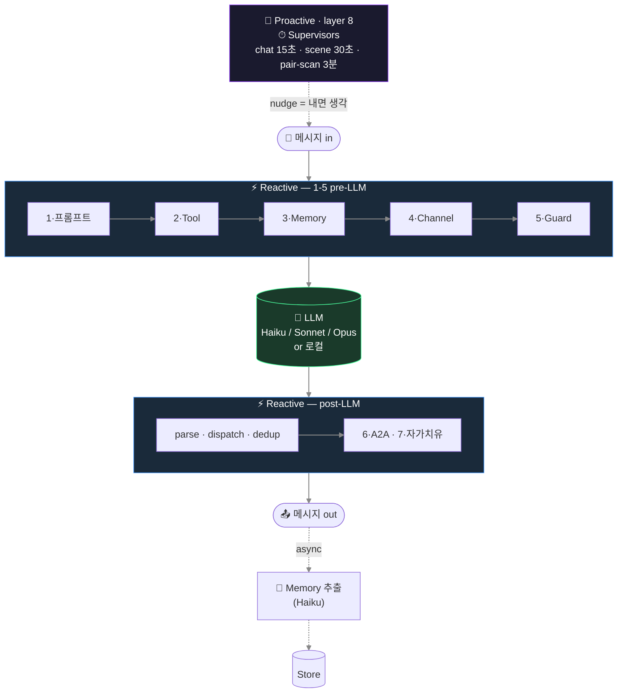
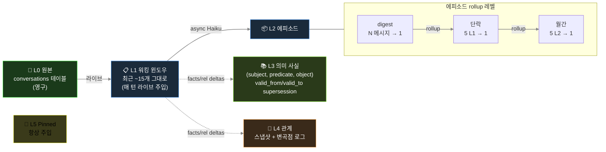
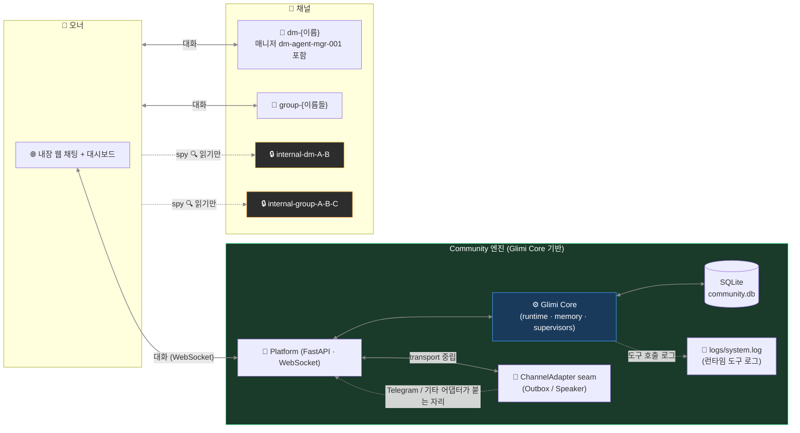

[← README](../README.ko.md)

# Glimi — 내부 구조

Glimi Core 런타임 파이프라인, 메모리 레이어, Community 채널 모델 등 깊은 내부 동작을 모은 문서다. README 는 무엇·왜·어떻게(설치/실행)에 집중하고, 아키텍처 상세는 여기에 둔다.

---

## 8 레이어

Glimi 응답은 **8개 개념 레이어**를 통과한다. 일부는 LLM 호출 근처(프롬프트·도구·메모리)에, 나머지는 A2A 루프·supervisor·자가 치유 등 별도 서브시스템에 있다. 7개는 reactive, 1개는 proactive(타이머 구동)다.



3개(채널 규율, anti-echo, 자가 치유)는 *application 패턴* 기반으로 Community 영역에, 나머지는 Glimi Core 가 담당한다.

**1 · 프롬프트 조립** — 언어 × agent_type dispatch (`ko/` 가 `en/` 위에 overlay). 백엔드별 도구 dialect (Claude `<tools>` XML, OpenAI function call). 로캘 snippet (`ㅇㅇ` / `ok`, `카톡` / `chat`).

**2 · 도구 프로토콜** — `ToolSpec` 레지스트리가 권한·타입 검증을 수행한다. dispatcher 는 핸들러 결과를 다음 user prompt 에 주입한다.

**3 · 메모리 파이프라인** — N 턴마다 Haiku 가 `{summary, facts[], relationships[], emotion, entities, importance}` JSON 을 만든다. 에피소드 rollup, 사실 supersession(Zep 스타일), 친밀도 자동 증분이 포함된다. Budget 은 ~1000 토큰/턴. pinned + relationship + episodic-current + cross-channel + retrieved + facts 가 주입된다. Retrieval 가중치: `0.4·semantic + 0.3·importance + 0.2·recency_decay + 0.1·relational`.

**4 · 채널 규율** — 프롬프트에 채널 참여자를 명시해 role bleed 를 막는다.

**5 · Anti-echo / dedup / reality guard** — 작별 핑퐁 차단, 단답 ack 후 도구 재호출 금지, 60초 내 유사 95% 호출 drop, 허위 행동 차단.

**6 · A2A 대화 루프** — `start_conversation(...)` 으로 에이전트 간 대화를 시작한다. 턴 제한과 closure 감지를 수행한다.

**7 · 자가 치유** (실험, 기본 OFF) — `request_dev_fix` 큐잉 → supervisor 트리아지 → 승인 시 Opus subprocess(`GLIMI_DEV_DISPATCH=1`) 패치 → 재시작 시 요약 주입.

**8 · Supervisors** ⭐ — 타이머 기반 3개 트리오. 페어 스캐너가 새 채널을 생성하고, Chat 감시자가 멈춘 채널을 깨우며, Scene 감시자가 phase 를 진행한다. **nudge 는 명령이 아니라 내면 생각으로 주입**된다.

```
Bad:  "다음 주제로 전환하라."             ← LLM 이 지시 해석, 어색한 응답
Good: "(아 이따 다른 얘기 꺼내봐야지)"    ← LLM 이 자기 생각으로 인식, 자연스럽게 흐름
```

이 설계로 캐릭터 일관성을 유지한다. 명령은 메타 텍스트로 처리되고, 혼잣말은 대사로 통합된다.

## 메모리 아키텍처



방어 장치:
- `_validate_fact()` 가 추상 subject(`"새_멤버"`), 일시 object(`"오랜만"`), 중복 self-fact 를 제거한다.
- `PREDICATE_ALIASES` 가 40+ 변형을 canonical 로 정규화한다.
- 비밀 채널 메모리는 오너 채널 주입 시 disclosure 마커를 붙인다.

## 모델 스왑·프로필 수정에도 맥락이 유지되는 이유

- 상태는 프롬프트 외부 저장소에 있다. Haiku → Sonnet → 로컬 Llama 로 교체해도 관계·fact·pinned 는 유지된다.
- 프로필 수정 시 `invalidate_cache()` 와 `runtime.refresh_agent()` 를 함께 실행해 즉시 반영한다. 반복 질문 회귀를 막는다.

## LLM 모델 역할 (기본 설정)

| 역할 | 모델 | 이유 |
|---|---|---|
| 메모리 추출 | `claude-haiku-4-5` | 싸고 빠름, 매 배치마다 백그라운드 worker |
| Supervisor / judge | `claude-haiku-4-5` | 경량 상태 판정 |
| 에이전트 응답 (기본) | `claude-haiku-4-5` | 대화량 많고 지연 민감 |
| 추론 / 도구 조합 | `claude-sonnet-4-6` | 대시보드에서 per-agent 오버라이드 |
| 원샷 구조화 출력 | `claude-opus-4-6` | 프로필 JSON, 복잡 생성 |
| 자가 치유 | `claude-opus-4-6` | 런타임 에러 기반 소스 패치 |
| 로컬 / 대안 | Ollama · Grok | 로컬 무료(Ollama) + Grok CLI; vLLM / llama.cpp 는 예정 (`AVAILABLE_MODELS` 스텁 준비됨) |

균일 Sonnet 대비 약 10배 저렴하다.

## 웹 대시보드 (Glimi Core 의 관찰성)

대시보드는 Glimi Core 에 포함된다. 그래프·메모리 인스펙터·채널 뷰어·도구 로그를 전 에이전트에 제공한다. **읽기 전용**이며 모델 스왑 *쓰기* 는 Community/Workspace 기능이다.

| 연결 그래프 | 메모리 인스펙터 |
|---|---|
|  |  |

- **Cytoscape.js 그래프** — 에이전트 연결·채널 활동·supervisor overlay 표시
- **메모리 인스펙터 (L0–L5)** — pinned, 에피소드, 의미 사실, 관계 변곡점 표시
- **실시간 채널 뷰어** — 각 에이전트의 현재 시점 표시
- **도구 호출 타임라인** — `<tools>` 호출 이력과 결과 표시
- **에이전트별 모델 (읽기 전용)** — 클라우드/로컬 모델 표시 (스왑은 Community/Workspace 전용)

## Community 아키텍처 (웹 우선; pluggable transport)



원칙: **내장 웹 채팅이 유일한 라이브 트랜스포트(`GLIMI_TRANSPORT=web`)이고, 트랜스포트는 어댑터로 갈아끼울 수 있다.** Glimi Core 는 특정 채팅 SDK 를 import 하지 않는다 — transport 중립 seam(`glimi/transport.py` 의 Outbox / Speaker + `community/core/channel_adapter.py` 의 ChannelAdapter Protocol)만 안다. 라이브 어댑터는 `community/adapters/web/` (`channels.py`) 이고, Community 가 1급 웹 채팅(FastAPI + WebSocket)을 제공한다. Telegram / 기타 어댑터가 같은 seam 에 붙을 예정이다. (Discord 어댑터가 이 seam 을 처음 검증한 부트스트랩 출구였으나, 웹이 패리티에 도달하면서 2026-06-25 에 은퇴했다.)

## 채널 구조 (Community)

| 채널 | 생성 시점 | 용도 |
|---|---|---|
| `dm-{에이전트}` (매니저 `dm-agent-mgr-001` 포함) | 첫 부팅 / 에이전트 생성 후 | 오너 ↔ 에이전트 1:1 |
| `group-{이름들}` | 요청 시 | 오너 + 에이전트 멀티 DM |
| `internal-dm-{A}-{B}` | 요청 시 | 에이전트끼리 비밀 1:1 (**오너 읽기 전용**) |
| `internal-group-{이름들}` | 요청 시 | 에이전트끼리 비밀 그룹 (**오너 읽기 전용**) |
| `logs/system.log` (파일) | 런타임 | 런타임 도구 호출 로그 — 채널 아님, 파일 |

## 기능 — 전체 상세

README 의 한눈에 보는 능력 표("박스 안에 든 것") 뒤에 있는 기능별 사양이다. 위에 자체 섹션이 있는 주제(메모리 레이어, 모델 역할, 8레이어 파이프라인, 대시보드, 채널)는 반복하지 않고 교차 링크한다.

- **멀티 에이전트 런타임.** 에이전트별 모델 오버라이드는 DB 에 저장된다. 클라우드(Claude) 와 로컬(Ollama) 캐릭터가 한 fleet 에 공존하고 — Grok CLI 도 마찬가지 — vLLM / llama.cpp 는 pluggable backend seam 으로 예정돼 있다. 모델은 재시작 없이 스왑된다.
- **도구 프로토콜.** `<tools><call id="1" name="...">...</call></tools>` 인라인 XML — 권한·타입·env 게이팅을 갖춘 선언적 `ToolSpec` 레지스트리. (파이프라인 관점: [8 레이어](#8-레이어)의 레이어 2.)
- **레이어드 영속 메모리 (L0–L5).** L0 원본(`conversations`) → L1 워킹 윈도우(최근 발화 그대로, 라이브 주입) → L2 에피소드 rollup(`memories` 안 L1→L2→L3 digest) → L3 의미 사실(`agent_facts`: subject·predicate·object + `valid_from`/`valid_to` supersession) → L4 관계(`relationships` + 이력) → L5 고정(`memories.is_pinned`). 비동기 Haiku 추출은 응답 경로 밖에서 돈다. 전체 다이어그램과 방어 규칙은 [메모리 아키텍처](#메모리-아키텍처)에.
- **자율 A2A 대화.** 1:1 및 멀티-에이전트 채널, 턴 제한 + closure 감지. 에이전트가 도구 프로토콜로 서로 대화를 시작한다(`start_conversation`; [8 레이어](#8-레이어)의 레이어 6).
- **Proactive supervisor 레이어.** 입력 없이 도는 유일한 레이어. 페어 스캐너가 새 에이전트-간 채널을 열고, chat 감시자가 멈춘 채널을 깨우며, scene 감시자가 정체된 워크플로우를 진행시킨다. 주기·judge 상세는 [8 레이어](#8-레이어)(레이어 8)에.
- **라이브 관찰성 대시보드** (`glimi[dashboard]`, 읽기 전용). Cytoscape.js 에이전트 그래프, per-agent 메모리 인스펙터(L0–L5), 실시간 채널 뷰어, 도구 호출 타임라인, LLM 사용량/비용 카드, 런타임 상태 배지. 라이브 모델 스왑 *쓰기*는 Community/Workspace 플랫폼 기능이고, Core 대시보드는 에이전트별 모델을 조회용으로 보여준다. 패널 분해는 [웹 대시보드](#웹-대시보드-glimi-core-의-관찰성)에.
- **평가 하네스.** 페르소나 / 도구사용 / 메모리 / 폴백 / 슈퍼바이저 능력을 아우르는 골든셋; 결정적(deterministic) 체크 + LLM-as-judge(재사용, 재발명 아님); 백엔드 태깅된 **회귀 게이트**(pass-rate 또는 judge 점수 하락 시 CI 실패); 플래그된 나쁜 턴을 골든 케이스로 승격하는 프로덕션 피드백 루프. 오프라인 `echo` 백엔드에서 무료 실행.
- **세대형 EDD QA.** 골든셋 eval 의 통합 짝: 자율 **오너 에이전트**가 앱을 온보딩부터 핵심 저니까지 구동하고, 가중 차원으로 채점해 **0–100 품질 점수**를 내며, 각 런은 **git-SHA 앵커 "세대"**(SQLite + 커밋 JSON)라 품질이 commit-over-commit 으로 추적된다. flagship 차별점 — 실측 세대와 flywheel 은 README 의 EDD 섹션 참조.
- **비용·지연 정산.** 모든 LLM 호출이 토큰·추정 비용·지연을 한 choke-point 에서 기록하고, 모든 도구 호출이 args/result/지연/성공여부를 또 한 곳에서 기록한다. 설계상 정직 — 로컬/echo 는 $0, CLI/추정 행은 *est.* 표시, 실제 과금된 지출에만 달러 표기.
- **사람 개입 게이트** (Workspace). 중대한 액션 둘레의 승인 정책(`승인 / 수정 / 거부` + 폴백 + 결정 로그), Workspace 가 사용; 절대 멈추지 않는다(비대화형은 자동 승인).
- **자가 치유** (실험적, 기본 비활성). 에이전트가 `request_dev_fix` 호출 → `dev_requests` 행 큐잉 → dev-queue supervisor 가 트리아지 → 승인 시 Opus subprocess(`GLIMI_DEV_DISPATCH=1`)가 소스 패치 → 봇 재시작 시 패치 요약 주입. (파이프라인 관점: [8 레이어](#8-레이어)의 레이어 7.)

## Elastic Memory — 컨텍스트 윈도우에 맞춘 메모리

로컬 모델은 윈도우가 작다(Ollama 4096). 전체 Glimi 프롬프트 — 캐릭터 시스템 + L0–L5 메모리 + 대화 히스토리 — 는 종종 그걸 넘겨 앞쪽 토큰이 잘린다. `Elastic Memory`(`glimi/context_budget.py`)가 이걸 관리한다:

- **메모리가 윈도우에 맞춰 스케일** — 기준 `num_ctx` 8192; 4096 이면 회상을 줄이고, 16384 면 두 배.
- **Best-effort fit** — 가장 오래된 대화부터 자르고, 시스템 프롬프트마저 넘치면 warning 을 남긴다.
- **백엔드 무관** — Claude 든 어느 백엔드든 동작하지만, 주로 로컬용(클라우드 200k 윈도우는 거의 필요 없음).
- **커뮤니티별·하드웨어 인지** — `community/core/system_specs.py` 가 RAM/VRAM 을 읽어 Low 4096 / Mid 8192 / High 16384 티어를 제안하고, 품질 슬라이더처럼 config 에 기록한다.

같은 에이전트가 4096 에서든 16384 에서든 성격을 잃지 않고 돈다. 다른 프레임워크도 히스토리를 자르지만(CrewAI, Letta, OpenAI Agents SDK, AutoGen, LangGraph) 목표 크기에 맞추지는 않는다. Ollama 의 VRAM 자동 매칭 요청은 아직 미해결이다.

## 라이브러리 임베딩 (KernelStore DI)

`Glimi(...)` 가 모듈을 배선한다 — 인메모리 `KernelStore`, 단순 `ProfileProvider`/`OwnerContext`, `NullObserver`, 그리고 고른 백엔드. 기본값으로 부족하면 구성요소를 직접 import 한다:

```python
from glimi import (
    InMemoryKernelStore, SimpleProfileProvider, SimpleOwnerContext,
    KernelStore, ProfileProvider, OwnerContext, KernelObserver,  # 직접 구현할 seam
    LLMBackend, LLMResponse, EchoBackend,
)
```

자체 DB 를 쓰려면 `KernelStore`(필요 시 `ProfileProvider` / `OwnerContext` / `KernelObserver`)를 구현해 `glimi.runtime.set_store(...)` 로 주입한다. 동작하는 SQLite + 웹 트랜스포트 예시:

- `community/adapters/kernel_store.py` — `SqliteKernelStore` + 프로필/옵저버 어댑터
- `community/core/runtime.py` — 커널 주입 + API 재export
