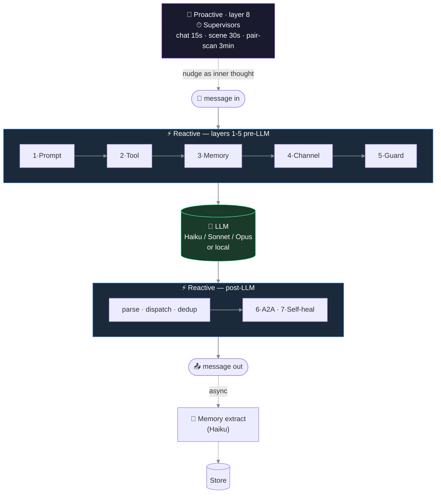
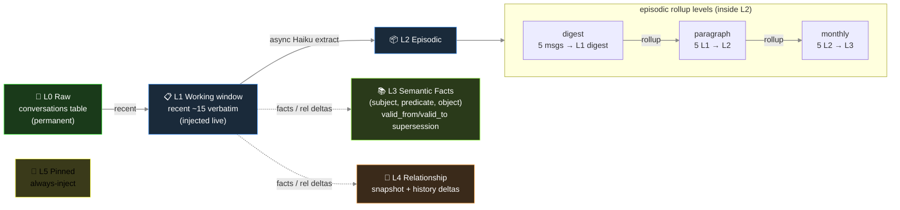

# Glimi — Memory & Runtime Internals

[← README](../README.md)

How a single response flows through the runtime, the layered persistent memory stack (L0–L5), and why state survives model swaps and profile edits. State lives outside prompts, so relationships and memories persist across restarts and model changes (Haiku → local Llama).

---

## The 8 layers

Each response runs through **8 layers** — five pre-LLM (prompt, tool, memory, channel, guard), two post-LLM (A2A loop, self-heal), and a scheduled supervisor tier. Some wrap the LLM call (prompt, tools, memory). Others live in subsystems (A2A loop, supervisors, self-heal). Seven follow messages; one runs on schedule.



Three layers — channel discipline, anti-echo guards, self-healing — sit near Community; others stay in Core.

**1 · Prompt assembly** — builds prompt text from language + agent-type dispatch (`ko/`, `en/`), provider dialect (Claude `<tools>` XML, OpenAI function call, local tag), and locale snippets.

**2 · Tool protocol** — `ToolSpec` validates permissions, types, and fields. Dispatcher runs handlers; outputs feed the next prompt.

**3 · Memory pipeline** — every N turns, Haiku extracts `{summary, facts[], relationships[], emotion, entities, importance}`. Handles episodic rollup, semantic supersession, and intimacy bumps. Injection ≈ 1000 toks/turn scaled by load: pinned + relationship + episodic-current + self-recent + retrieved + facts. Retrieval weights `0.4·semantic + 0.3·importance + 0.2·recency_decay + 0.1·relational`.

**4 · Channel discipline** — prompts declare listeners to stop role bleed (e.g. agent speaking for owner in private A2A chat).

**5 · Anti-echo / dedup / reality guard** — ends goodbye loops, skips repeat tool calls, drops duplicates, blocks fake actions.

**6 · A2A conversation loop** — `start_conversation(channel, participants, …)` opens agent-to-agent talk with turn limits and closure check.

**7 · Self-healing** (off by default) — `request_dev_fix` logs a dev_request. Supervisor triages; on approval, Opus subprocess (`GLIMI_DEV_DISPATCH=1`) patches source and restarts with patch summary injected.

**8 · Supervisors** — timed processes (conversation trio and others). A pair scanner (DB intimacy + idle-time, no LLM) opens A2A channels. A chat watcher (Haiku judge) revives idle ones. A scene watcher moves stuck phases. Nudges appear as agent thoughts, not commands.

```
Bad:  "Switch to a new topic now."             ← LLM parses as command, awkward output
Good: "(oh, I should bring up something else)" ← LLM reads as self-talk, natural flow
```

Commands show system noise; self-talk merges into the next line.

## Memory architecture

Layered persistent memory (L0–L5): L0 raw (`conversations`) → L1 working window (recent verbatim, injected live) → L2 episodic rollup (L1→L2→L3 digests in `memories`) → L3 semantic facts (`agent_facts`: subject·predicate·object with `valid_from`/`valid_to` supersession) → L4 relationship (`relationships` + history) → L5 pinned (`memories.is_pinned`). Async Haiku extraction runs off the response path.



Hardening:
- `_validate_fact()` drops vague subjects (`"new member"`), transient objects (`"recently"`), and duplicate self-facts.
- `PREDICATE_ALIASES` merges 40+ variants into a small canon for consistent retrieval.
- A2A memories carry a disclosure tag before showing to owners.

## Why it survives model swaps and profile edits

- State stays outside prompts. Swapping Haiku → Sonnet → local Llama keeps relationships, facts, pinned memories; new models read the same injection.
- Profile-edit tools pair `invalidate_cache()` with `runtime.refresh_agent()` so updates apply next turn and stop repeat-question bugs.
