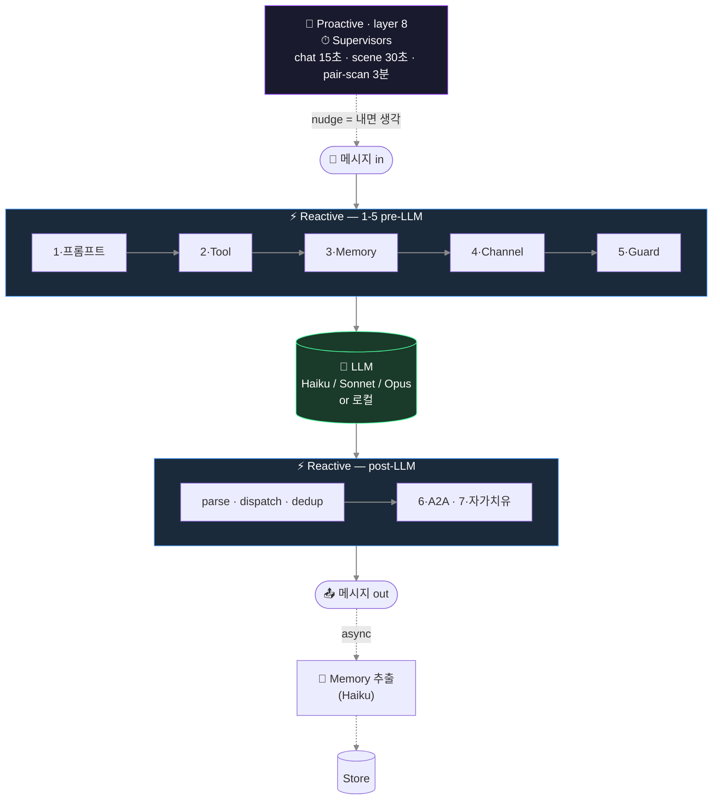
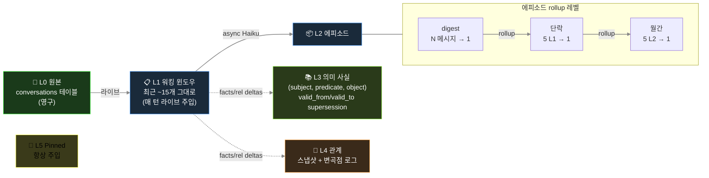

# Glimi — 메모리 & 런타임 내부

[← README](../README.ko.md)

응답 한 번이 런타임을 어떻게 통과하는지, 레이어드 영속 메모리 스택(L0–L5)은 어떻게 구성되는지, 그리고 왜 상태가 모델 스왑·프로필 수정에도 살아남는지. 상태는 프롬프트 밖 저장소에 있어, 재시작하거나 모델을 Haiku → 로컬 Llama 로 바꿔도 관계·기억이 유지된다.

---

## 8 레이어

응답 한 번이 **8 레이어**를 거친다 — pre-LLM 5개(프롬프트, 도구, 메모리, 채널, guard), post-LLM 2개(A2A 루프, 자가치유), 그리고 주기적으로 도는 supervisor 티어. 일부는 LLM 호출 근처(프롬프트·도구·메모리)에, 나머지는 A2A 루프·supervisor·자가 치유 등 별도 서브시스템에 있다. 7개는 reactive, 1개는 proactive(타이머 구동)다.



3개(채널 규율, anti-echo, 자가 치유)는 *application 패턴* 기반으로 Community 영역에, 나머지는 Glimi Core 가 담당한다.

**1 · 프롬프트 조립** — 언어 × agent_type dispatch (`ko/` 가 `en/` 위에 overlay). 백엔드별 도구 dialect (Claude `<tools>` XML, OpenAI function call). 로캘 snippet (`ㅇㅇ` / `ok`, `카톡` / `chat`).

**2 · 도구 프로토콜** — `ToolSpec` 레지스트리가 권한·타입 검증을 수행한다. dispatcher 는 핸들러 결과를 다음 user prompt 에 주입한다.

**3 · 메모리 파이프라인** — N 턴마다 Haiku 가 `{summary, facts[], relationships[], emotion, entities, importance}` JSON 을 만든다. 에피소드 rollup, 사실 supersession(Zep 스타일), 친밀도 자동 증분이 포함된다. Budget 은 ~1000 토큰/턴. pinned + relationship + episodic-current + cross-channel + retrieved + facts 가 주입된다. Retrieval 가중치: `0.4·semantic + 0.3·importance + 0.2·recency_decay + 0.1·relational`.

**4 · 채널 규율** — 프롬프트에 채널 참여자를 명시해 role bleed 를 막는다.

**5 · Anti-echo / dedup / reality guard** — 작별 핑퐁 차단, 단답 ack 후 도구 재호출 금지, 60초 내 유사 95% 호출 drop, 허위 행동 차단.

**6 · A2A 대화 루프** — `start_conversation(...)` 으로 에이전트 간 대화를 시작한다. 턴 제한과 closure 감지를 수행한다.

**7 · 자가 치유** (실험, 기본 OFF) — `request_dev_fix` 큐잉 → supervisor 트리아지 → 승인 시 Opus subprocess(`GLIMI_DEV_DISPATCH=1`) 패치 → 재시작 시 요약 주입.

**8 · Supervisors** ⭐ — 타이머 기반 3개 트리오. 페어 스캐너가 새 채널을 생성하고, Chat 감시자가 멈춘 채널을 깨우며, Scene 감시자가 phase 를 진행한다. **nudge 는 명령이 아니라 내면 생각으로 주입**된다.

```
Bad:  "다음 주제로 전환하라."             ← LLM 이 지시 해석, 어색한 응답
Good: "(아 이따 다른 얘기 꺼내봐야지)"    ← LLM 이 자기 생각으로 인식, 자연스럽게 흐름
```

이 설계로 캐릭터 일관성을 유지한다. 명령은 메타 텍스트로 처리되고, 혼잣말은 대사로 통합된다.

## 메모리 아키텍처

레이어드 영속 메모리(L0–L5): L0 원본(`conversations`) → L1 워킹 윈도우(최근 발화 그대로, 라이브 주입) → L2 에피소드 rollup(`memories` 안 L1→L2→L3 digest) → L3 의미 사실(`agent_facts`: subject·predicate·object + `valid_from`/`valid_to` supersession) → L4 관계(`relationships` + 이력) → L5 고정(`memories.is_pinned`). 응답 경로 밖에서 비동기 Haiku 추출이 돈다.



방어 장치:
- `_validate_fact()` 가 추상 subject(`"새_멤버"`), 일시 object(`"오랜만"`), 중복 self-fact 를 제거한다.
- `PREDICATE_ALIASES` 가 40+ 변형을 canonical 로 정규화한다.
- 비밀 채널 메모리는 오너 채널 주입 시 disclosure 마커를 붙인다.

## 모델 스왑·프로필 수정에도 맥락이 유지되는 이유

- 상태는 프롬프트 외부 저장소에 있다. Haiku → Sonnet → 로컬 Llama 로 교체해도 관계·fact·pinned 는 유지된다.
- 프로필 수정 시 `invalidate_cache()` 와 `runtime.refresh_agent()` 를 함께 실행해 즉시 반영한다. 반복 질문 회귀를 막는다.
